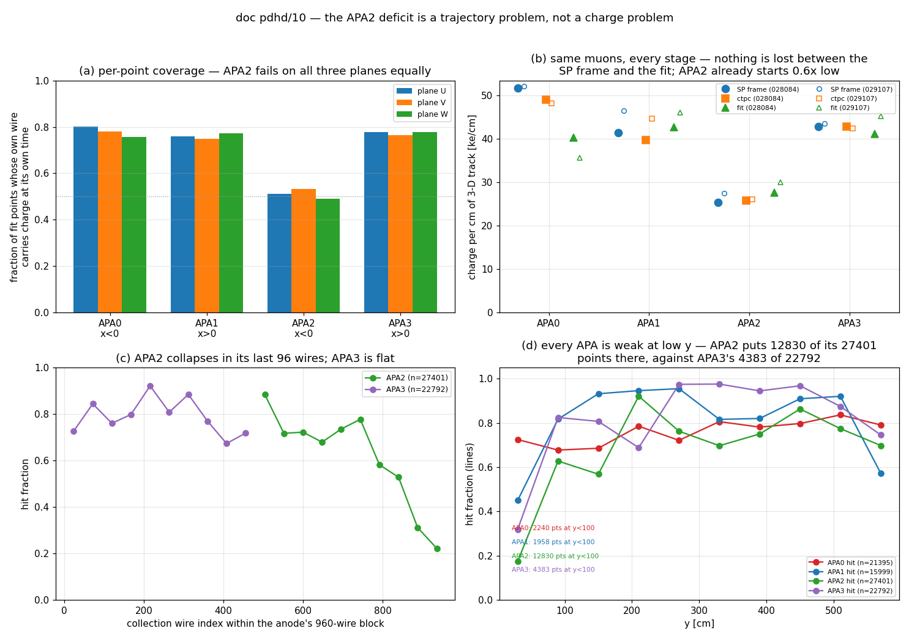

# doc pdhd/10 — the APA2 charge deficit: which stage it comes from

**Scope.** No code and no configuration is changed. Everything below is measured
from reconstruction products already on disk; six new analysis scripts are
added under `pdhd/docs/scripts/`. This round **diagnoses**; it proposes a fix
but does not implement one (CLAUDE.md §5.1).

**Owner question (2026-09-07).** *"Can you continue the investigation to see what
is going on for APA2 (w.r.t. APA1 and APA3)? Incorrect field response function
used? Different gain etc. The source could be a) difference in raw digits
measurement b) signal processing chain and its input c) difference in the decon
results from the above d) some weird geometry or mapping problem? So far, the
imaging results look normal. We know there are something weird in APA0 though,
which can be seen. Given that we know that APA2 is normal like APA1 and APA3,
there must be a bug somewhere."*

## The short answer

**None of (a), (b), (c) or (d) carries it.** Measured on the same fitted muons,
with the charge summed in a ±3-wire tube around the trajectory and divided by
the true 3-D path length, **the ctpc reproduces the SP frame to 0.93–1.02 in all
four APAs on both runs**, and the fit reproduces the ctpc to 0.74–1.15 — no APA
loses charge that another keeps:

| APA | ctpc ÷ SP frame (028084 / 029107) | fit ÷ ctpc (028084 / 029107) |
|---|---|---|
| 0 | 0.948 / 0.926 | 0.824 / 0.739 |
| 1 | 0.959 / 0.961 | 1.074 / 1.032 |
| 2 | **1.018 / 0.946** | **1.072 / 1.154** |
| 3 | 0.998 / 0.977 | 0.962 / 1.063 |

and the collection plane of APA2 is healthy — 480 of 480 imaging wires carry
charge, uniform to ±30 % across the plane, 2 quiet channels (APA3 has 6).
The wire→channel and the drift→time mappings are both exact (§2). The one real
chain-level face-0/face-1 asymmetry found is in **noise filtering**, and it is
small: post-NF ÷ pre-NF charge at the trajectory is 0.90 (APA2) and 0.94 (APA0)
against 1.02 for APA1 and APA3 — ~10 % of a factor 1.6, traced to
`PDHD::SignalProtection`'s noise-scaled threshold meeting face 0's 3–4× larger
coherent noise (§4).

**And the deficit is not in the charge either.** With no trajectory involved —
the whole SP gauss frame, imaging collection face — the charge per *occupied*
cell is 11 852 / 9 795 / **9 310** / 10 159 e for APA0–3, i.e. APA2 sits at
**0.93** of the APA1/APA3 mean with occupancy between theirs (§4.0). Nothing
like the 0.61 measured along the trajectory.

What APA2 actually has is a **trajectory** problem, not a charge problem:

1. **Half of APA2's fitted points sit where there is no charge — on all three
   planes at once.** The fraction of accepted-STM fit points whose own wire
   carries charge at its own time is **0.51 / 0.53 / 0.49** (U/V/W) in APA2
   against 0.75–0.80 in APA0, APA1 and APA3. All three planes fail *together*,
   which excludes any plane-, ROI- or wire-mapping-specific cause and points at
   the point's position.
2. **They are concentrated in one corner, and it is a track-level class.**
   12 677 of APA2's 27 401 fit points (46 %) lie in the last 96 collection wires
   (imaging wires 384–479, z ≈ 416–462 cm) at y ≈ 23 cm — the bottom, far-z
   corner, where the hit fraction is **0.17–0.22** against 0.72 in the rest of
   APA2 and 0.73–0.84 everywhere in APA3. Weighted per track rather than per
   point it holds up: **35 of the 91 APA2 passes (38 %) have more than half
   their APA2 points in that corner, and 33 (36 %) have more than 80 %**, while
   38 (42 %) have none at all. It is a bimodal population of tracks, not a tail
   of one or two long objects.
3. **The charge is not missing from the detector there.** Those same wires carry
   16.2–16.9 ×10⁶ e per 48-wire block per event in the SP output, in line with
   the rest of APA2 and with APA1/APA3.
4. **The trajectories in that corner are pathological.** The largest single
   contributor, `028084_9` block 360, is a 397 cm "track" running from
   x = −339 cm to x = −13 cm — i.e. *along the drift axis* — at fixed
   y ≈ 11–44 cm, z ≈ 434–457 cm, with **negative fitted charge** over most of
   its length. The fraction of fit points with negative dQ/dx is 0.031 / 0.091 /
   **0.174** / 0.083 for APA0–3.

**And doc pdvd/50 §4.2's "APA0 and APA2 both read 0.573" turns out to be two
different failures**, exactly as §4.2 suspected from its partial-band /
dead-band split: APA0's cells are *present but weak* (the documented hardware
fault; coverage 0.76, normal), APA2's cells are *absent* (coverage 0.49).
They do not share a cause, and "face 0" is not the variable.

**One defect found on the way (§6):** every accepted STM pass whose trajectory
is in APA1 or APA3 carries **92–95 % of its live collection cells in the
opposite drift volume**, while APA0/APA2 passes carry 0 %. Any per-APA number
obtained by binning a `T_proj_data` block's cells by APA is therefore wrong —
which is what doc 50 §4.2c did, and why its ordering differs from the
trajectory-local measurement here.

---

## Repro

```bash
cd /nfs/data/1/xqian/toolkit-dev/wcp-porting-img/pdhd
S=<scratch>

# 1. per-point wire coverage, per APA per plane per run  (sec 3)
python3 docs/scripts/d10_coverage.py --det pdhd --status 0 \
    --out $S/pdhd_s0 work/*_d30hpost/tracking-stm.root

# 2. charge in a +-3 wire tube around the trajectory, per cm, at every
#    stage from the raw ADC to the fitter   (sec 4)
EV=$(ls -d work/028084_*_d09 | sed 's#work/##; s#_d09##' | tr '\n' ' ')
python3 docs/scripts/d10_tube_census.py $EV --out $S/tube_028084
python3 docs/scripts/d10_tube_census.py $EV --adc --run 028084 \
    --out $S/tube_adc_028084
EV9=$(ls -d work/029107_*_d09ctl | sed 's#work/##; s#_d09ctl##' | tr '\n' ' ')
python3 docs/scripts/d10_tube_census.py $EV9 --sp-tag _d09ctl --run 029107 \
    --out $S/tube_029107

# 3. the four-stage hit ladder on a few events   (sec 4)
python3 docs/scripts/d10_stage_ladder.py 028084_0 028084_2 028084_5 028084_9

# 4. SP frame vs ctpc, cell by cell   (sec 2 gate)
python3 docs/scripts/d10_frame_vs_ctpc.py 028084_0 028084_1 028084_2 028084_3

# 5. the trajectory-free discriminator: charge per OCCUPIED collection cell,
#    and the per-wire plane census   (sec 4.0, 4.1)
python3 docs/scripts/d10_plane_census.py $(ls -d work/028084_*_d09 | head -8) \
    --out docs/figs/10_plane_census.tsv

# 6. the per-track corner statistic of sec 5, from the coverage blocks TSV
awk -F'\t' 'NR==2{for(i=1;i<=NF;i++){if($i=="apa")A=i; if($i=="frac_hi96")F=i}}
  NR>2 && $A==2 {n++; if($F>0.5) a++; if($F>0.8) b++; if($F==0) c++}
  END{printf "%d passes; >50%% corner %d; >80%% %d; none %d\n",n,a,b,c}' \
  docs/figs/10_coverage_blocks.tsv
```

**Arms.** PR/STM: `work/*_d30hpost` (61 events = 31 × run 028084 + 30 × run
029107), written 2026-09-07 06:47, the same arm doc pdvd/50 used. SP frames and
imaging: `work/028084_*_d09` (2026-09-06 22:57) and `work/029107_*_d09ctl`
(2026-09-07 04:24) — **both post-date the `wrapped_channel_charge` flip**
(`8ee69e06`, 2026-09-06 10:08), so this analysis is on the fixed clustering.
Pre-NF ADC: `input_data_7p8_new_coh_grouping/run<R>/evt_<E>/protodunehd-orig-frames-anode{0..3}.tar.bz2`
(present for 31/31 and 30/30 events; note the directory name records the
*coherent-grouping epoch*, not the gain — run 028084 is 14 mV/fC, run 029107 is
7.8).

**Everything is read from files already on disk. No wire-cell job was re-run.**
The SP archives already carry `frame_gauss<N>` (SP output), `frame_wiener<N>`,
`frame_raw<N>` (**post-NF ADC**) and `chanmask_bad`, so the whole ladder is
available offline.

---

## 1. What doc pdvd/50 left open

Doc 50 §4.2 measured the plateau dQ/dx ÷ the Modified-Box table, with no free
scale, as **0.573 / 0.941 / 0.573 / 0.935** for APA0–3, and showed it is not a
gain shift: the surviving points agree to 5 % in every APA and what differs is
the *share of points killed* (43–47 % vs 29 %). It also noted that the two bad
APAs fail differently — APA0's excess is in the **partial** band (0.2–0.5 of
expectation, 0.29), APA2's in the **dead** band (<0.2, 0.31) — and left the
question "why does APA2 behave like APA0" as the central open item, with §9
item 1 recommending exactly the upstream stage comparison done here.

§4.2b had already established that the APA label is wire-based and
t0-independent (`(pw−6400)//960`, 78 867/78 867 agreement), so mis-labelling is
not on the table: **APA2 really is APA2.**

## 2. Two gates, run before anything is read into the numbers

**G1 — the (channel, tick) mapping is exact.** `T_rec_charge`'s `pw` and
`T_proj_data`'s `channel` are both `ChanScheme::global/globalf` = `base[plane] +
rank of the channel among that plane's channels over all anodes`
(`PdvdMagnifyTrackingVisitor.cxx:414`, `:599-601`, `.h:85-101`). For the
collection plane this inverts to

```
rank = pw - 6400 ;  apa = rank // 960
raw LArSoft channel = [1600, 4160, 6720, 9280][apa] + rank % 960
SP-frame row        = raw - 2560*apa
imaging-face W raw  = 2080-2559 / 4160-4639 / 7200-7679 / 9280-9759
time slice s        <-> frame ticks [4s, 4s+4)
```

Gate: **every live collection cell of `T_proj_data` must be reproducible from
the `frame_gauss` array at the derived (row, tick)**. Run 028084 event 0, all
blocks:

| APA | cells | frame > 0 | charge agrees to <2 % |
|---|---|---|---|
| 0 | 132 801 | 1.0000 | 1.0000 |
| 1 | 4 675 | 1.0000 | 1.0000 |
| 2 | 95 113 | 1.0000 | 1.0000 |
| 3 | 21 933 | 0.9951 | 0.9951 |

**PASS.** The ctpc is a faithful copy of the SP frame, and the mapping used
throughout this doc is verified rather than assumed.

**G2 — the drift↔time mapping is exact, per APA.** Fitting `x` against `pt` per
track (cosmics have per-track t0, so this must be done per track, not pooled):

| APA | tracks | median dx/d(slice) [cm] | p16 | p84 |
|---|---|---|---|---|
| 0 | 30 | **+0.3152** | +0.3152 | +0.3152 |
| 1 | 33 | **−0.3152** | −0.3152 | −0.3152 |
| 2 | 52 | **+0.3152** | +0.3152 | +0.3152 |
| 3 | 51 | **−0.3152** | −0.3152 | −0.3152 |

Expected: 1.576 mm/µs × 0.5 µs/tick × 4 ticks/slice = 0.3152 cm/slice, sign set
by the face's `dirx` (+1 for the x<0 faces, −1 for x>0). **PASS, with zero
spread.** This closes the `dirx` / `time2drift` reading of hypothesis (d): the
one even/odd scalar in the system is used correctly.

## 3. The measurement that reframes the problem

`T_proj_data` spans the bounding box of the main *plus associated* clusters, so
counting a block's cells and dividing by track length — what doc 50 §4.2c did —
mixes in charge that belongs to other objects (and, per §6, to the other drift
volume). The unambiguous observable is **per fit point**: does the wire the
trajectory sits on carry a live cell at the time it sits at?

Because a cluster in the PDHD face-0 group spans APA0 **and** APA2
(`clus.jsonnet:46-55`, `group02 = apas [0,2] face 0`), each point is labelled by
its *own* collection wire, never by its track's median.

Accepted STM passes (status 0, ≥20 points), 61 events, 302 passes, 78 k points,
match window ±2 slices:

| APA | points | cov U | cov V | cov W | wire has charge at *some* time (W) |
|---|---|---|---|---|---|
| 0 | 21 395 | 0.800 | 0.782 | 0.756 | 0.962 |
| 1 | 15 999 | 0.760 | 0.749 | 0.771 | 0.856 |
| **2** | **27 401** | **0.512** | **0.533** | **0.490** | 0.841 |
| 3 | 22 792 | 0.777 | 0.764 | 0.778 | 0.851 |

Split by run — the effect is in both, so it is not a gain or a beam-condition
artifact:

| APA | 028084 (14 mV/fC, cosmics) U/V/W | 029107 (7.8 mV/fC, beam) U/V/W |
|---|---|---|
| 0 | 0.818 / 0.775 / 0.713 | 0.790 / 0.786 / 0.783 |
| 1 | 0.745 / 0.742 / 0.773 | 0.777 / 0.756 / 0.769 |
| **2** | **0.491 / 0.514 / 0.461** | **0.538 / 0.557 / 0.527** |
| 3 | 0.776 / 0.764 / 0.779 | 0.778 / 0.764 / 0.777 |

Three things follow immediately.

- **APA0's coverage is normal.** Its dQ/dx deficit is an amplitude deficit
  (cells present, charge weak) — the documented plane-2 fault. It is *not* the
  same failure as APA2's, and the doc-50 "face 0" grouping of the two is a
  coincidence of the summary statistic.
- **All three planes fail together in APA2.** U, V and W are three independent
  wire mappings; the only thing they share at a fit point is the point's
  position and its time slice. A wrapped-plane, ROI, field-response, gain or
  channel-map problem would show on one plane, not all three equally.
- **The wires are not dead.** 84 % of the crossed wires carry charge somewhere
  in the readout; it is simply not at the trajectory's own time.

And the misses are not a displacement. Taking the nearest live collection cell
on the same wire, the signed wire offset has median +0.0 with p16/p84 = −2/+2 in
every APA — no shift — while the time offset for APA2's corner points spreads to
p16/p84 = −10/+8 slices with median 0. There is no coherent offset to correct.

## 4. The stage ladder: nothing is lost between the raw ADC and the fitter

The trajectory-local charge, summed over the distinct (collection wire, slice)
cells within ±3 wires of each fit point, de-duplicated, and divided by the
track's **true 3-D path length**. Run 028084, all 31 events, accepted STM passes:

| APA | tracks | points | SP frame [e/cm] | ctpc [e/cm] | fit [e/cm] | **ctpc/frame** | **fit/ctpc** |
|---|---|---|---|---|---|---|---|
| 0 | 35 | 8 176 | 51 671 | 48 985 | 40 367 | **0.948** | 0.824 |
| 1 | 35 | 8 584 | 41 424 | 39 715 | 42 661 | **0.959** | 1.074 |
| 2 | 53 | 15 227 | **25 329** | **25 784** | **27 653** | **1.018** | 1.072 |
| 3 | 48 | 11 186 | 42 882 | 42 817 | 41 206 | **0.998** | 0.962 |

The independent half of the arm, run 029107 (7.8 mV/fC, 1 GeV beam, all 30
events), gives the same answer:

| APA | tracks | points | SP frame [e/cm] | ctpc [e/cm] | fit [e/cm] | **ctpc/frame** | **fit/ctpc** |
|---|---|---|---|---|---|---|---|
| 0 | 50 | 13 219 | 52 129 | 48 258 | 35 653 | **0.926** | 0.739 |
| 1 | 30 | 7 415 | 46 448 | 44 615 | 46 061 | **0.961** | 1.032 |
| 2 | 38 | 12 174 | **27 499** | **26 023** | **30 021** | **0.946** | 1.154 |
| 3 | 46 | 11 606 | 43 508 | 42 492 | 45 181 | **0.977** | 1.063 |

**Imaging, clustering, the ctpc and the dQ/dx fit lose nothing, and lose the
same nothing in all four APAs — on both runs, at both gains.** APA2's factor
0.61 against APA1/APA3 is already present in the SP gauss output at the
trajectory's own location: 25 329 vs 41 424/42 882 on run 028084, 27 499 vs
46 448/43 508 on run 029107.

Walking one stage further back, the same tube summed in the **pre-NF** and
**post-NF ADC** frames (14 events of run 028084; ADC counts, so only the ratios
*between* APAs are meaningful — the ADC→electron gain is identical for every
channel of every anode, `chndb-base.jsonnet:66`, `params.jsonnet:140-153`):

| APA | tracks | pre-NF [ADC/cm] | post-NF [ADC/cm] | SP frame [e/cm] | post/pre | ÷ mean(APA1, APA3) pre-NF | ÷ mean(APA1, APA3) SP |
|---|---|---|---|---|---|---|---|
| 0 | 21 | **259** | **244** | 49 094 | 0.94 | 0.04 | 1.10 |
| 1 | 13 | 6 357 | 6 471 | 45 326 | 1.02 | 1.04 | 1.02 |
| 2 | 24 | **4 241** | **3 836** | 27 198 | **0.90** | **0.69** | **0.61** |
| 3 | 18 | 5 918 | 6 033 | 44 018 | 1.02 | 0.97 | 0.98 |

Two readings, and only the first is load-bearing.

- **APA2's deficit is already 0.69 in the raw ADC** and 0.61 after SP: the chain
  does not create it and does not much amplify it. Since this is the same
  trajectory-driven quantity, it says the trajectory's cells were never occupied
  — not that APA2's electronics is weaker. §4.1 shows the plane itself is
  healthy.
- APA0's raw collection ADC is **0.04** of APA1/APA3 while its SP output is
  1.10 — the documented plane-2 fault seen from both ends at once: it barely
  collects, and the induction-path ROI treatment turns what is there into the
  largest deconvolved charge in the detector. This is a second, independent
  confirmation that APA0 and APA2 do not share a failure mode.
- A small real NF effect: post/pre is **0.90 in APA2 and 0.94 in APA0** against
  **1.02 in both of APA1 and APA3**. Face 0 carries 3–4× the coherent noise of
  face 1 (`pdhd/nf_plot/noise_rms_comparison.md` obs. 2: NF removes 4–7 ADC
  there against 1.2–1.8), and `PDHD::SignalProtection` picks its protection
  threshold as `min(max(protection_factor × rms(group median), 30), 100)`
  (`sigproc/src/ProtoduneHD.cxx:305-318`, `chndb-base.jsonnet:72-73`) — a
  threshold that scales with the group's own noise. Worth ~10 %, i.e. a small
  part of a factor 1.6. Not the effect being chased, but the first real
  face-0/face-1 asymmetry found in the chain, and the one thing here that could
  be tightened.

On the hit-fraction observable (a cell counts as
occupied if the pre-/post-NF ADC exceeds 3× that channel's own
`Derivations::CalcRMS` 4.5σ-clipped noise — so a noisier APA is not penalised),
four events:

| APA | points | pre-NF ADC | post-NF ADC | SP gauss | ctpc |
|---|---|---|---|---|---|
| 0 | 818 | 0.191 | 0.242 | 0.791 | 0.873 |
| 1 | 640 | 0.278 | 0.281 | 0.259 | 0.314 |
| 2 | 1 903 | 0.502 | 0.523 | 0.488 | 0.531 |
| 3 | 1 042 | 0.693 | 0.695 | 0.678 | 0.706 |

Within each APA the four numbers are flat (APA0 excepted, where the ROI tune and
the plane fault inflate the deconvolved stages). **Where the fit expects charge
and finds none, there is no charge in the raw digits either.** That is the
direct answer to hypothesis (a): the raw digits do not differ; the trajectory
asks about cells that were never occupied.

### 4.0 The discriminator: charge per *occupied* cell, with no trajectory involved

The tube and ladder numbers above are all measured *at the fitted trajectory*, so
a low value has two possible readings: the trajectory is misplaced, or less
charge was collected there. The following separates them, and uses no
trajectory at all — the whole SP gauss frame of the imaging collection face,
rebinned to imaging slices, 8 events of run 028084:

| APA | occupied cells / event | **charge per occupied cell [e]** | occupancy | ÷ mean(APA1, APA3) |
|---|---|---|---|---|
| 0 | 34 700 | 11 852 | 0.0482 | 1.188 |
| 1 | 13 614 | 9 795 | 0.0189 | 0.982 |
| **2** | 17 030 | **9 310** | 0.0237 | **0.933** |
| 3 | 19 123 | 10 159 | 0.0266 | 1.018 |

**APA2's occupied collection cells carry 0.93 of what APA1's and APA3's do**, and
its occupancy sits between theirs. There is no charge deficit in APA2's
collection plane — nothing like the 0.61–0.69 seen along the trajectory. So the
low pre-NF ADC at the trajectory's cells is a statement about *where the
trajectory points*, not about what the detector collected. (APA0 is 1.19 and
2.5× more occupied, which is its fault.)

### 4.1 The collection plane of APA2 is healthy

Mean SP charge on the imaging collection face, 8 events of run 028084, in
48-wire blocks (10⁶ e per event):

| wires | APA0 | APA1 | APA2 | APA3 |
|---|---|---|---|---|
| 0–47 | 41.3 | 11.1 | 15.6 | 15.4 |
| 48–95 | 44.4 | 16.4 | 11.6 | 16.7 |
| 96–143 | 41.6 | 11.4 | 16.0 | 15.6 |
| 144–191 | 41.6 | 7.6 | 16.9 | 15.3 |
| 192–239 | 40.7 | 9.4 | 21.1 | 23.3 |
| 240–287 | 44.6 | 12.3 | 12.3 | 23.6 |
| 288–335 | 40.8 | 13.1 | 17.1 | 20.2 |
| 336–383 | 33.6 | 18.7 | 14.8 | 20.4 |
| 384–431 | 38.5 | 15.5 | **16.9** | 25.7 |
| 432–479 | 44.1 | 17.9 | **16.2** | 18.0 |

Quiet channels (< 10⁵ e per event): APA0 1/480, APA1 1/480, **APA2 2/480**,
APA3 6/480. `chanmask_bad` per anode: 33 / 38 / 41 / 40. There is **no dead
region, no masked block, and no gain step** anywhere in APA2's collection plane
— including the last two wire blocks, which is exactly where the trajectories
fail. APA0 is 2.5–3× hotter than everyone everywhere, which is its known fault.

This also closes the config readings of (b) and (c) empirically. For the record,
the configuration audit found the PDHD chain branches on **APA0 only** and never
on even/odd: the per-anode field response `tools.fields[anode.data.ident]`
(`sp.jsonnet:100`) resolves to the *same* `dune-garfield-1d565.json.bz2` for
APA1, APA2 and APA3 (`params.jsonnet:189-194`, only index 0 differs);
`gain_correction` is 1.0 for every channel of every anode
(`chndb-base.jsonnet:66`); the four `elecs` entries are identical
(`params.jsonnet:140-153`); DNNROI passes the collection plane straight through
on every APA (`dnnroi_pp.jsonnet:109`, and `MP2ROI`/`MP3ROI` return early for
`plane == 2`); and the compiled `OmnibusSigProc` channel map in the run log is
byte-for-byte the same shape for APA1, APA2 and APA3.

## 5. Where APA2's deficit actually is



*(a) per-point coverage per APA per plane; (b) charge per cm at the SP frame, in
the ctpc and in the fit, both runs; (c) hit fraction against collection wire
index, APA2 vs APA3; (d) hit fraction against y, with each APA's point count
below y = 100 cm. Regenerate with `docs/scripts/d10_plots.py`.*

Hit fraction against the trajectory's own collection wire index within the APA's
960-wire block, all 61 events (APA2's imaging wires are the upper half, 480–959;
APA3's are the lower half, 0–479) — `figs/10_apa2_anatomy_profiles.tsv`:

| wire bin | APA2 hit | APA2 points | | wire bin | APA3 hit | APA3 points |
|---|---|---|---|---|---|---|
| 480–527 | 0.884 | 2 377 | | 0–47 | 0.727 | 1 827 |
| 528–575 | 0.717 | 1 747 | | 48–95 | 0.844 | 2 587 |
| 576–623 | 0.722 | 1 692 | | 96–143 | 0.760 | 2 239 |
| 624–671 | 0.679 | 1 699 | | 144–191 | 0.799 | 1 971 |
| 672–719 | 0.736 | 2 437 | | 192–239 | 0.922 | 1 477 |
| 720–767 | 0.777 | 1 523 | | 240–287 | 0.808 | 1 680 |
| 768–815 | 0.582 | 1 475 | | 288–335 | 0.885 | 2 298 |
| 816–863 | 0.528 | 1 774 | | 336–383 | 0.770 | 2 145 |
| **864–911** | **0.311** | **3 194** | | 384–431 | 0.673 | 2 957 |
| **912–959** | **0.222** | **9 483** | | 432–479 | 0.718 | 3 611 |

and against y, in 60 cm bands:

| y [cm] | APA0 hit / n | APA1 hit / n | APA2 hit / n | APA3 hit / n |
|---|---|---|---|---|
| 0–60 | 0.725 / 1 130 | 0.450 / 1 398 | **0.174 / 11 730** | 0.318 / 3 398 |
| 60–120 | 0.677 / 1 602 | 0.817 / 842 | 0.628 / 1 413 | 0.825 / 1 392 |
| 120–180 | 0.686 / 2 019 | 0.932 / 1 074 | 0.568 / 1 357 | 0.807 / 891 |
| 180–240 | 0.785 / 1 858 | 0.946 / 1 206 | 0.921 / 926 | 0.688 / 747 |
| 240–300 | 0.721 / 1 902 | 0.955 / 1 179 | 0.762 / 1 166 | 0.975 / 1 065 |
| 300–360 | 0.806 / 2 288 | 0.816 / 1 332 | 0.697 / 1 198 | 0.976 / 1 443 |
| 360–420 | 0.781 / 3 989 | 0.820 / 1 441 | 0.750 / 1 813 | 0.945 / 2 306 |
| 420–480 | 0.797 / 2 433 | 0.909 / 1 147 | 0.863 / 1 958 | 0.968 / 2 725 |
| 480–540 | 0.837 / 1 651 | 0.921 / 2 339 | 0.774 / 2 122 | 0.875 / 3 505 |
| 540–600 | 0.791 / 2 361 | 0.572 / 3 934 | 0.698 / 3 420 | 0.746 / 5 106 |

APA3 is flat in wire (0.67–0.92 across all ten bins); APA2 collapses in its last
two bins, which hold **12 677 of its 27 401 points (46 %)** at hit 0.31 and 0.22.
Every APA is weak in the lowest y band, but **APA2 puts 11 730 points there —
8.4× APA0's 1 130 and 3.5× APA3's 3 398 — and reads 0.174 where APA0 reads
0.725.** The problem is not that low y is hard; it is that APA2's trajectories
go there and find nothing.

**This is a concentration of fitted points in a corner where they do not
correspond to charge, not a region where charge is missing.** The corner
(z ≈ 416–462 cm, y ≲ 60 cm) is spread over **41 of 61 events and 53 tracks**, so
it is systematic, not one pathological event.

The tracks themselves say what is happening. `028084_9` block 360 (660 corner
points, and 827 of 827 of that event's APA2 points):

```
npts 660   status 0   3-D length 396.6 cm
x  -339.3 .. -12.8      <- runs along the DRIFT axis, anode to cathode
y    11.4 .. 43.9
z   433.8 .. 457.2
dQ/dx over most of its length: NEGATIVE (-4.4k, -13k, -20k, -36k e/cm ...)
its cluster's live collection cells: 8 486 in APA0, 796 in APA2
```

A 4 m object at fixed (y, z) spanning the full drift is not a muon; it is a
reconstruction artifact, and the dQ/dx fit on it is ill-conditioned — which is
where the negative charges come from. Negative-dQ/dx point fractions: **0.031 /
0.091 / 0.174 / 0.083** for APA0–3. That is doc 50's "dead band" excess in
APA2, seen directly.

Along-drift tracks proper (|Δx|/L > 0.85) are only 0–4 % of accepted passes in
every APA, so this class alone does not carry the whole 46 %; what the corner
holds is a *population* of trajectories that wander off the charge, of which the
along-drift ones are the extreme.

## 6. A defect found on the way — `T_proj_data` carries the other drift volume

Census over all 302 accepted STM passes, classifying each block's live
collection cells by the drift volume of their own APA:

| trajectory APA | passes | median fraction of live W cells in the **opposite** drift volume | p84 |
|---|---|---|---|
| 0 | 71 | 0.000 | 0.000 |
| 1 | 51 | **0.945** | 0.989 |
| 2 | 74 | 0.000 | 0.000 |
| 3 | 75 | **0.914** | 0.958 |

139 of 302 passes (46 %) carry more than 5 % of their cells across the cathode.
The contamination is strictly one-way: face-1 (x>0) blocks are flooded with
face-0 (x<0) cells; face-0 blocks carry none. Example, run 028084 event 0:

| block | trajectory APA | live W cells per APA |
|---|---|---|
| 430 | 2 | {0: 5858, 2: 2933} |
| 610 | 2 | {0: 5858, 2: 4172} |
| 1080 | 3 | {0: 5858, 1: 57, 2: 4134, 3: 1176} |
| 1170 | 3 | {0: 5858, 1: 57, 2: 4134, 3: 3276} |

The same 5 858 APA0 cells appear in each of these four blocks, including the two
whose trajectory never leaves x > 0. **The mechanism is not traced.** Most of
those cells carry `charge_pred == 0` (69 % in the one block sampled), which is
what the visitor's owner-less-cell branch would give
(`PdvdMagnifyTrackingVisitor.cxx:471-472` keeps a cell when `fc.clusters` is
empty), and APA0 supplies by far the largest pool of cells to draw from
(§4.1; 132 801 live collection cells in that event against APA1's 4 675). But
the counts are **not** constant across all blocks of the event — the non-accepted
blocks of the same event hold 789, 7 553 and 7 185 APA0 cells — so a single
shared owner-less pool does not explain it on its own. The census stands; the
cause does not, and it is worth tracing on its own account: a one-way
cross-cathode leak in the fitted-charge map is arguably a larger defect than the
APA2 corner.

**Consequence.** Any per-APA quantity computed by binning a block's cells is
contaminated. Doc pdvd/50 §4.2c's "W pixels per cm" and "measured W charge per
cm" (34.8 / 90.9 / 46.8 / 114.9 and 0.40 / 0.85 / 0.47 / 1.15) were computed
that way, which is why their ordering — APA0 *and* APA2 low — differs from the
trajectory-local measurement in §3 and §4, where APA0 is normal. The doc-50
*conclusion* that the charge is missing before the fit still stands (§4 here
confirms it, by a method the contamination cannot reach); the per-APA
decomposition in §4.2c should not be quoted.

This is a defect in a **diagnostic output**, not in the reconstruction: the
fitter uses `m_charge_data` keyed on `(apa, time, channel)`, not the visitor's
block. Nothing in production reads `T_proj_data`.

## 7. The owner's four hypotheses, answered

| hypothesis | verdict | evidence |
|---|---|---|
| **(a) raw digits** | **No.** | APA2's deficit is already 0.69 in the pre-NF ADC *at the trajectory's cells*, and the hit fraction is the same at pre-NF, post-NF, SP and ctpc (§4) — so nothing downstream creates it. That alone would not distinguish "trajectory misplaced" from "less charge collected", so §4.0 settles it without a trajectory: charge per **occupied** collection cell is 0.93 of the APA1/APA3 mean in APA2, with occupancy between theirs, and the plane is uniform over all 480 imaging wires (§4.1). The detector collected normal charge; the trajectory asks about cells that were never occupied. |
| **(b) SP chain and its input** | **No, with one 10 % caveat.** | ctpc ÷ SP frame = 0.926–1.018 on both runs (§4); the compiled `OmnibusSigProc` map and every SP parameter are identical for APA1, APA2 and APA3. The one real face-0/face-1 asymmetry found is in **NF**, not SP: post-NF ÷ pre-NF is 0.90 (APA2) and 0.94 (APA0) against 1.02 (APA1, APA3), driven by face 0's 3–4× larger coherent noise through `PDHD::SignalProtection`'s noise-scaled threshold. Worth ~10 % of a factor 1.6. |
| **(c) decon results** | **No.** | Same rows. In addition, the field response is literally the same file for APA1/2/3, DNNROI passes W through unchanged on every anode, and doc 50 already showed the *surviving* points agree with expectation to 5 % in every APA — an amplitude-calibration error would move those too. |
| **(d) geometry / mapping** | **No.** | The wire→channel mapping is exact (G1, 100.0 %); the drift→time mapping is exact and correctly signed per face (G2, zero spread); there is no wire displacement (median Δwire = 0 ± 2); and the failure hits U, V and W *equally*, which no single-plane mapping error can do. |

**Where it does come from:** the trajectory. Half of APA2's accepted fit points,
concentrated in one corner, are placed where no charge was ever recorded, and
the dQ/dx fit on them returns zero or negative charge.

**Why APA0 looked like APA2 in doc 50:** it does not. APA0 has an amplitude
deficit with normal coverage; APA2 has a coverage deficit with normal amplitude.
Two different defects that a single plateau ratio cannot separate.

## 8. Next step

The question has moved from "which stage loses APA2's charge" (none) to **"why
does pattern recognition put trajectories in the bottom/far-z corner of APA2"**.
The recommended first move, in order:

0. **Tighten NF signal protection on face 0** — the only real chain-level
   asymmetry measured here (post/pre 0.90 vs 1.02, §4). `PDHD::SignalProtection`
   scales its protection threshold with the group median's own RMS, and face 0's
   coherent noise is 3–4× face 1's. A `-d` dump run
   (`run_nf_sp_evt.sh -d`, writing `<dump>/<run6>_<evt>/apa<N>/<plane>_g<gid>.npz`)
   gives `adc_threshold_chosen`, `rms_adc` and the protected-sample fraction per
   coherent group, which settles whether the protected fraction really splits by
   face. Worth ~10 %, so do it *after* the corner, not instead of it.
1. **Look at the 53 corner tracks.** Render them as a Bee scan set
   (`bee-review`) with the live charge, and hand-scan ~10. The list is
   reproducible from `d10_coverage.py`'s `_blocks.tsv` by selecting
   `apa == 2 and cov_w < 0.3`. This decides in one afternoon between "the
   cluster is real and the fit wanders" and "the cluster itself is fabricated".
2. **Ask whether it is the corner or APA2.** The same census restricted to
   z > 416 cm in APA3 (its wires 384–479, hit 0.73) says APA3's equivalent
   corner is fine, so the effect is not "the far end of the detector". Check
   whether APA2's corner is where the face-0 group's two APAs' clusters are
   stitched, and whether `clus.jsonnet`'s `group02` merge is involved.
3. **Check APA0 as the source.** APA0's faulty plane produces 2.5–3× the charge
   of any other APA and dominates the shared face-0 clustering volume's cell
   inventory (§6). A clean test: re-run imaging + clustering for a few events
   with APA0 excluded from `group02`, and re-measure APA2's coverage. If it
   recovers, APA2 is collateral damage from APA0 and the fix belongs upstream in
   APA0, not in APA2.
4. **Fix the `T_proj_data` cross-volume leak** (§6) so per-APA diagnostics from
   the tracking output are usable. This is a visitor-only change and can be
   gated with `hash_archive.py` on `mabc-pr.zip` (unchanged) plus a
   `T_proj_data` tree hash (changed, intentionally).

Items 3 and 4 change output and are therefore **blocking asks** (CLAUDE.md
§5.1); nothing here has been implemented.

## 9. Limits

- The coverage measure uses a ±2-slice match window. Widening it to ±10 slices
  does not rescue APA2 (the corner points' nearest cell spreads to ±10 slices
  with no coherent offset), but the absolute coverage values would rise.
- The stage ladder's ADC hit fractions use a 3σ threshold on each channel's own
  clipped noise RMS. This is a threshold observable and its absolute value is
  not meaningful; only the *flatness across stages within an APA* is used.
- The tube census uses a ±3-wire half-width. Charge deposited further than
  3 wires (≈1.4 cm) from the trajectory is not counted, in any APA equally.
- The per-wire SP census in §4.1 averages 8 events of run 028084 only.
- APA0's numbers are quoted throughout but never used to characterise the
  face-0 volume: it carries five APA0-only config branches
  (`np04hd-garfield-6paths-mcmc-bestfit`, swapped `filter_responses_tn`,
  `apa0_w_roi_tune`, `Wiener_tight_*_APA1`, and exclusion from
  `w_col_break_roi_tune`), so an APA0-vs-APA1 comparison is never clean.
- `T_proj_data` also holds dead-region filler cells; §3's coverage counts only
  cells with `charge > 0`, which includes fillers. A filler at the trajectory
  would count as a hit, so §3's coverage is an **upper** limit on the real
  coverage.

## 10. Files

| file | what |
|---|---|
| `docs/scripts/d10_coverage.py` | per-point wire coverage per APA per plane per run, from `tracking-stm.root` alone; writes `_blocks.tsv` (one row per pass per APA) and `_summary.tsv` |
| `docs/scripts/d10_tube_census.py` | charge per cm of 3-D track in a ±3-wire tube around the trajectory, in the pre-NF ADC (`--adc`), post-NF ADC, SP gauss frame, ctpc and the fit |
| `docs/scripts/d10_stage_ladder.py` | the four-stage hit ladder at the trajectory's cells, judged against each channel's own 4.5σ-clipped noise RMS |
| `docs/scripts/d10_frame_vs_ctpc.py` | the G1 gate: every ctpc collection cell reproduced from `frame_gauss` at the derived (row, tick) |
| `docs/scripts/d10_plane_census.py` | §4.0's trajectory-free discriminator (charge per occupied cell, occupancy) and §4.1's per-wire plane census; writes `figs/10_plane_census.tsv` |
| `docs/scripts/d10_plots.py` | the four panels of `figs/10_apa2_anatomy.png` and its profile TSV |
| `docs/figs/10_apa2_anatomy.png` | the figure |
| `docs/figs/10_apa2_anatomy_profiles.tsv` | hit fraction vs wire index and vs y, per APA, all 61 events |
| `docs/figs/10_coverage_{summary,blocks}.tsv` | §3's numbers; `blocks.tsv` also carries `wire_med` and `frac_hi96` per pass, which give §5's per-track corner statistic and the list the §8 item 1 scan set is selected from (`apa == 2 and cov_w < 0.3`) |
| `docs/figs/10_plane_census.tsv` | §4.0 and §4.1 |
| `docs/figs/10_tube_{028084,029107}_summary.tsv` | §4's stage table, per run |
| `docs/figs/10_tube_adc_028084_summary.tsv` | §4's ADC table |
