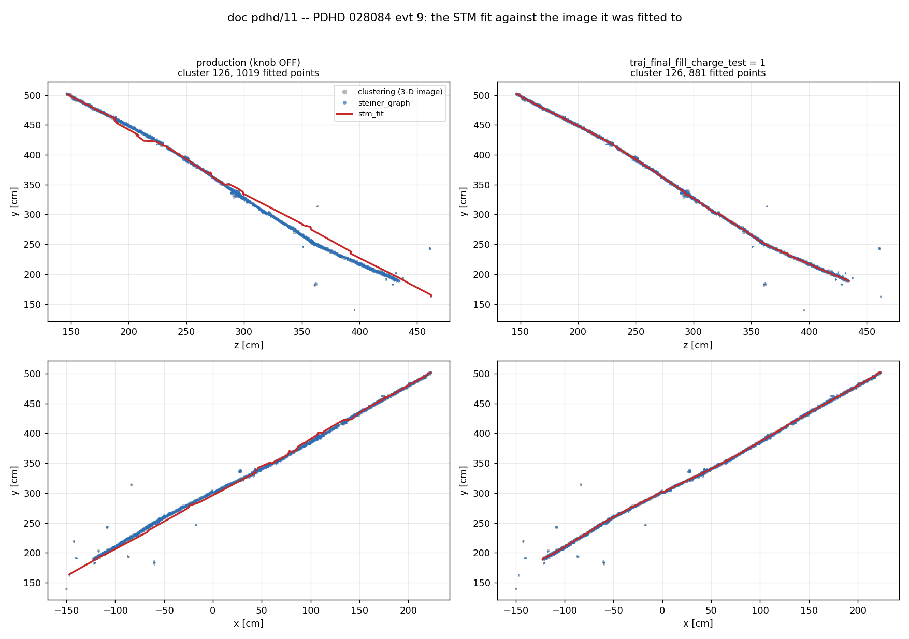

# PDHD doc 11 — the STM fit walks a Dijkstra stub, and the dot clusters are never unmerged

**Owner, 2026-09-07, on the [doc pdhd/10](10_apa2-charge-deficit.md) Bee links:**

> *"If you compare the stm_fit image vs. either stm image of Steiner Graph image, you can see they
> are not consistent. On the PDVD bee link, these three images are quite consistent. Note the track
> trajectory fit's initial seed is the shortest path walked on the Steiner Graph, so we expect the
> best fit point should be consistent with the original image. But this is not… follow
> (x, y, z) = (-67.2, 245.9, 369.0) cluster = 126"*
>
> *"…cluster 36 … is not a contineous track … a group of dots … at least the umerge should have
> separate them back to a lot of dots? Why it is not doing its job. … (-316.0, 258.5, 208.7)
> cluster = 27 and (129.4, 12.7, 222.1) cluster = 121 … I do not see a similar problem in the PDVD
> images"*
>
> *"can it also be a points ordering problem somehow related to the wrapped wires?"*
>
> *"We should [find] the fundamental problem, instead of doing a surface fix. Is it related to
> defect B somehow, for this straight edge issue? Or related to confusion in checking CTPC from
> different volume?"*

## The answers

**Question 1 — a silent Dijkstra failure, and it is one line of missing validation.**
`do_rough_path` walks `shortest_path(first, last)` on `"steiner_graph"` and **never checks that the
two vertices are in the same connected component**. When they are not, boost leaves
`predecessor[dst] == dst` and `ShortestPaths::path` (`Graphs.cxx:19-40`) returns the stub
`{src, dst, dst}` — two endpoints and no route. It is indistinguishable from a genuine 2-node path,
so the whole chain accepts it and interpolates a straight line between the two ends. Cluster 126's
1019-point "trajectory" across 592 cm of empty detector is that stub, interpolated.

**Question 2 — `unmerge_assoc` does its job. PDHD never runs it.** All four of the owner's dot
clusters split apart under `-unmerge` (§5.1). PDHD's defaults are off at both ends; PDVD's are on at
both. That is the PDHD/PDVD asymmetry.

**The owner's two candidates for question 1 both test negative, with numbers (§2.6).** It is not a
cross-drift-volume / CTPC confusion: of the 14 evt-9 passes carrying a long seed edge, **1** has an
edge straddling the cathode and **10** are in clusters that never leave one drift volume. And it is
not downstream of defect B: `separate` with its fiducial volume repaired leaves the seeding point
exactly where it was (§5.3). It is also not point ordering (§2.5) and not wire wrapping (§3.2).

**But the owner's instinct that this is an over-clustering problem is right.** The stub exists
because clustering glued a **single detached 3-D point, 45.4 cm from the nearest other point of the
same cluster**, onto the main cluster; the STM boundary finder picked that point as the track's
extreme; and that point carries its own 2-vertex Steiner component. `unmerge_assoc` — the same stage
question 2 is about — removes it, and the stub disappears with it. **One upstream defect, two
symptoms.**

| | what | fix in this doc | default |
|---|---|---|---|
| **R1** | clustering absorbs detached clumps into main clusters; PDHD never undoes it | *nothing new* — `unmerge_assoc` already exists and is already PDVD production | off on PDHD (runner) |
| **R2** | a cross-component Dijkstra query returns a stub instead of failing | `rough_path_require_connected` | **OFF** |
| **R3** | the final `organize_ps_path` fill is never charge-tested, so rejected points return | `traj_final_fill_charge_test` | **OFF** |
| **B** | `separate(drift_side_fv_x)` is silently inert on PDHD | `drift_side_fv_skip_degenerate` | **OFF** |

R2 is the fix for the owner's cluster 126. R3 is containment for a *different* family (objects that
are not tracks). R1 is the upstream cause of both and is already built. **R2 is not the cure either**:
it repairs a genuine query bug — a Dijkstra call that fails must not return a stub — but its remedy
still works around a cluster that clustering should never have built. Only R1 removes the cause. B is an independent real bug
found on the way, with a small measured effect. **No default is changed and no production output
moves** — every gate is in §6.

---

## 0. Repro

```bash
cd /nfs/data/1/xqian/toolkit-dev/wcp-porting-img/pdhd

# the trace (log-only: env var, no config key, no output change -- gate 5 in sec 6)
WCT_STM_PATH_DEBUG=1 ./run_pr_evt.sh -stm-fit -s d11trace2 028084 9
docs/scripts/d11_seed_census.py --log work/028084_9_d11trace2/wct_pr_028084_9.log \
        --out docs/figs/11_seed_census_evt9.tsv
grep STMGRAPH work/028084_9_d11trace2/wct_pr_028084_9.log     # the component anatomy

# the four PR arms of sec 4
./run_pr_evt.sh -stm-fit                                            -s d11off  028084 all
PDHD_PR_TLA="-S stm_rough_path_require_connected=true" \
  ./run_pr_evt.sh -stm-fit                                          -s d11conn 028084 9
WIRECELL_PATH=$PWD PDHD_PR_TLA="-A trackfitting_config=d11_track_fitting_fillcheck.json" \
  ./run_pr_evt.sh -stm-fit                                          -s d11on   028084 all
./run_pr_evt.sh -stm-fit -unmerge                                   -s d11um   028084 9
docs/scripts/d11_fit_image.py --label OFF "work/028084_*_d11off" \
                              --label ON  "work/028084_*_d11on" --out docs/figs/11_fit_image
docs/scripts/d11_plots.py --off work/028084_9_d11off --on work/028084_9_d11on \
        --cluster 126 --blocks docs/figs/11_fit_image_blocks.tsv --out docs/figs/11_cluster126.png

# defect B: the runtime proof and the 31-event A/B
WCT_SEP_DEBUG=1 ./run_clus_evt.sh -q -save-pctree -save-assoc -s d11sepoff 028084 9
PDHD_MAX_JOBS=8 ./run_clus_evt.sh -q -save-pctree -save-assoc -s d11sepoffA 028084 all
PDHD_MAX_JOBS=8 PDHD_CLUS_TLA="-S clus_drift_side_fv_skip_degenerate=true" \
  ./run_clus_evt.sh -q -save-pctree -save-assoc -s d11seponA 028084 all

# the PDVD control -- seed edges (sec 3.1 table 1)
cd ../pdvd && WCT_STM_PATH_DEBUG=1 ./run_pr_evt.sh -stm-fit -s d11vtrace 039252 16

# the PDVD component census (sec 3.1 table 2), on the SAME binary as every gate in sec 6.
# NOTE: the trace writes to STDOUT, which run_pr_evt.sh does not fold into wct_pr_*.log
# (that is an spdlog file sink) -- redirect the runner or the lines are lost.
cd ../pdvd && for e in 5 16; do
  WCT_STM_PATH_DEBUG=1 ./run_pr_evt.sh -stm-fit -s d11vgraph 039252 $e > /home/xqian/tmp/d11vgraph_$e.log 2>&1
  grep '^STMGRAPH' /home/xqian/tmp/d11vgraph_$e.log | grep -c 'same_comp=0'   # -> 0
done

# R2's own footprint (sec 4.3)
grep -h "re-anchoring" work/028084_*_d11both/wct_pr_028084_*.log
python3 docs/scripts/d08_tag_flips.py d11off d11on   028084
python3 docs/scripts/d08_tag_flips.py d11off d11both 028084
```

Binary pinned for the arms above: `local/lib/libWireCellClus.so` md5 `e3b1ea36a578070fd206f9a3f24a44df`,
2026-09-07T12:29:06, toolkit `0316086d` + this change. **Freshness proof (M1):** the library is newer
than every compiled source it contains — `TaggerCheckSTM.cxx` 12:28:33, `TrackFitting.cxx` 12:10:24,
`clustering_separate.cxx` 12:01:12. (Arms `d11off`/`d11on`/`d11sep*A` were taken on the intermediate
build md5 `a9b74d7ed52861d0fb12afbcc2d9b32b`, which differs from the final one only by R2, a knob
those arms do not set; the §6 gate re-runs knob-off on the **final** binary and reproduces production
byte-for-byte.)

---

## 1. It is the fit that moved, not the image

For every fitted point of a `T_rec_charge` block, the 3-D distance to the **nearest charge point
anywhere in the event** (the `clustering` Bee layer). Tolerance-free, and deliberately generous — a
fit that merely wandered onto a *neighbouring* object still scores well, so a large value means the
trajectory is in genuinely empty space (`docs/scripts/d11_fit_image.py`).

### 1.1 Cluster 126, the owner's coordinate

A 592 cm cathode-crossing muon over APA1 + APA2 + APA3, 1019 fitted points, status 3. Mean position
per 20 cm bin in y:

| y bin | image ⟨x,z⟩ | steiner ⟨x,z⟩ | terminals ⟨x,z⟩ | **fit** ⟨x,z⟩ | Δx | Δz |
|---|---|---|---|---|---|---|
| 180–200 | −111.4, 422.6 | −113.7, 424.5 | −111.2, 422.3 | **−118.4, 437.7** | +7.1 | **−15.1** |
| 240–260 | −61.3, 366.2 | −60.7, 364.9 | −60.6, 367.1 | **−52.3, 381.2** | −9.0 | **−15.0** |
| 260–280 | −37.9, 346.6 | −38.1, 346.9 | −37.1, 346.1 | **−31.4, 363.4** | −6.5 | **−16.9** |
| 300–320 | 7.8, 315.2 | 9.5, 314.4 | 9.0, 314.5 | 15.9, 324.2 | −8.1 | −9.1 |
| 360–380 | 83.3, 267.3 | 83.5, 267.4 | 83.3, 267.4 | 81.5, 268.1 | +1.8 | −0.8 |
| 480–500 | 210.0, 158.6 | 209.3, 159.3 | 210.0, 158.6 | 209.8, 158.7 | +0.2 | −0.1 |

**`clustering`, `steiner_graph` and `steiner_terminals` agree with one another to under 2 cm in every
bin, in both drift volumes. Only `stm_fit` departs.** The owner's coordinate (−67.2, 245.9, 369.0) is
**19.0 cm** from the nearest fitted point.

Four facts close off every mapping explanation:

- **96.8 %** of the cluster's 2867 APA2 image points land on a live ctpc cell (±2 slices) — image,
  ctpc and Steiner path are mutually consistent.
- The fit's own 3-D↔2-D relation is exact: `pw = 2.08681·z + const`, `x = 0.31520·pt + const` per
  APA, **residual 0.0000**.
- The fit is a straight chord: max **4.58 cm** from its own end-to-end line over **591.8 cm**.
- Its APA2 points sit on charge from *any* cluster with probability 0.036/0.005/0.023 (U/V/W) at
  ±2 slices and only **0.308/0.079/0.162 at ±32 slices (±10.1 cm)** — against APA1 0.804/0.967/1.000
  and APA3 0.598/0.816/0.701.



### 1.2 The population, 31 events of run 028084

683 blocks of ≥ 20 points, every accepted and rejected STM pass:

| | median-of-medians | blocks with median > 3 cm | mean frac > 10 cm | mean negative dQ/dx |
|---|---|---|---|---|
| all 683 | 0.56 cm | **147 (21.5 %)** | 0.113 | 0.231 |
| **accepted only (status 0), n = 153** | **1.10 cm** | **45.8 %** | 0.190 | **0.344** |

The **accepted** passes are the worst of every status class (rejected statuses 2/3/4/5/7 all sit at
0.51–0.59 cm median). So this is not a display artifact of `stm_fit` drawing rejected fits: it is
worst exactly where the tagger says the fit is good. PDVD control (`039252_{5,16}_d42fit`):
median-of-medians **0.50 cm**, one bad cluster in 43.

---

## 2. The trace, and the root cause

The chain had no per-stage dump, so one was added: **`WCT_STM_PATH_DEBUG`**, `getenv`-gated,
log-only, no config key — the pattern of `WCT_SEP_DEBUG` (`clustering_separate.cxx:30`). It prints
the trajectory after every stage of `TrackFitting::do_single_tracking`, plus one `STMGRAPH` line per
`do_rough_path` call giving the Steiner graph's anatomy.

### 2.1 The `STMGRAPH` line names the bug

Event 9, 23 rough-path calls. Twenty-two look like this:

```
STMGRAPH cluster=125 nvert=5000 nedge=10908 ncomp=1 biggest_comp=5000 same_comp=1 npath=519
```

One does not:

```
STMGRAPH cluster=126 nvert=5086 nedge=9387 ncomp=2 biggest_comp=5084 src_comp=1 dst_comp=0 same_comp=0 npath=3
```

The Steiner graph of cluster 126 has **two** components: the track (5084 vertices) and a **2-vertex
island**. The path's **source is in the island and its destination is in the track.** Dijkstra cannot
connect them — and does not say so. `ShortestPaths::path` walks the predecessor chain, boost's
convention for an unreachable vertex is `predecessor[v] == v`, the loop breaks immediately, and the
function returns `{source, destination, destination}`. Exactly what the trace shows:

```
STMPATH 126/fwd/r1 seed 0  -147.276  162.785  462.057
STMPATH 126/fwd/r1 seed 1   223.354  503.044  146.715
STMPATH 126/fwd/r1 seed 2   223.354  503.044  146.715      edges: 593.8, 0.0 cm
```

**A 593.8 cm "shortest path" with no intermediate node is not a path. It is a failed query returned
as a success.**

### 2.2 Why the source is on an island: one detached point

The start vertex sits at (−147.0, 161.7, 462.1). In cluster 126's 6950-point cloud that position is
a **single 3-D point whose nearest neighbour inside the same cluster is 45.4 cm away** — a lone
detached hit at the far end of the track, absorbed into the main cluster by `clustering_isolated`
(the merge doc pdhd/06 §2 documents PDHD doing on every event). `cluster_fc_check` →
`get_two_boundary_steiner_graph_idx` legitimately reports it as the cluster's extreme point, and the
retiler gave it its own 2 Steiner vertices, disconnected from everything else.

So the chain is:

```
clustering_isolated absorbs a lone point 45.4 cm off the track  (never undone on PDHD)
   -> the STM boundary finder makes it the track's start
      -> it is its own 2-vertex Steiner component
         -> shortest_path returns the stub {src, dst, dst}
            -> organize_orig_path interpolates 496 points along it
               -> form_map drops most; the fit keeps 389
                  -> the FINAL organize_ps_path re-inserts 641 untested
                     -> 1019 points across 592 cm of empty detector
```

### 2.3 The amplifier: the last fill is never charge-tested

`126/fwd/r2`, stage by stage: `seed` 4 → `org1` 496 → `map1` 189 → `fit1` 150 → `org2` 1021 →
`map2` 473 → **`fit2` 389** → **`org3` 1030** → `final` 1019.

`organize_ps_path`'s middle resample (`TrackFitting.cxx:2812-2823`) straight-line-fills every gap,
and **between that call at `:10079` and the `PR::Fit` construction at `:10327` there is no
`form_map`, no `examine_point_association` and no `skip_trajectory_point`.** A point `form_map` had
already rejected for carrying no charge on any plane is re-created by interpolation and reaches
`stm_fit`, `T_rec_charge` and the dQ/dx fit. **The chain decides a point has no support, drops it,
then puts it back untested.**

That is why the negative dQ/dx follows: `dQ_dx_fit`'s smoothness term is weighted *up* where data is
missing (`+0.3` per dead induction plane, `+0.9` collection, `:9026-9028`), so a point with no cells
of its own has its charge interpolated from neighbours and the residual can take either sign.

### 2.4 A second, different family: objects that are not tracks

Six of evt 9's seven bad blocks are **not** the stub bug — their `STMGRAPH` shows one component and a
sensible path. They are the dot clusters of question 2: cluster 118 has **10** image points and was
fitted with **86**; cluster 98 has 51 and was fitted with 190; cluster 51 has 37 and 167; cluster 36
is 190 points in **18 dot groups** over 339 cm. Their Steiner graph legitimately hops between dots,
and §2.3's untested fill turns the hops into a continuous track.

**Two families, two depths.** The stub is a hard bug in the fitter (R2). The dotty objects are a
clustering problem (R1/question 2); R3 only stops the fitter from fabricating a track across them.

### 2.5 The ordering hypothesis: answered, negative

Not ordering, for two independent reasons. The output excludes a *scramble*: the fit is smooth and
monotone in `rr` with both ends anchored (1.76 cm and 0.23 cm from the image), which a shuffled point
list does not produce. And the trace shows the order is correct at every stage — the seed's points
are in track order; the defect is that there are only two of them. What the hypothesis was reaching
for is real but is **interpolation, not reordering**.

### 2.6 The two candidates in the owner's follow-up: both negative

**Not a cross-drift-volume / CTPC confusion.** Evt 9, the 14 round-1 seeds carrying an edge > 20 cm:
the long edge straddles the cathode in **1** of them, and **10 of the 14 affected clusters never
leave one drift volume** (48 at 128.8 cm, 121 at 66.3, 110 at 63.0, 47 at 59.0, 50 at 58.8, 41 at
54.8, 20 at 53.4, 36 at 51.5, 25 at 49.1, 98 at 41.1 — all single-volume). Cluster 126 is a cathode
crosser, but that is incidental: its stub spans the whole track, not the cathode.

**Not downstream of defect B.** With `drift_side_fv_skip_degenerate` on, the detached point that
seeds the stub is **still in the same cluster**, with the same 6950 points and the same 45.4 cm
isolation, in both arms (§5.3). `separate` is not the stage that would remove it — `unmerge_assoc`
is, and it does (§5.1).

---

## 3. Why PDHD and not PDVD

### 3.1 The seeds

Same trace, PDVD run 039252 events 16 and 5 (39 round-1 seeds) against PDHD 028084 evt 9 (23):

| | PDVD | PDHD |
|---|---|---|
| median longest seed edge | **4.8 cm** | **49.1 cm** |
| p90 / max | 36.5 / 114.1 cm | 65.6 / **593.8** cm |
| seeds with an edge > 20 cm | 8 / 39 (21 %) | **15 / 23 (65 %)** |
| median seed nodes | 251 | 86 |
| seeds with ≤ 5 nodes | **0 / 39** | **3 / 23** |

The mechanism is detector-agnostic code. What differs is the input: PDVD runs `unmerge_assoc` by
default at both ends (doc pdhd/06 §"Producer/Consumer"), so detached clumps do not sit inside main
clusters, so boundary points land on the track and the Steiner graph is one component.

**That last clause is measured, not inferred** (added after the first draft, which asserted it).
The `STMGRAPH` diagnostic of §2.1 was re-run on PDVD on the same binary
(`libWireCellClus.so` md5 `e3b1ea36a578070fd206f9a3f24a44df`, 12:29 — the build every gate in §6 was
taken on), arm `d11vgraph`:

| | PDVD 039252 evt 5 + evt 16 | PDHD 028084 evt 9 |
|---|---|---|
| STM seed queries traced | 42 | 23 |
| queries on a **single-component** graph (`ncomp=1`) | **42 / 42** | 22 / 23 |
| **disconnected queries** (`same_comp=0` ⇒ stub) | **0** | **1** — cluster 126 |
| shortest walked path | 11 nodes | **3 nodes** (the stub) |

So the bug is *latent* on PDVD, not absent: the same unvalidated query runs there, and in this
sample it is never handed a disconnected pair. Two events / 42 queries is a thin sample and the
claim is bounded by it — it is a demonstration that PDVD's graphs are whole, not a proof that they
always are.

### 3.2 Two premises to correct

- **PDVD is not unwrapped.** `protodunevd/clus.jsonnet:204-207`: 1568 U/V wires (11.3 %) wrap at the
  CRU boundary; PDHD wraps 1148 wires onto 800 channels — 65 % of an imaging face
  (`pdhd/clus.jsonnet:160-166`). Both wrap; PDHD ~6× harder. **Nothing in this document is a wrapping
  defect.** The genuine binary difference is *two faces per anode with one insensitive*, and that
  drives §5.2 only.
- **Drift-parallel over-clustering is not more common on PDHD.** Clusters ≥ 50 points with
  `Δx > 150 cm, Δy < 60, Δz < 60`: PDHD 028084 **11 / 1266 = 0.87 %**; PDVD 039252
  **37 / 1146 = 3.23 %**. PDVD has *more*. What differs is that PDVD un-merges them.

### 3.3 A tolerance caveat for doc 10's numbers

Doc pdhd/10 §3 compared per-point wire coverage at ±2 time slices on both detectors. That window is
**0.63 cm on PDHD** (0.3152 cm/slice) and **0.59 cm on PDVD** (0.2961 cm/slice, measured the same way
from `T_rec_charge`) — 6 %, far too small to manufacture 0.49 vs 0.95, so doc 10's contrast survives.
But the window is *tighter than the fit's own precision*, which is why this doc leads with a
tolerance-free 3-D measure instead.

---

## 4. The fix ladder, measured

All four arms are the same pctree (`028084_9_d09`) and the same event; only the knob differs.
`med>3cm` counts blocks whose median fit-to-charge distance exceeds 3 cm.

| arm | blocks | points | med-of-med | **med > 3 cm** | mean frac > 10 cm | mean negative dQ/dx |
|---|---|---|---|---|---|---|
| **OFF** (production) | 22 | 9725 | 0.75 cm | **7** | 0.167 | 0.249 |
| **R2** `rough_path_require_connected` | 22 | 9583 | 0.67 cm | **6** | 0.152 | 0.240 |
| **R3** `traj_final_fill_charge_test` | 21 | 8088 | 0.56 cm | **0** | 0.042 | 0.197 |
| **R1** `-unmerge` (existing machinery) | 17 | 5572 | 0.50 cm | **2** | 0.094 | **0.105** |
| R2 + R3 | 21 | 8084 | 0.56 cm | **0** | 0.042 | 0.197 |

Read it as a ladder, not a contest:

- **R2 changes exactly one block** — 1260, from 5.02 cm to **0.51 cm**, frac > 10 cm 0.33 → **0.00**,
  negative dQ/dx 0.22 → **0.02**. Everything else in the event is untouched. It is the cure for the
  owner's coordinate and it fires **once per event**. The re-anchor is logged:
  `do_rough_path: cluster 126 start vertex is in Steiner component 1 but the end is in 0;
  re-anchoring the start 45.2 cm to the nearest vertex of the end's component`. The seed goes
  **3 → 806 points** and the chain becomes healthy (`map1` keeps 494 of 499, was 189 of 496).
- **R3 removes all seven**, because it is a filter on the output rather than a fix of the cause. It
  is what stops §2.4's family being fabricated into tracks. Cluster 118 goes from 86 fitted points on
  10 image points to **6** — the fix working, not a loss.
- **R1 gives the lowest negative dQ/dx by far (0.249 → 0.105)** because it removes the junk objects
  instead of fitting them: 22 blocks → 17. But it has a known regression of its own — block 360
  (cluster 36) gets **worse** (5.2 → 13.3 cm), which is doc pdhd/06 §8.4's gutted-main case
  reproducing exactly. **That is why R1 is not proposed for a flip here.**

### 4.1 The owner's four objects, evt 9 (OFF → R3)

| cluster | n | median fit→charge | frac > 10 cm | negative dQ/dx | status |
|---|---|---|---|---|---|
| **126** | 1019 → 881 | **5.02 → 0.53 cm** | 0.33 → **0.00** | 0.22 → **0.02** | 3 → 7 |
| **36** | 660 → 165 | 5.19 → 1.23 | 0.21 → 0.12 | 0.80 → 0.57 | 0 → 0 |
| **27** | 241 → 180 | 3.45 → 1.53 | 0.21 → 0.11 | 0.44 → 0.47 | 0 → 0 |
| **121** | 326 → 248 | 0.75 → 0.61 | 0.22 → **0.00** | 0.19 → 0.24 | 7 → 7 |

### 4.2 R3 over 31 events, and the verdicts

| | OFF | R3 |
|---|---|---|
| blocks / points | 683 / 273 000 | 662 / 242 371 (−11 %) |
| blocks with median > 3 cm | **147 (21.5 %)** | **45 (6.8 %)** |
| mean frac > 10 cm | 0.113 | 0.055 |
| mean negative dQ/dx | 0.231 | 0.184 |
| **accepted (status 0)** | n = 153, med 1.10 cm, **45.8 %** > 3 cm | n = **167**, med **0.58 cm**, **12.0 %** > 3 cm |

**Verdicts move and the sign is NOT graded.** STM-tagged objects matched as a set, not by count
(`feedback_count_vs_set_census`): **161 → 191 — 157 unchanged, 4 lost, 34 gained**, over 21 of 31
events. This is **R3's footprint alone**: the OFF→R3 and OFF→BOTH censuses are identical row for row
(§4.3), so every tag that moves here is moved by the fill test.
Mostly additive and consistent with 14 more accepted passes, but **no hand scan was done**. Read it
as "the tags move and the surviving trajectories now sit on charge", not as an improvement. The scan
of the 34 gained and 4 lost is the grading step (§9).

### 4.3 R2's own footprint over 31 events

R2 changes where a trajectory *starts*, and for a **stopping**-muon tagger the endpoint is the
observable — so a re-anchor is only correct when the extreme it discards is junk (an unrelated
detached hit, as in cluster 126) and not the muon's real end behind a dead region. That distinction
is not visible in the fit→charge metric, so R2 is measured separately here.

```
grep -h "re-anchoring" work/028084_*_d11both/wct_pr_028084_*.log
python3 docs/scripts/d08_tag_flips.py d11off d11on   028084   # R3 only
python3 docs/scripts/d08_tag_flips.py d11off d11both 028084   # R2 + R3
```

| | measured |
|---|---|
| events in which R2 fires | **1 of 31** (evt 9, cluster 126) |
| re-anchor distances | a single value, **45.2 cm** — no second firing, no tail |
| STM tags gained / lost vs OFF→R3 | **0 / 0** — the two censuses are identical |
| TGM, FC | 885 → 885, 1063 → 1063, zero flips in both arms |

So over this sample R2's verdict footprint is **empty**: it repairs the owner's trajectory and moves
no tag anywhere, on any of the three taggers. That is the reassuring reading. The honest one is that
**n = 1** — a fault this rare cannot have its tail characterised from 31 events, and the case that
would worry me (a re-anchor of 150+ cm silently truncating a real stopping muon) is *unobserved*,
not *excluded*. Any flip of R2 to production should carry a firing-rate and distance monitor.

---

## 5. Question 2: the dot clusters

### 5.1 `unmerge_assoc` splits all four of them

`./run_pr_evt.sh -stm-fit -unmerge -s d11um 028084 9` on the same pctree (which already carries the
provenance, `save_assoc_id=true`):

| owner's coordinate | production | with `-unmerge` |
|---|---|---|
| cluster **36** | 190 pts, **339.5 cm** x-span, **18 dot groups** | cluster 185, **6 pts**, 1.3 cm |
| cluster **27** (−316.0, 258.5, 208.7) | 419 pts, 53.9 cm, 3 groups | cluster 157, **57 pts**, 2.5 cm |
| cluster **121** | 1093 pts, 77.2 cm | cluster 323, **21 pts**, 5.7 cm |
| cluster **27** (−311.2, 256.7, 203.5) | the same 419-pt object | cluster 155, **19 pts**, 2.2 cm |

**It does exactly what the owner expected — it separates them back into a lot of dots. It simply
does not run on PDHD.** Producer and consumer are both off (`run_clus_evt.sh` `PDHD_SAVE_ASSOC=0`,
`run_pr_evt.sh` `UNMERGE=0`); PDVD has both on by default. And in the same arm the cluster-126 stub
disappears — no `same_comp=0` line remains — because the detached point becomes its own cluster 350.

**It is still not proposed for a PDHD default**, for the reason already on file: doc pdhd/06 §9
item 1 blocks it until its §8.4 false-STM-tag case is settled, and §4 above reproduces that
regression on cluster 36. Doc pdhd/06 §8.3's retiler bounding-box pull is a second open limitation.

### 5.2 A separate real bug found on the way: `separate`'s fiducial volume is wrong on PDHD

`Facade::select_scope_fv` (`clustering_separate.cxx:78-99`) adopts a drift group's own x-window only
if **every** configured face agrees on `FV_xmin`/`FV_xmax`. `dv->wpident_faces()` is built from every
*geometry* face of every configured anode (`aux/src/DetectorVolumes.cxx:85-95`), and
`Gen::AnodePlane` constructs both faces even when the jsonnet declares one `null`
(`gen/src/AnodePlane.cxx:160-163`). PDHD declares exactly that (`params.jsonnet:68-94`) and gives the
wall face a **degenerate** block (`pdhd/clus.jsonnet:88-101`): `FV_xmin == FV_xmax == −357.985 cm`.
One disagreement is enough, so `common = false` and the pass falls back to `overall` — **±357.985 cm,
the whole cryostat, both drift volumes.**

Proved at runtime, not read off the source (`WCT_SEP_DEBUG=1`, new `SEPDBG scopefv` line):

```
SEPDBG scopefv drift_side_fv_x=1 x=[-357.985,357.985] y=[22.61,591] z=[15.2343,447.297]
SEPDBG scopefv_face apa=0 face=0 x=[-357.985,-2.54]     degenerate=0
SEPDBG scopefv_face apa=0 face=1 x=[-357.985,-357.985]  degenerate=1
SEPDBG scopefv_face apa=2 face=0 x=[-357.985,-2.54]     degenerate=0
SEPDBG scopefv_face apa=2 face=1 x=[-357.985,-357.985]  degenerate=1
```

So `separate(drift_side_fv_x=true, far_point_x_cut=14 cm, far_point_mid_dis=60 cm)` — configured
**character-for-character identically** on PDHD (`clus.jsonnet:515-519`) and PDVD (`:550-554`) — is
**live on PDVD and inert on PDHD**. This is the failure mode `clustering-separate-fv-27409.md`
diagnosed and commit `ee054213` was written to fix: with the fiducial volume covering both drift
volumes no cluster has points outside it in x, `JudgeSeparateDec_2`'s surface-contact count is
starved, and crossing cosmics stay one cluster. **On PDHD that fix has never taken effect.** The
comment at `pdhd/clus.jsonnet:116-117` ("The off-scope entries are inert for clustering decisions")
is false for this path.

`drift_side_fv_skip_degenerate` (C++ default `false`) makes `select_scope_fv` ignore face blocks
whose x-range is degenerate — such a block belongs to a face that names no drift volume, so it cannot
speak for one. With it on the same print gives `x=[-357.985,-2.54]` for group02 and `x=[2.54,357.985]`
for group13. The `dvm` metadata is deliberately **not** touched: `Grouping::fill_dv_cache` reads
drift parameters from every geometry face, so deleting the wall-face block would silently zero them.

### 5.3 What it does — and what it does not

31 events of run 028084, clustering A/B:

| | clusters | points | drift-parallel objects (Δx>150, Δy<60, Δz<60) |
|---|---|---|---|
| OFF (production) | 2988 | 3 640 647 | 12 |
| ON | **3001** (+13, +0.4 %) | 3 662 603 (+0.6 %) | 11 |

16 of 31 events change their cluster count, by −3 to +3. **The effect is small, and it does not solve
the dot clusters** — `separate` runs at the drift-group stage on clusters longer than 100 cm, which
is not the population `clustering_isolated` builds. It also leaves cluster 126's detached point
exactly where it was (§2.6). The point-count rise is not traced; it is downstream stages
(`connect1`/`deghost`/`isolated`) seeing a different partition, not `separate` creating points.

So: a real bug, correctly fixed, **with a modest measured effect and no claim beyond that.**

---

## 6. Gates

| # | gate | result |
|---|---|---|
| 1 | compiled **clustering** config, all knobs off, vs HEAD | **byte-identical**, md5 `ad4a9cfb8afc5b6ad793bfca99b0b38e` both sides |
| 2 | compiled **PR** config, all knobs off, vs HEAD | **byte-identical**, md5 `e6b985a78cf4a93eb881cd66cefbbf7e` both sides |
| 3 | compiled-config proof, knobs on (M6) | `drift_side_fv_skip_degenerate` present on `group02` + `group13`; `rough_path_require_connected` present on `TaggerCheckSTM:pr`; both absent at HEAD |
| 4 | runtime, **PR** knob-off, final binary vs production `d30hpost`, evt 9 | **identical member content** `f90f31ea3f716699afc7ce4bf6979748d87ff118eb71b54868e0ba417175acd1` |
| 5 | runtime, **PR** knob-off, all **31 events** vs `d30hpost` | **31 / 31 identical** (`hash_archive.py`, arm `d11off`) |
| 6 | runtime, **clustering** knob-off vs production `d09`, evt 9 | **identical** `11053bee2cea1cc1f5d5937b3ea1dad11d02c5aeb63a92977db9ac7e4239d8bd`; knob on differs (`d67d9ff3…`) |
| 7 | `T_rec_charge` with the trace on vs production | **identical** md5 `d550f311f37a618ba3e50a85edc6e671`, 9725 rows — the instrumentation changes nothing |
| 8 | `./build/clus/wcdoctest-clus` | **334 / 334 passed**, 0 failed |
| 9 | freshness proof (M1) | lib 12:29:06 newer than every source; md5 `e3b1ea36a578070fd206f9a3f24a44df` |

**Cross-detector.** `clustering_separate` is also bound by `protodunevd` and `sbnd`, and
`TaggerCheckSTM` by all three. Neither detector's compiled config gains either key (gate 3 checks
HEAD-vs-work on the PDHD compile; the jsonnet uses the key-suppression idiom, so an unset argument
emits nothing anywhere). PDVD's own runtime knob-off arm was **not** re-run — the nearest PDVD
clustering arms on disk are from 09-03/09-04, several toolkit commits back, so a comparison against
them would fail for unrelated reasons (`feedback_check_the_cfg_epoch_between_arms`). **Stated as a
gap**, not papered over; the PDHD runtime gates (4–6) exercise the same code paths in a 4-APA,
two-faces-per-anode configuration.

---

## 7. Not fixed here

1. **`unmerge_assoc` on PDHD** — the upstream cause of both symptoms, machinery already built and
   already PDVD production. Blocked by doc pdhd/06 §9 item 1, and §4 reproduces the regression.
2. **The Steiner edge weight prices charge only at its two endpoints**, over a bounded [0.8, 1.2]
   range (`SteinerGrapher.cxx:1385-1391`). `steiner_graph_gap` fixes this and is shipped, but
   `TaggerCheckSTM.cxx:1116` hardcodes the base flavour, so STM cannot use it. Independent of the
   stub bug — worth its own round.
3. **The retiler's bounding-box pull** (doc pdhd/06 §8.3) and the uncapped path painting
   (doc pdhd/08) — why a split may not reach the Steiner build.
4. **A cross-component Dijkstra query returning a stub is arguably never correct**, on any detector,
   and §3.1 shows the same unvalidated query runs on PDVD. R2 is knobbed here because a hard fix
   changes output; whether it should instead be unconditional is an owner decision.
5. **R2's remedy is a policy choice, and the conservative alternative was not taken.** Two responses
   to "the endpoints are in different components" are defensible: *re-anchor* to the nearest vertex
   of the destination component (what R2 does), or *fail* — return an empty path and let
   `check_stm_conditions` give up, which it already handles (it bails on a ≤ 3-point fit). Failing
   never invents an endpoint, so it cannot truncate a real stopping muon; re-anchoring keeps the
   pass alive and recovers a usable trajectory, which is what the owner's cluster 126 wanted. I
   chose re-anchor for that reason and because it is the one that produces a *visible* fix in the
   Bee comparison — but on a stopping-muon tagger the case for failing is real, and it is a one-line
   change from here.
6. **Whether the seeding point should exist at all is untested.** A single blob 45 cm from every
   other point of its cluster is also what `clustering_deghost` exists to remove. This doc locates
   the *merge* that glued it onto cluster 31 and the *query* that then broke on it; it does not ask
   whether imaging should have made the point. If it is a ghost, the root is one stage further
   upstream than R1.
7. Doc pdhd/10's APA2 coverage numbers stand; §3.3 adds the tolerance caveat, and §2 supplies the
   mechanism doc 10 could only describe.

---

## 8. Bee links

Same six events, same slot order, same pctree; only the two default-OFF knobs differ. Slot **3 is
event 9**, which carries all four of the owner's clusters. All six layers verified from the server's
own contents listing, not from a URL probe (`feedback_bee_layer_url_200_when_missing`): `clustering`,
`stm`, `stm_fit`, `stm_tagged`, `steiner_graph`, `steiner_terminals`, plus `channel-deadarea-*`.

| | link |
|---|---|
| **before** — production, both knobs off (`d11off`; byte-identical to `d30hpost` on 31/31 events, gate 5) | https://www.phy.bnl.gov/twister/bee/set/a0dc6dac-19fb-4f51-95e3-75d04221c9b6/event/list/ |
| **after** — `rough_path_require_connected` + `traj_final_fill_charge_test` (`d11both`) | https://www.phy.bnl.gov/twister/bee/set/99ca3205-b4a1-4f1e-8ff1-8d7c4e1b6935/event/list/ |

| slot | event | DAQ ident | blocks with median fit→charge > 3 cm, before → after |
|---|---|---|---|
| 0 | 6 | 28084-0-74456 | 12 → 3 |
| 1 | 7 | 28084-0-74464 | 7 → 1 |
| 2 | 8 | 28084-0-74472 | 9 → 0 |
| **3** | **9** | **28084-0-74480** | **7 → 0** — clusters 126, 36, 27, 121 |
| 4 | 19 | 28084-0-74560 | 6 → 0 |
| 5 | 29 | 28084-0-74640 | 8 → 2 |

Records: `pdhd/bee-pr-run028084-d11{before,after}.{url,index.txt}`.  The doc pdhd/10 sets stay valid
and are a different comparison.

---

## 9. Recommended next step

**Blind-scan the 34 gained and 4 lost STM tags of §4.2**, on the R3 arm, with the `stm_fit` layer
overlaid on `clustering` so the scan judges the trajectory and not only the verdict
(`feedback_scan_display_must_show_the_evidence`). §4.3 narrows what that scan decides: the 34/4 are
**R3's**, so the scan grades R3 and only R3.

That splits the ladder into two independent decisions:

- **R3** is the one the scan gates. It changes 30 net verdicts across 21 of 31 events; nothing
  should flip until those are graded.
- **R2** moves no tag on any of the three taggers over 31 events (§4.3) and repairs the owner's
  cluster 126. It can be decided on its own merits — but on **n = 1 firing**, so the honest
  precondition is a wider sample (more runs, or PDHD events beyond 028084) with the re-anchor
  distance logged, plus the §7.5 choice of whether failing the query is the better remedy than
  re-anchoring it for a stopping-muon tagger.
- **R1** (`unmerge_assoc`) remains the only fix that removes the cause of both symptoms, and stays
  queued behind doc pdhd/06 §9 item 1.
