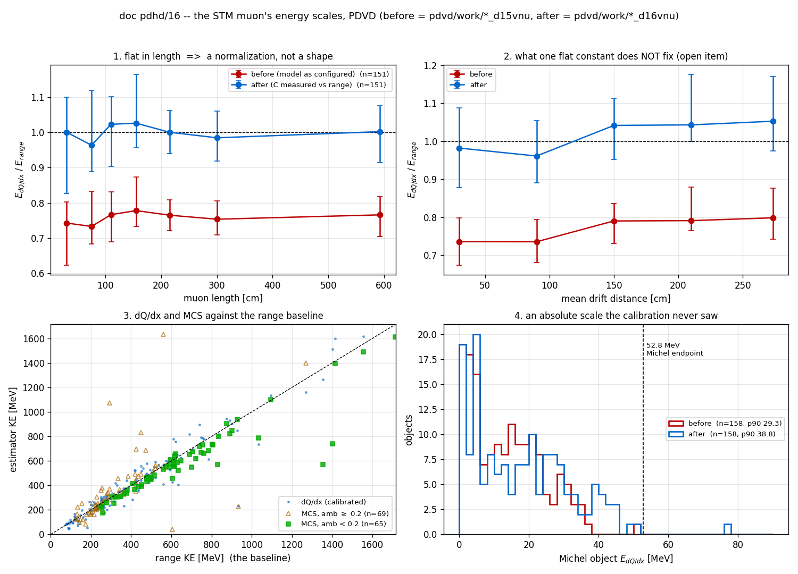
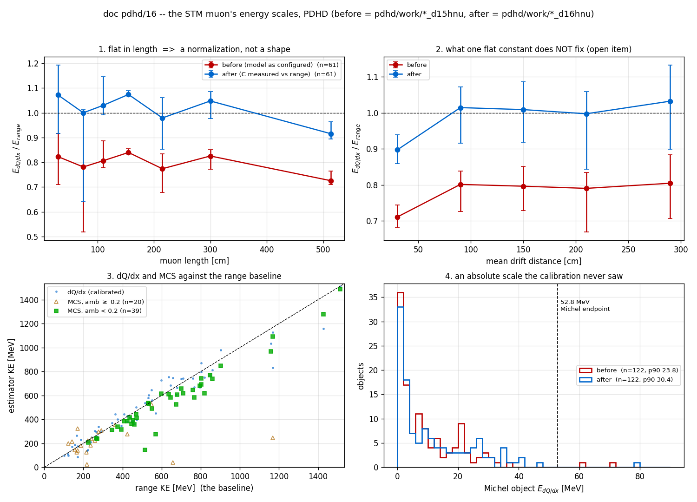

# The STM muon's three energy scales — doc pdhd/16

**Status: NOT bit-identical, and deliberately so.** `T_stm_michel` goes from
**88 branches to 97**. Nine are new (MCS and the three momenta). Six existing
ones move — `muon_ke_dqdx`, `michel_ke_dqdx`, `michel_ke_core`,
`dots_ke_dqdx`, `michel_ke_best`, and `muon_ke_best` below 4 cm — because
`check_stm_michel`'s dQ/dx → dE/dx inverse now carries the normalization its
own PID tables were built with. They are the *only* six: §6.2's before/after
census asks **all 80** pre-existing scalar branches on all 579 / 325
candidates, and 74 come back bit-identical. **No
verdict moves**: `is_stm`, `reject_bits`, `contrast`, `plateau_med`, `ks_mu`,
`muon_len` are bit-identical candidate by candidate (§6), and the STM and
neutrino taggers keep the uncalibrated recombination instance untouched.

**Follow-up, same day: §9** audits the MCS cathode band on both ProtoDUNEs,
builds the negative control this doc never had (the band turned *off*), and
adds two branches — 97 → **99** — so the excision is auditable on every future
arm. No band value changed.

Owner ask, 2026-09-08: *"integrate the MCS so that we can provide the MCS
momentum estimation for the STM … the range estimation of muon energy is the
baseline … the inverse of this recombination model should be what we can use to
do dQ/dx → dE/dx conversion … the key question is whether this dQ/dx → dE/dx
energy estimation of muon agrees with the range estimation? If not, we need to
iterate on the recombination model."*

**The answer, in three lines.** It did not agree: the dQ/dx energy sat at
**0.765** of the range energy. The cause is not the drift field — that lever is
~1.5 % across 0.40–0.60 kV/cm and above 0.45 it pushes the *wrong way* — it is
the **×0.85 the PID tables carry and the recombination model has no slot for**,
times the charge the reconstruction does not recover. One measured
normalization `C` closes it, and the same number falls out of doc pdvd/50's
independent differential comparison.

**Follow-up:** doc pdhd/17 (2026-09-08) re-asks this round's model question
forward *and* backward, splits `C` into its two measured halves
(0.828 model x 0.921 charge on PDVD), and amends §6.2 below.

## Repro

```bash
# the C++ and the model identity
cd /nfs/data/1/xqian/toolkit-dev/toolkit && wcbuild
./build/gen/wcdoctest-gen && ./build/clus/wcdoctest-clus && ./build/mcs/wcdoctest-mcs

# the fit, on arms already on disk -- no new arm needed to MEASURE C
cd /nfs/data/1/xqian/toolkit-dev/wcp-porting-img
python3 pdhd/docs/scripts/d16_stm_energy_scales.py --det pdvd \
    --arm 'pdvd/work/*_d15vnu' --out /home/xqian/tmp/d16/d16v_pre
python3 pdhd/docs/scripts/d16_stm_energy_scales.py --det pdhd \
    --arm 'pdhd/work/*_d15hnu' --exclude-apa0 --out /home/xqian/tmp/d16/d16h_pre

# the shipping arms.  RUN NO WAF TARGET WHILE THESE ARE LIVE -- not `install`,
# not even a plain `./wcb build`: the runner's plugin search reaches
# build/<pkg>/ as well as local/lib, so relinking build/ truncates the .so the
# live jobs are dlopening (it cost 20 of 31 PDHD events in doc pdhd/15).
ARM=d16vnu DET=pdvd SRC=d15vnu JOBS=8 pdhd/docs/scripts/d16_run_arms.sh
ARM=d16hnu DET=pdhd SRC=d15hnu JOBS=8 pdhd/docs/scripts/d16_run_arms.sh

# the closure, the before/after branch census and the figure
python3 pdhd/docs/scripts/d16_stm_energy_scales.py --det pdvd \
    --arm 'pdvd/work/*_d16vnu' --compare 'pdvd/work/*_d15vnu' \
    --out /home/xqian/tmp/d16/d16v
python3 pdhd/docs/scripts/d16_stm_energy_scales.py --det pdhd \
    --arm 'pdhd/work/*_d16hnu' --compare 'pdhd/work/*_d15hnu' \
    --out /home/xqian/tmp/d16/d16h
python3 pdhd/docs/scripts/d16_energy_plots.py --det pdvd \
    --before 'pdvd/work/*_d15vnu' --after 'pdvd/work/*_d16vnu' \
    -o pdhd/docs/figs/d16_energy_scales_pdvd.png

# the display
cd pdhd/stm_michel_scan
./prep_stm_michel_scan.py --det pdvd \
    --pin-tranche HEAD:pdvd/docs/scan/pdvd_stm_michel_scan_sheet.tsv
./selftest_stm_michel_scan.py            # group [O] is this round
```

---

## 1. The comparator already existed

`CheckSTM_Michel.cxx:1096-1097` has written both estimators for the same muon
since doc pdhd/14:

```cpp
rec.muon_ke_range = cal_kine_range(rec.muon_len, 13, particle_data()) / units::MeV;
for (auto& s : chain) rec.muon_ke_dqdx += segment_cal_kine_dQdx(s, m_recomb_model) / units::MeV;
```

`cal_kine_range` (`PRSegmentFunctions.cxx:2673`) is a lookup in the CSDA
range → KE table (`protodunevd/particle_dataset.jsonnet:146`,
`muon_range_function`, 1067 points, byte-identical across all three
detectors — it is the one table that does **not** depend on drift field or
charge calibration). `segment_cal_kine_dQdx` (`:2483`) integrates
`recomb_model->dE(dQ, dx)` over the fitted points.

So the question the owner asked was already answerable from arms on disk.
On `d15vnu` — 120 events, 579 candidates, **151 `is_stm`**, 166 137 fitted
chain points:

| quantity | value |
|---|---|
| `muon_ke_dqdx / muon_ke_range`, `is_stm` | **median 0.765**, IQR 0.691–0.818 |
| the same, all 579 candidates | 0.738 |
| median `muon_ke_range` / `muon_len` | 367 MeV / 154 cm (CSDA-consistent) |
| PDHD `d15hnu`, 61 events, 61 `is_stm` | **0.784** (0.793 excluding APA0) |

`T_stm_michel_pts` persists the per-point dQ/dx (`q`, e/cm, **already dQ/dx and
needing no `dQdx_scale` unwind**, unlike `T_rec_charge`), so the whole fit below
is a re-analysis: `d16_stm_energy_scales.py` reproduces the chain's own
`muon_ke_dqdx` from that tree to **0.19 %** (median ratio 1.0019 PDVD /
1.0026 PDHD), including both of `segment_cal_kine_dQdx`'s clamps.

---

## 2. Root cause — the ×0.85 the model has no slot for

**Symptom.** The calorimetric energy of a stopping muon is a quarter below its
range energy, on both ProtoDUNEs.

**Root cause.** Two objects in the same config are built from the same
Modified Box and differ by a constant:

* the PID `*DeDx` tables (`protodunevd/particle_dataset.jsonnet:13-31`),
  generated by `energy_loss/pion_travel/convert_field.C:42,71` as
  ```
  dQ/dx = ln(alpha + beta'*dE/dx) / (beta' * W_ion) * 0.85
  alpha = 0.93, beta = 0.212, rho = 1.38, W_ion = 23.6 eV, beta' = beta/(rho*E)
  ```
* the live recombination model, `Gen::PracticalBoxRecombination`
  (`pr.jsonnet:1230-1234`) — the *same* α/β/ρ and the *same* field, and
  **no 0.85** (`gen/src/PracticalRecombinationModels.cxx:43-52`).

`recomb_model->dE()` applied to a measured dQ/dx therefore lands
`1/0.85 = 1.176` away from the scale its own tables were built on. At the PDVD
plateau (54.7 ke/cm) it returns **1.826 MeV/cm** where inverting the table's own
rr = 59.5 cm entry gives **2.193**.

**Why it hid.** Nothing in the chain ever put the two numbers next to each
other. `do_track_comp` compares measured dQ/dx against the *tables* and never
touches a recombination model; `segment_cal_kine_dQdx` inverts the *model* and
never touches the tables. Both are reached from the same component with the
same charge. The energy they disagree about was not persisted at all until doc
pdhd/14, and doc pdhd/14 persisted both estimators without comparing them.
`energy_loss/docs/dqdx_consistency_check.md` §6 names the 0.85 as "the thing to
chase"; this is the first measurement that prices it on ProtoDUNE data.

---

## 3. The field is not the lever — measured, not asserted

The owner's hypothesis was *"maybe with slightly higher effective E-field"*.
It is testable two ways and fails both.

**Pointwise.** At a fixed measured plateau dQ/dx of 54.7 ke/cm,
`PracticalBoxRecombination::dE()` returns

| E (kV/cm) | 0.40 | 0.45 | 0.4959 | 0.55 | 0.60 |
|---|---|---|---|---|---|
| inferred dE/dx (MeV/cm) | 1.853 | **1.826** | 1.803 | 1.784 | 1.771 |

against a true plateau near 2.19. The entire 0.40–0.60 span moves the answer by
4 %, against a 17 % gap, and **above 0.45 it moves the wrong way** — raising the
field lowers the inferred dE/dx.

**Whole-sample.** Refitting the normalization at each trial field only trades
`C` against `E` and does not tighten the sample:

| E (kV/cm) | 0.40 | 0.45 | 0.4959 | 0.55 | 0.60 |
|---|---|---|---|---|---|
| PDVD fitted `C` | 0.8134 | **0.7941** | 0.7812 | 0.7698 | 0.7611 |
| rms(log ratio) | 0.2306 | 0.2242 | 0.2189 | 0.2134 | 0.2089 |

The spread improves by 7 % relative over a 33 % change in field — the two
parameters are degenerate and the data does not prefer a field.

**And the residual has no shape to fix.** After one flat `C`, the ratio is flat
in muon length across the whole range — short muons are Bragg-dominated, long
ones plateau-dominated, so a shape error would show here and does not:

| muon length (cm) | <80 | 80–120 | 120–180 | 180–250 | >250 |
|---|---|---|---|---|---|
| PDVD, n | 32 | 31 | 20 | 27 | 41 |
| ratio median | 0.975 | 1.016 | 1.020 | 0.999 | 0.984 |

A free power on dE/dx (`PowerBoxRecombination`'s `p`) gives χ² 0.48 at p = 0.85
against 0.65 at p = 1 over those five bins — **Δχ² = 0.17, nothing**. So p = 1,
the plain Modified Box, is what ships.

---

## 4. What is fitted, and what the number means

Requiring `median(E_dQdx / E_range) = 1` over the `is_stm` sample:

| detector | arm | n | `C` | k (= β′·pivot) | E (kV/cm) |
|---|---|---|---|---|---|
| PDVD | `d15vnu`, 120 evt | 151 | **0.7941 ± 0.0093** | 0.7169082125603865 | 0.45 |
| PDHD, APA0 excluded | `d15hnu`, 61 evt | 54 | **0.8120 ± 0.0138** | 0.6505519170239442 | 0.4959 |
| PDHD, all APAs | " | 61 | 0.8088 ± 0.0151 | " | " |

errors from a 200-sample bootstrap over tracks.

**APA0 is excluded on purpose.** Doc pdvd/50 §13 measures APA0 at 0.654 of the
muon table against 1.01–1.03 for APA1/2/3 — the `pdhd/docs/sp-apa0-plane2.md`
hardware fault. This sample sees the same thing per readout unit:

| unit | PDVD | | unit | PDHD |
|---|---|---|---|---|
| bottom (x<0, anodes 0–3), n=43 | 1.109 | | APA0, n=7 | **0.845** |
| top (x>0, anodes 4–7), n=108 | 0.976 | | APA1, n=10 | 1.001 |
| | | | APA2, n=23 | 1.032 |
| | | | APA3, n=21 | 1.008 |

(ratios after the calibration). Only 7 of 61 PDHD muons stop in APA0, so the two
PDHD constants agree inside their errors — but a blended constant would still be
absorbing a known instrumental defect.

**`C` is not a recombination measurement.** It is
`0.85 × (the charge the reconstruction does not recover)`, and both halves are
independently known:

* 0.85 is `convert_field.C`'s own factor, documented in
  `particle_dataset.jsonnet:55-59` as "not a physics term and degenerate with
  the missing gain / electron-lifetime calibration";
* doc pdvd/50 §14 measures the second half *differentially* — PDVD's
  reconstructed dQ/dx against its own tables — at k = 0.86 (unselected) to 0.95
  (charge-complete tracks). 0.85 × 0.93 = **0.79**.

So a differential dQ/dx-vs-residual-range comparison and an absolute
energy-vs-range comparison, on different samples through different code, give
the same normalization to ~1 %. That agreement is the evidence that the
Modified Box *shape* at 0.45 kV/cm is right and only its scale was missing.

**One carrier only.** Three places in this tree can absorb the same
gain × lifetime × recombination degeneracy: the tables' ×0.85,
`PowerBoxRecombination`'s `C`, and the
`kine_recom_factor` / `kine_fudge_factor` family (PDVD runs SBND-transfer
0.87 / 0.58 / 0.51). This round moves **only** `C`. The tables are not
regenerated and the `kine_*` factors are not touched.

---

## 5. The change

### 5.1 The calibrated inverse needs no new C++

`Gen::PowerBoxRecombination` (`gen/src/RecombinationModels.cxx:143-180`)
computes `u = k(dE/dx / pivot)^p`, `R = ln(A+u)/u`, `dQ/dx = C·R·(dE/dx)/W`. At
**p = 1** and **k = β′·pivot** that *is* the Modified Box at field E, with `C`
exposed. `gen/test/doctest_powerbox_recombination.cxx` pins the identity for
both ProtoDUNE fields to 1e-9 in both directions, and — because the two classes
*do* diverge outside the interpolation range (PowerBox saturates at
`dedx_max = 77` MeV/cm and returns 0 for dQ/dx ≤ 0, the Box does neither) — it
also replays `segment_cal_kine_dQdx`'s own guards to show the divergence is
**unobservable through the only function that consumes these models**: any
dQ/dx that reaches saturation already exceeds the 50 MeV/cm ceiling
(285 vs 326 ke/cm on PDVD, 311 vs 357 on PDHD), and a negative dQ/dx is clamped
to zero either way.

New `pdvd_stm_recomb` / `pdhd_stm_recomb` instances in
`cfg/pgrapher/experiment/{protodunevd,pdhd}/pr.jsonnet`, bound as
`recombination_model` on the **`check_stm_michel` node alone**. New function arg
`stm_recomb_calibrated`, C++/jsonnet default **false**; both ProtoDUNE drivers
set it true.

### 5.2 MCS, called directly

`clus` already links `WireCellMcs` (`clus/wscript_build:1`) — no build-system
change and no new dependency. `PR::mcs_fill_kine` is **not** reused: it writes a
`KineInfo` this component does not have, and its `beam_window_only` default
returns silently on cosmics. `CheckSTM_Michel::fill_mcs` calls the engine
directly with the muon profile's own points (cm on that boundary), entry as
`vtx_start` — the high-energy end the CSDA walk starts from — and the stop as
`vtx_end`.

Knobs, all C++ default off/legacy so an absent bag leaves the compiled config
where doc pdhd/15 left it: `mcs_enable` (false), `mcs_min_len_cm` (40),
`mcs_cathode_x` (0), `mcs_cathode_xcut` (0). Both drivers set
`mcs_enable: true` and `mcs_cathode_xcut: 5.0` — both ProtoDUNEs are
cathode-centred at x = 0 and lose charge at the seam, the same value SBND
production runs.

### 5.3 The nine new branches

`muon_ke_mcs`, `muon_mcs_amb`, `muon_mcs_tracklen`, `muon_mcs_range_ke`
(the engine's own CSDA over its trimmed path — an independent second range
estimate), `muon_mcs_nsegs`, `muon_mcs_bad_path`, and
`muon_p_range` / `muon_p_dqdx` / `muon_p_mcs` =
`sqrt((KE + m_mu)² − m_mu²)`, m_mu = 105.658 MeV.

**`-1` means "not computed" and stays −1.** The engine refuses a path it could
not trim, one with fewer than 20 trimmed points, one whose trimmed end is
nearer than 28 cm to the stop, or one yielding fewer than two 14 cm segments.
A zero there would read as a measured zero energy and pass every `>= 0` gate,
so the non-finite guard at `:1495` gained a second loop that restores −1 rather
than 0 for these fields (`feedback_nan_fails_positive_gate`).

**`muon_ke_best` does not change.** For a stopping muon range is the better
estimator and MCS is a cross-check; the `< 4 cm ⇒ dQ/dx` rule stands. Group
`[O]` of the scan self-test pins that nothing silently promoted MCS.

---

## 6. Verification

Arms `d16vnu` (120 events, 579 candidates) and `d16hnu` (61, 325), the same
pctree input as `d15*nu` (symlinked, `d16_run_arms.sh`). `libWireCellClus.so`
md5 **`4cd43f0e1c75`** before **and** after both arms — the runner fingerprints
the pin at both ends because doc pdvd/43 lost a round to a rebuild between arms.
The arms were produced twice: a first pass on `0da184196bf0`, then re-run in
full on the shipped `.so` after a comment/definition reorder inside
`CheckSTM_Michel`'s class body changed the binary. Every number below is from
the second pass, so no result carries a "the source moved afterwards" asterisk.
119 of 120 PDVD events carry `T_stm_michel`; `039252_11` produces no STM
candidate and did not in `d15vnu` either.

### 6.1 The closure

| | PDVD `d16vnu` | PDHD `d16hnu` | PDHD, APA0 excluded |
|---|---|---|---|
| n `is_stm` | 151 | 61 | 54 |
| `muon_ke_dqdx / muon_ke_range` | **1.0021** | **0.9999** | 1.0119 |
| IQR | 0.904–1.091 | 0.894–1.086 | 0.906–1.089 |
| still flat in length | yes, 0.97–1.02 | yes | yes |

The per-track spread (IQR ±10 %) is **not** reduced by this round and is not
meant to be: it is the drift and readout-unit structure of §7, plus fit quality.
`C` is a median.

### 6.2 What moved, and the causal check

`is_stm` matching before and after proves nothing on its own — the
recombination model is on no verdict path, so that is my own reasoning restated.
The branches a **re-run** could move are the ones fed by `preload_clusters` →
`prepare_data()` (doc pdhd/15 §7's companion perturbation). Those are checked
explicitly:

The census is over the **whole scalar tree**, not a list I chose: all **80**
scalar branches `persist()` wrote before this round (the 89 it writes now, minus
the 9 that are new and so have no counterpart in the `d15` arm), on all 579
(PDVD) / 325 (PDHD) common candidates. Both detectors give the *same*
partition. So "these branches moved" is a statement about the tree rather than
about my recall of it.

**Bit-identical, candidate by candidate, on all 579 / 325 rows: 74 of 80** —
every branch except the six below. That includes every verdict input
(`is_stm`, `reject_bits`, `contrast`, `contrast_expected`, `plateau_med`,
`ks_mu`, `ks_flat`, `ratio_mu`, `ratio_flat`, `tail_med`, `n_tail`,
`n_plateau`, `bragg_valid`, `short_track`, `in_fv`), every geometry and
topology column (`entry_*`, `stop_*`, `tagger_stop_*`, `michel_start_*`,
`michel_seg_id`, `michel_parent_vtx_id`, `michel_conn_type`, `n_chain_segs`,
`n_dots`, `michel_n_pieces`), every length and point count (`muon_len`,
`michel_len`, `cont_len`, `ext_len`, `delta_len`, `n_live_pts`, `n_dead_pts`,
`n_cluster_pts`, `chain_coverage`), and the MIP-scale columns `michel_mip` and
`cont_mip`.

Two entries in that list carry more weight than the rest:

- **`michel_ke_range`** — the *range* arm of the comparator is demonstrably
  independent of the recombination model, not merely argued to be: it is a CSDA
  table lookup on a length, and the length (`muon_len`) is itself bit-identical.
- **`michel_ke_charge`, `dots_ke_unfit`, `dots_charge_unfit`** — the positive
  evidence that only *one* of the three carriers of the gain × lifetime ×
  recombination degeneracy moved. These ride the flat `kine_*` /
  `stm_michel_charge_to_energy` factors, which this round deliberately leaves
  alone, and they did not budge.

  **AMENDED 2026-09-08 (doc pdhd/17 §7): on PDVD that evidence is vacuous.**
  `dots_charge_unfit` and `dots_ke_unfit` are identically **zero** on all 160
  `michel_found` candidates of *both* arms, and a branch that is zero on both
  sides is bit-identical for free; `michel_ke_charge` is non-zero on 6 of 160.
  The control is real on **PDHD**, where `dots_ke_unfit` is non-zero on 17 of
  124 candidates with values up to 36 MeV and is bit-identical across the arms
  — that is the arm of this line that carries the statement, and the "one
  carrier only" conclusion stands on it. Nothing else in this section changes:
  the 74-of-80 partition and the six movers are unaffected. Doc pdhd/17 §6 also
  prices what leaving the flat conversion alone now costs — it is 16-20 % away
  from the calibrated fitted path, and `michel_ke_best` adds the two.

**Moved (6):** `muon_ke_dqdx` (×1.3114 PDVD / ×1.2587 PDHD, median),
`michel_ke_dqdx` (×1.2994 / ×1.2273), `michel_ke_core`, `dots_ke_dqdx`,
`michel_ke_best`, and `muon_ke_best` — the last only on muons shorter than
4 cm, where `best` is the dQ/dx number by the `PRSegmentFunctions.cxx:2900`
rule. Every mover is a dQ/dx-derived energy, and — having asked all 80 —
nothing else in the tree moves.

**A second, smaller behaviour change, measured rather than assumed.** The
PowerBox inverse returns 0 for dQ/dx ≤ 0 where the Box's returns a spurious
`(1−A)/β′` — **0.205 MeV/cm on PDVD, 0.226 on PDHD** — because `R = ln(A+u)/u`
sends dQ/dx to −∞ as dE/dx → 0 and inverting there is meaningless. The window
is dQ/dx ∈ (ln A/(β′·W), 0], i.e. (−9008, 0] e/cm on PDVD. Priced on the arms:

| points | PDVD | PDHD |
|---|---|---|
| muon chain (role 1) | **0 of 166 137** | **0 of 97 872** |
| Michel arm (role 3) | 30 of 1 505 (2.0 %) | 16 of 899 (1.8 %) |
| dot / piece (role 4) | 12 of 413 | 7 of 382 |

So `muon_ke_dqdx` is untouched by it, and the whole effect on the Michel side is
under **0.03 MeV per object**. It is an improvement — a cell the charge solve
could not read should contribute no energy — but it is a change and it is named.

### 6.3 The Michel endpoint — an absolute scale the fit never saw

`michel_ke_dqdx`, objects with `michel_found` and a ≥ 10 cm muon:

| | n | median | p90 | max | above 52.8 MeV |
|---|---|---|---|---|---|
| PDVD before | 158 | 12.7 | 29.3 | 51.6 | 0 |
| PDVD after | 158 | 16.5 | 38.8 | 76.8 | **1** |
| PDHD before | 122 | 6.2 | 23.8 | 70.4 | 2 |
| PDHD after | 122 | 7.5 | 30.4 | 105.6 | **2** |

No population appears above the endpoint — PDHD's count does not move at all,
and PDVD's single new entry is `039252_15` cluster **77**, which already sat at
**51.6 MeV**, 2 % under the ceiling, before this round. The other two are
`028084_18/122` (60.7 → 79.3) and `029107_19/95` (70.4 → 105.6, a 677 cm muon).
All three predate the calibration; it re-scaled a tail it did not create. The
thing to check on them is doc pdhd/15's **gathering** rule, not the scale.

**A caveat that must not be lost:** `C` was fitted on muon *tracks* and the
Michel energies inherit it because a component has one recombination model. For
a shower-like object at higher local dE/dx that is an extrapolation. The
endpoint is the only absolute handle available and it is consistent; a Michel
scale of its own would need MC truth (doc pdvd/48's open item).

### 6.4 MCS, validated against range on data

This is the first data-side answer to doc 84's deferred item 1 (the MCS
absolute scale), and it is on two detectors that were not part of the SBND tune.

| | PDVD | PDHD |
|---|---|---|
| MCS computed | 134 / 151 (**88.7 %**) | 59 / 61 (**96.7 %**) |
| `amb < 0.2` | 65 (43.0 %) | 39 (63.9 %) |
| `ke_MCS / ke_range`, all computed | 0.956 (IQR 0.897–1.033) | 0.901 (IQR 0.816–0.954) |
| `ke_MCS / ke_range`, `amb < 0.2` | **0.933** (IQR 0.893–0.958) | **0.897** (IQR 0.853–0.938) |

Doc 84 R3.5 measured **0.943** (IQR 0.914–0.980) on SBND with the same
`amb < 0.2` cut. Three detectors, three samples, one code path: MCS reads
**6–10 % below the CSDA range** of a contained stopping muon and the ambiguity
cut is what makes the number meaningful — the unselected sample scatters by a
factor of two (panel 3 of the figure). The usable fraction here (43 % / 64 %)
is far better than SBND's 23.5 %, as expected for clean single stopping muons.

**This is reported, not acted on.** Whether that 6–10 % is an MCS scale, a
range-table convention, or the muon sample is exactly the question doc 84 left
to MC truth. Nothing in this round tunes it.

### 6.5 Gates

| gate | result |
|---|---|
| `./build/gen/wcdoctest-gen` | **18 / 18**, 789 assertions — includes the p = 1 identity for both fields, the whole-domain replay of `segment_cal_kine_dQdx`'s guards, and the calibrated PDVD operating point |
| `./build/clus/wcdoctest-clus` | **335 / 335**, 23 172 assertions |
| `./build/mcs/wcdoctest-mcs` | **4 / 4**, 5 651 assertions |
| compiled-config, knob **off** vs pre-doc-16 HEAD | 60 nodes vs 60, **one** difference: the four `mcs_*` keys added to `CheckSTM_Michel` (`mcs_enable`, `mcs_min_len_cm`, `mcs_cathode_x`, `mcs_cathode_xcut` — §5.2's own list and `default_configuration()` both say four; "three" here was a miscount, corrected 2026-09-08 in §9) |
| compiled-config, knob **on** vs off | adds exactly one node (`PowerBoxRecombination:pdvd_stm_recomb`) and changes exactly one (`CheckSTM_Michel`); `TaggerCheckSTM` keeps `pdvd_box_recomb` |
| python re-implementation vs the chain (G1) | 1.0017 PDVD / 1.0024 PDHD at the shipped `C` |
| before/after census coverage | **all 80 pre-existing scalar branches** (of the 89 `persist()` now writes) on 579 / 325 common candidates; **74 bit-identical, 6 moved**, the same partition on both detectors (§6.2) |
| both clamps (`43e3×1000`, 50 MeV/cm) | 0 and **1** firing of 46 592 / 20 021 points |
| PowerBox saturation reachable? | no — the 50 MeV/cm ceiling binds at 285 ke/cm against the branch end at 326 (PDVD), 311 vs 357 (PDHD) |
| `selftest_stm_michel_scan.py` | **72 069 checks, 0 failed**, both detectors, incl. new group `[O]` |
| `selftest_smx3d_browser.py` | **59 / 59** each detector |
| scan sheet vs the committed one | identical on every data row; the only diff is the two header lines (arm name, pin source). 568 / 302 items, `scan_id` and `tranche` unchanged |
| answer key | one column moves: `michel_ke_best`, on the 158 Michel-carrying rows |

The scan was re-prepped with **`--pin-tranche`** from the committed sheet (doc
pdhd/15 §10's rule) and `pdvd/work/stm_michel_labels/smx1` was not touched —
the owner's four labels keep their tag, their `scan_id` and their list order.

---

## 7. Open items — reported, not fixed

1. **A drift-dependent charge scale, ~8 % on PDVD**, which one flat constant
   cannot absorb: after calibration the ratio runs 0.981 / 0.961 / 1.039 /
   1.043 / 1.055 across drift bins 0–60 … 240–400 cm. The sign is **wrong for
   attenuation** — charge appears to grow with drift — which is the same
   unphysical `tau_eff = −6037 us` `pdvd/stm/dqdx_rr_field_check.tsv` already
   records. Owner decision 2026-09-08: report it, do not fit it. It is a
   position calibration, not a recombination result.
2. **PDVD's two drift volumes disagree by 14 %**: bottom (x < 0, anodes 0–3)
   1.109 against top 0.976, on 43 and 108 muons. Doc pdhd/03 §6 saw the same
   asymmetry in the raw plateau (44.5 vs 53.5 ke/cm).
3. **PDHD APA0 sits at 0.845** where APA1/2/3 give 1.00–1.03, consistent with
   doc pdvd/50 §13 and `pdhd/docs/sp-apa0-plane2.md`. Excluded from the fit;
   with only 7 of 61 muons there it moves `C` by 0.4 %.
4. **The chain-wide flip is not taken.** `use_power_recomb` would hand the same
   calibrated model to the STM and neutrino taggers and to every model-driven
   dE/dx in the PR chain — a production output change needing its own A/B
   campaign. Doc pdvd/25 M7 ("fit a PDVD power box") is now answerable: the
   parameters are `{A: 0.93, k: 0.7169082125603865, p: 1.0, C: 0.7941,
   pivot: 2.1, Wi: 23.6e-6, dedx_max: 77.0}`, but they are **not** written into
   `pdvd_power_recomb`, because that block is what `use_power_recomb=true`
   selects and editing it would change what a flip means without measuring it.
5. **The Michel object has no scale of its own** (§6.3) and three objects sit
   above the 52.8 MeV endpoint, all of them there before this round.
6. **MCS reads 6–10 % below range** on all three detectors (§6.4) — doc 84's
   deferred item, still needing MC truth to say whether it is scale or
   convention.

## 8. Files

| | |
|---|---|
| `clus/src/CheckSTM_Michel.cxx` | `fill_mcs`, `mom_from_ke`, four knobs, nine branches, the −1-preserving guard, the log line |
| `cfg/pgrapher/experiment/{protodunevd,pdhd}/pr.jsonnet` | `{pdvd,pdhd}_stm_recomb`, `stm_recomb_calibrated` (default false), the component-only binding |
| `gen/test/doctest_powerbox_recombination.cxx` | the p = 1 identity, the domain replay, the calibrated operating point |
| `clus/test/doctest_check_stm_michel_defaults.cxx` | the four MCS knob defaults |
| `pdvd/wct-pr-perevt.jsonnet`, `pdhd/wct-pr-perevt.jsonnet` | `stm_recomb_calibrated=true`, the `mcs_*` bag |
| `pdhd/docs/scripts/d16_stm_energy_scales.py` | the fit and every number above |
| `pdhd/docs/scripts/d16_energy_plots.py`, `d16_run_arms.sh` | the figure, the arms |
| `pdhd/stm_michel_scan/{prep_stm_michel_scan,stm_michel_viewer,smkine,selftest_stm_michel_scan}.py` | d16 arms, the MCS keys, the calibrated inverse, group `[O]` |
| `pdhd/docs/figs/d16_energy_scales_{pdvd,pdhd}.png` | the figure |
| `pdhd/docs/scripts/d16_mcs_cathode_export.py` | §9 — the MCS input cloud out of an arm already on disk |
| `pdhd/docs/scripts/d16_mcs_cathode_sweep.cxx`, `d16_mcs_cathode_build.sh` | §9 — the engine re-run at several bands; links the installed `libWireCellMcs.so`, no toolkit build change |
| `pdhd/docs/scripts/d16_mcs_cathode_report.py` | §9 — every number §9 quotes |

**Not touched, on purpose:** `energy_loss/` is a separate repository, and
nothing in this round changes it. Its `pion_travel/convert_field.C` is the
*source* of the ×0.85 (§2) and its `docs/dqdx_consistency_check.md` §6 already
names that factor as "the thing to chase" — but that question is answered
**here**, on ProtoDUNE data, and no file over there records it. A reader who
starts from `energy_loss/docs` should be sent to this doc; a reader who starts
here should not go looking for a companion change in `energy_loss/`, because
there isn't one. The ×0.85 stays in the table generator, where it belongs: the
tables are the PID reference and moving them would move every verdict. What
this round did was give the *inverse* the matching normalization.





---

## 9. The cathode band, audited (2026-09-08)

Owner ask: *"For PDHD and PDVD, the cathode plane also represents some
discontinuity as the cathode plane in SBND. I recall that we exclude the region
near cathode plane in SBND for a better MCS estimation. I would like to do the
same for PDHD and PDVD. Note, we do not need to worry about the boundary among
nearby TPCS in one side of cathode plane. Those should be solid."*

**It is already there, on both detectors, and it is doing real work.** §5.2
shipped `mcs_cathode_x = 0, mcs_cathode_xcut = 5.0` in both drivers'
`stm_michel_knobs` bags. What was missing was *evidence*: every MCS number in
§6.4 was measured with the band already on, so nothing on record said what it
bought — and the engine's two fire counters were computed and thrown away, so
no arm could be asked whether it had fired at all. This section supplies both.

**Nothing about the band's value changed.** The 5 cm is now measured rather
than inherited from SBND, and it sits on a plateau.

**Repro** (no new arm — the engine is re-run over clouds already on disk):

```
cd wcp-porting-img
pdhd/docs/scripts/d16_mcs_cathode_build.sh
python3 pdhd/docs/scripts/d16_mcs_cathode_export.py PDVD 'pdvd/work/*_d16vnu' > pdvd.mcsin
python3 pdhd/docs/scripts/d16_mcs_cathode_export.py PDHD 'pdhd/work/*_d16hnu' > pdhd.mcsin
pdhd/docs/scripts/d16_mcs_cathode_sweep 0 5 8 10 15 < pdvd.mcsin > pdvd.sweep.tsv
pdhd/docs/scripts/d16_mcs_cathode_sweep 0 5 8 10 15 < pdhd.mcsin > pdhd.sweep.tsv
python3 pdhd/docs/scripts/d16_mcs_cathode_report.py pdvd.sweep.tsv pdhd.sweep.tsv
```

### 9.1 Why no new arm was needed

`fill_mcs` hands the engine `prof.pts` (`CheckSTM_Michel.cxx:847-850`), and
`add_points(rec, chain.back(), 1, &prof)` at `:1284` persists **that same
vector, in that same order, in cm** (`:808-812`, `:961-969`). `prof` is built
at `:1263` and nothing between there and `:1284` touches it; `entry_pt` /
`stop_pt` are last written at `:1240/:1249`, i.e. **before** `fill_mcs`. So the
role-1 rows of `T_stm_michel_pts` *are* the engine's input cloud and the
persisted endpoints *are* its two vertices. Everything the engine needs is
already in the d16 arms.

**The gate that makes this usable.** The engine is reused verbatim, but the
input assembly is reimplemented, so before any swept number is believed the
replay must reproduce the arm's own binary. At `xcut = 5`:

| | muons | bit-exact on (`ke_MCS`, `amb`, `nsegs`, `tracklen`) |
|---|---|---|
| PDVD | 515 | **515** |
| PDHD | 283 | **283** |

798 of 798, exact doubles, not "within a tolerance". (Both detectors' pooled
`ke_MCS/ke_range` at `amb < 0.2` also come back as §6.4's published **0.933**
and **0.897**, from a completely separate code path.)

### 9.2 The single-plane band is complete, not a simplification

The owner's "we do not need to worry about the boundary among nearby TPCs" is
true **by construction**: on both ProtoDUNEs — and on SBND — the only
x-boundaries are the central cathode and the outer anode face. Every
inter-TPC / inter-APA seam is in y or z (PDVD y = 0, |y| = 168.5, z = 149.65;
PDHD z = 231), so a single `|x − cathode_x| ≤ cathode_xcut` test is the whole
description. `Mcs::McsOptions` carries one scalar plane
(`MuonMCS.h:80-81`) and one is all three detectors need.

| | cathode structure half-thickness | measured dead half-width | anode \|x\| | median \|Δx\|/muon_len | path inside ±5 cm |
|---|---|---|---|---|---|
| SBND | 0.45 cm | ~0.45 (hole is *empty*, R = 0.00) | 202.05 cm | — | — |
| PDHD | **0.159** cm (`cpa_thick` 3.175 mm) | not measured | 352.094 cm | **0.217** | ≈ 46 cm |
| PDVD | **3.00** cm (`cpa_thick` 60 mm) | **4.08** cm, ~25 % of nominal density *survives* inside (doc pdvd/35 §3.2) | 339.91 cm | **0.785** | ≈ 12.7 cm |

Two things in that table are worth keeping. First, PDVD's cathode hole is
**not empty** — unlike SBND's, it reconstructs a quarter of nominal density at
normal charge, which is exactly the material that can fake a kink. Second, the
cost of the band is **inverted** from cathode thickness: PDVD is a vertical-drift
detector, so its cosmics run *along* the drift axis (|Δx|/len 0.785) and a
crossing muon spends only ~13 cm inside a ±5 cm band, while PDHD's cosmics run
transverse to drift (0.217) and spend ~46 cm there. **PDHD pays ~3.6× more path
per cm of band than PDVD**, despite having the thinner cathode. Any future
argument about widening must use this, not the cathode dimensions.

### 9.3 How much of the sample is even exposed

`is_stm`, `muon_len ≥ 40` (`fill_mcs`'s own gate), stratified on the **cloud**
rather than the endpoints, because a muon can graze the cathode with neither
end near it:

| stratum | PDVD | PDHD |
|---|---|---|
| A — never reaches \|x\| < 5 | 118 (87.4 %) | 56 (94.9 %) |
| B — reaches the band, no sign change | 3 (2.2 %) | 0 |
| C — sign change (true crosser) | 14 (10.4 %) | 3 (5.1 %) |

Stratum A is a *provable* control, not a statistical one: with no segment in
the band the engine's `angle_keep` mask stays empty and the answer is
bit-identical to the band being off (`MuonMCS.cxx:1181-1210`). Measured:
**118 of 118** (PDVD) and **56 of 56** (PDHD) bit-identical between
`xcut = 0` and `xcut = 5`. So **at the shipped 5 cm** the band is inert on
~90 % of the sample by construction, and everything below concerns the other
~10 %. The strata are defined by that same 5 cm and would have to be redrawn
for any other band — which is why the sweep rows below quote stratum A and
B+C separately rather than re-cutting the sample per row.

### 9.4 The negative control, and why 5 cm stays

Turning the band **off** is the control that never existed:

On the **same muons** at both settings — the exposed muons that pass
`amb < 0.2` with the band both off and on, so this is a paired comparison and
not two different populations:

| | n (paired) | `ke_MCS/ke_range`, band 0 → 5 cm |
|---|---|---|
| PDVD | 12 of 17 exposed | **0.902 → 0.961** |
| PDHD | 2 of 3 exposed | **0.621 → 1.020** |

(The unpaired medians are 0.866 → 0.961 and 0.621 → 1.020; the PDVD pair
differs because three muons pass `amb < 0.2` only with the band off — that is
the resolution cost, priced below, not an accuracy change.)

The band is not cosmetic. Two cases carry it, both on disk:

- **PDVD `039349_63_d16vnu` cluster 67** — 46 fitted segments, of which the
  band drops **one** (2 angles masked). `ke_MCS` **787.66 → 1489.86 MeV**
  against a range energy of 1555.7. One fake kink at the cathode, in 1 of 46
  segments, was halving the MCS energy.
- **PDHD `028084_20_d16hnu` cluster 124** — 15 segments, 3 dropped / 4 angles
  masked. `ke_MCS` **151.65 → 536.91 MeV** against a range energy of 530.8,
  i.e. 0.286 → 1.011 of range.

And the sweep says 5 cm is already on the plateau — this is the measurement
that justifies leaving it alone:

| `xcut` | PDVD computed / `amb<0.2` | PDVD A | PDVD B+C | PDHD computed / `amb<0.2` | PDHD A | PDHD B+C |
|---|---|---|---|---|---|---|
| 0 | 99.3 % / 50.4 % | 0.921 | **0.866** | 100 % / 66.1 % | 0.892 | **0.621** |
| **5** | 99.3 % / 48.1 % | 0.921 | **0.961** | 100 % / 66.1 % | 0.892 | **1.020** |
| 8 | 99.3 % / 48.1 % | 0.921 | 0.962 | 100 % / 66.1 % | 0.892 | 1.020 |
| 10 | 99.3 % / 48.1 % | 0.921 | 0.962 | 100 % / 66.1 % | 0.892 | 1.019 |
| 15 | 99.3 % / 48.1 % | 0.921 | 0.962 | **98.3 %** / 64.4 % | 0.895 | 1.013 |

Everything above 5 cm is flat to ≤ 0.001, and at 15 cm PDHD starts losing
muons outright — the `kept < 1` abort at `MuonMCS.cxx:1204`, which is the
predictable end state of masking angles on a detector whose tracks lie in the
cathode plane (§9.2). The price already paid at 5 cm is visible too and is the
one the engine's header predicts ("the cost is resolution, not accuracy"):
PDVD's `amb < 0.2` fraction falls **50.4 % → 48.1 %**, i.e. ~2 points of usable
sample bought +9.5 % of accuracy on the exposed stratum. That is a good trade
and it is the trade that stops being good above 5 cm.

**Conclusion: the value is unchanged on both detectors**, now for a measured
reason rather than by analogy with SBND.

### 9.5 The change — the excision is now auditable

`T_stm_michel` goes **97 → 99 branches**. Both are additive; no existing value
moves.

| branch | meaning |
|---|---|
| `muon_mcs_cathode_segs` | 14 cm segments dropped for intersecting the band |
| `muon_mcs_cathode_angles` | likelihood terms masked with them, **including the bridging angle** |

Read them as follows. Both 0 means either the band is off *or* no segment
reached it — and in the second case the fit is bit-identical to off, which is
the ~90 % of §9.3. A cathode-caused abort needs no branch of its own: it is
exactly `muon_ke_mcs < 0 && muon_mcs_nsegs >= 2 && muon_mcs_cathode_angles > 0`
(`nsegs` and `tracklen` are set *before* the cathode block, so a muon that
aborts there still publishes a plausible `nsegs` — anyone filtering on
`nsegs > 0` would wrongly conclude MCS ran).

The per-candidate INFO line gains `cath {segs}/{angles}`, which is how both
case studies above were read off a production log. The scan-display plumbing is
deferred (§9.7).

`mcs_cathode_x` in both `stm_michel_knobs` bags now rides the shared
`cathode_x` job parameter instead of a literal `0.0`, matching what the
`TaggerCheckNeutrino` bag already did. Both are 0 today, so the compiled
config is byte-identical (proved below); it removes a trap where the two bands
could silently diverge.

### 9.6 A second binding exists, and it is dead on both ProtoDUNEs

`mcs_cathode_xcut = 5` is also set for `TaggerCheckNeutrino`
(`pdhd:1727`, `pdvd:1685`, reaching `PR::mcs_fill_kine`). **That component is
in neither detector's default `pipeline_names`** — PDVD's list omits it and
PDHD's comment says so explicitly. So on both ProtoDUNEs today only the
`CheckSTM_Michel` binding can move anything, and it is the only one this
section measured. The neutrino copy is deliberately left at 5; it needs its
own measurement on its own population (`mcs_muon_source =
'long_muon_else_pf'`, not a stopping muon) if that chain is ever turned on.

### 9.7 Gates

| gate | result |
|---|---|
| replay reproduces the arm at `xcut = 5` | **798 / 798 bit-exact** on `ke_MCS`, `amb`, `nsegs`, `tracklen` |
| stratum A bit-identical `xcut` 0 vs 5 | **118/118** PDVD, **56/56** PDHD |
| branch census, binary A/B (§9.7 note) | **0 movers of 106** pre-existing `T_stm_michel` branches on **both** detectors; exactly the 2 new columns; `T_stm_michel_pts` untouched |
| new columns populated | PDHD 2 of 7 candidates fire (1/1 and 3/4), PDVD 1 of 6 (1/2) — zeros and non-zeros in the same run |
| chain determinism | same binary, two PDVD runs: **0 movers** on both trees |
| `./build/clus/wcdoctest-clus` | 338 / 338, 23 236 assertions |
| `./build/mcs/wcdoctest-mcs` | 4 / 4, 5 651 assertions |
| compiled config, `mcs_cathode_x` rewiring | **byte-identical** on both drivers |
| freshness (M1) | `libWireCellClus.so` newer than the source at every build |

`mcs/` is **not modified by this section at all** — the two counters it
publishes already existed in `McsResult::counters`; they were simply never read.

**The condition on the smoke and A/B rows.** They were taken in a working tree
that also carried a *concurrent* session's uncommitted doc pdvd/51 work in this
same file (capture-gamma branches, `stop_gamma_enable` defaulting on). The
offline replay does not — its arms predate that work entirely. The two agree
**bit-for-bit** on both case studies (PDHD 536.9 MeV / `cath 3/4`, PDVD
1489.9 MeV / `cath 1/2`, matching the replay's 536.91 and 1489.86 exactly),
which is itself the evidence that the pdvd/51 round does not perturb the MCS
path — it does not touch `prof.pts`.

The **binary A/B was therefore built to hold that session's code constant**:
the baseline is the working tree *minus this section's five hunks and nothing
else*, sha256-pinned before and after the build window so a concurrent edit
could not slip in unseen. (One did arrive mid-window on the second attempt —
comment-only, and after the build; caught by the hash, which is why the pinning
is worth the trouble. An earlier attempt whose two builds straddled a real peer
edit showed seven `stop_gamma_*` movers on PDVD and was discarded, not
explained away.) With the code pinned, **both** detectors give 0 movers of 106.
Run-to-run determinism was checked separately — the same binary twice on the
same PDVD event moves nothing — so the discarded pair was a code difference,
not chain noise.

For the same reason, **the scan self-test is red in this tree and not by this
section's doing**: that session has repointed `prep_stm_michel_scan.py` at its
own `d51gh`/`d51gv` arms while the committed payloads are still `d16hnu`, so
97 payload-vs-tree checks compare across arms. No check added or touched here.
The scan-display plumbing for the two new branches is **deliberately deferred**
to that round, which is mid-restructure of the very files it would land in
(role 4 → 3 migration, new markers, new arm names).

### 9.8 Open, reported not fixed

- **PDHD's cathode seam has never been measured** the way doc pdvd/35 §3.2
  measured PDVD's. Its geometric half-thickness is 0.159 cm and the band clears
  it by 31×, so nothing here is blocked on it — but the "4.08 vs 3.00" dilation
  PDVD showed has no PDHD counterpart on record.
- **`degenerate_plane`** (`McsCounters`, the drift-parallel projection-plane
  fallback, bug #9) is the PDVD-specific concern §9.2 implies: at
  |Δx|/len = 0.785 a large fraction of PDVD segments are near drift-parallel.
  The counter already exists and is not persisted. Not touched here.
- The **6–10 % low bias** of §6.4 survives this section intact: it is a
  property of stratum A (0.921 PDVD / 0.892 PDHD), which the band provably
  never touches. It is not a cathode artefact, and doc 84's deferred item 1
  (MCS absolute scale vs truth) remains the arbiter.
- The exposed strata are **n = 12 (PDVD) and n = 2 (PDHD)** after the
  `amb < 0.2` cut. The direction of the effect is unambiguous and the two case
  studies are individually large, but the plateau above 5 cm is thinly
  measured; a larger arm would firm it up.
