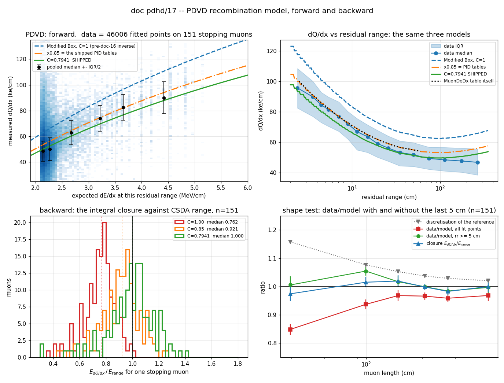
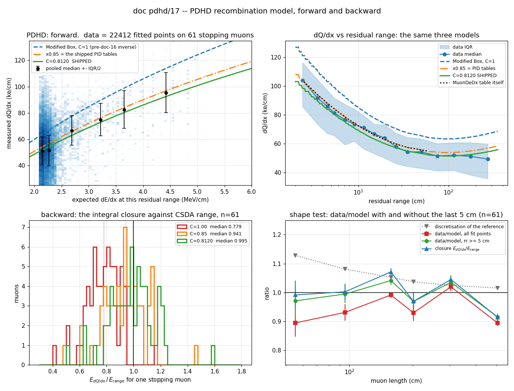

# The recombination model in CheckSTM_Michel, forward and backward — doc pdhd/17

**Status: no code and no config changes.** This is a re-analysis of arms already
on disk plus an inversion of the shipped PID table. It answers four questions
about the model doc pdhd/16 calibrated, and it corrects one claim in doc
pdhd/16 §6.2 that turned out to be vacuous on PDVD (§7).

Owner ask, 2026-09-08: *"1. are we having a consistent recombination model
forward and backward? 2. How does the latest recombination model compare to
where we started? 3. Can you make a plot to compare the data vs. these
recombination models? 4. Did you do anything regarding the charge
reconstruction, estimation of energy using charge directly?"*

**The four answers, in four lines.**

1. **Inside `check_stm_michel`, yes — now.** The backward inverse is the exact
   analytic inverse of the same Modified Box that generated the forward PID
   tables, at the same field, differing only by one constant — 0.85 for the
   *true* charge the tables predict, 0.7941 for the *reconstructed* charge the
   component actually sees. That difference is required for as long as the
   charge scale is not corrected where the charge is made (§6). **Outside
   `check_stm_michel`, no** — `tagger_check_neutrino` still runs the
   uncalibrated inverse and is ~24 % low on the same charge (§2, §3).
2. **We started 24 % low and we are at 1.000.** The ladder is
   **0.762 → 0.921 → 1.000** as C goes 1 → 0.85 → 0.7941, and that splits the
   old deficit into **0.828 (a model bug) × 0.921 (charge the reconstruction
   does not recover)** — measured, not inferred (§4).
3. **Yes** — `figs/d17_recomb_model_pdvd.png`, four panels, described in §5.
4. **No, deliberately** — and §6 prices what that costs: the flat
   charge→energy conversion for *unfitted* charge now disagrees with the
   calibrated fitted path by **20 % on PDVD / 16 % on PDHD** at MIP, where
   before doc 16 the two agreed to 4–6 %. It contributes **zero on PDVD** today
   and **17 of 124 Michel objects on PDHD**, where it is 100 % of their energy.

## Repro

```bash
cd /nfs/data/1/xqian/toolkit-dev/wcp-porting-img
python3 pdhd/docs/scripts/d17_recomb_model.py --det pdvd \
    --arm 'pdvd/work/*_d16vnu' --out /home/xqian/tmp/d17/d17v \
    --fig pdhd/docs/figs/d17_recomb_model_pdvd.png
python3 pdhd/docs/scripts/d17_recomb_model.py --det pdhd \
    --arm 'pdhd/work/*_d16hnu' --out /home/xqian/tmp/d17/d17h \
    --fig pdhd/docs/figs/d17_recomb_model_pdhd.png
```

No arm is produced and no chain is re-run. `d17_recomb_model.py` imports
`dedx_box`, `track_energy` and `load` from `d16_stm_energy_scales.py`, so the
clamps, the endpoint `dX` rule and the accumulation are bit-for-bit the ones
doc pdhd/16 was gated with; the PID table is read from the **compiled** jsonnet
(`wcsonnet`) and self-gated against the committed re-derivation
(`pdvd/stm/pdvd_ref_dqdx_045.json`, max relative deviation 1.6e-6 over 60 bins
— the jsonnet carries 6 significant figures).

---

## 1. What "the recombination model" is in this tree

A recombination model is one function and its inverse:

```
forward   dQ/dx  =  C · R(dE/dx) · (dE/dx) / W_ion ,   R = ln(A + u)/u ,  u = beta' · dE/dx
backward  dE/dx  =  ( exp( (dQ/dx / C) · beta' · W_ion ) - A ) / beta'
```

with `beta' = B/(rho·E)`, `A = 0.93`, `B = 0.212`, `rho = 1.38 g/cm³`,
`W_ion = 23.6 eV`, `E = 0.45 kV/cm` (PDVD) / `0.4959` (PDHD). Everything in
this document is that one family; the **only** thing that differs between the
three objects below is `C`.

| | `C` | what it is | where it lives |
|---|---|---|---|
| the PID `*DeDx` tables | **0.85** | *forward*: dQ/dx a stopping particle should deposit at each residual range | `protodunevd/particle_dataset.jsonnet:64+`, generated by `energy_loss/pion_travel/convert_field.C:42,71` |
| `pdvd_box_recomb` | **1** (no slot) | *backward*: `Gen::PracticalBoxRecombination` | `pr.jsonnet:1239` |
| `pdvd_stm_recomb` | **0.7941** | *backward*, calibrated (doc pdhd/16) | `pr.jsonnet:1289` |

**There is no simulation arm in this comparison, and that is a real scope
limit.** `Recombination` appears in exactly two files under `cfg/` — the two
`pr.jsonnet` — and `pdvd_sim/`'s generators (`sim.tracks`) set electrons per
step directly. So in *this* tree "forward" means **the table generator**, not a
simulated charge. If a PDVD simulation ever binds an `IRecombinationModel`, it
becomes a fourth carrier and this document's §3 must be re-asked.

---

## 2. Who consumes the backward inverse

The question "is the model consistent" only has an answer per consumer, so here
is the full list, from `grep segment_cal_kine_dQdx / segment_cal_4mom`:

| consumer | node | model in force | consistent with the tables? |
|---|---|---|---|
| `CheckSTM_Michel` — `muon_ke_dqdx`, `michel_ke_dqdx/core`, `dots_ke_dqdx`, `set_pdg` | `check_stm_michel` | **`pdvd_stm_recomb`, C = 0.7941** | **yes** (§3) |
| `NeutrinoPatternBase`, `NeutrinoTaggerSSM`, `NeutrinoTrackShowerSep`, `NeutrinoKinematics` | `tagger_check_neutrino` | `pdvd_recomb`, C = 1 | **no — 24 % low** |
| `MuonMCSDriver`'s `ke_dqdx_toolkit` cross-check | (neutrino chain) | `pdvd_recomb`, C = 1 | no |
| `do_track_comp` → `is_stm`, `contrast`, `ks_mu` | `check_stm_michel`, `tagger_check_stm` | **none** — compares measured dQ/dx against the *tables* directly | n/a; **no verdict depends on a recombination model** |

**A dead binding, reported not fixed.** `tagger_check_stm` is handed
`recombination_model` by `clus.jsonnet:309`, and `TaggerCheckSTM.cxx` mentions
the string exactly once — at `:421`, inside `default_configuration()`. It never
`get()`s it and never uses it. The binding is inert. It is harmless (it names
the *uncalibrated* model, so nothing is silently miscalibrated through it) and
it is out of scope here.

---

## 3. Q1 — forward and backward, made a measurement

The forward and the backward are the same expression, so "consistent" is not a
matter of opinion: **invert the shipped table and see whether the dE/dx comes
back.** The reference is the CSDA `dE/dx = dKE/dR` from
`muon_range_function` in the *same* config file — the one object in it that
carries no drift field and no charge calibration, and the one the range energy
`muon_ke_range` is read from.

Over the table's own grid, residual range 2 – 59.5 cm:

| inverse used | PDVD median | p10 – p90 | PDHD median |
|---|---|---|---|
| `C = 1` — `pdvd_box_recomb`, what `check_stm_michel` ran before doc pdhd/16 | **0.8298** | 0.812–0.833 | **0.8343** |
| `C = 0.85` — the tables' own factor | **1.0000** | 0.9987–1.0019 | **1.0000** |
| `C = 0.7941` / `0.8120` — shipped | 1.0848 | 1.083–1.095 | 1.0541 |

Three things follow, and none of them needs data.

* **The tables *are* the Modified Box × 0.85 at these parameters.** Inverting
  them with the 0.85 returns the CSDA dE/dx to **0.00 %**, flat to ±0.2 % over
  the whole grid. That is the cleanest possible statement of what the ×0.85 is:
  not a fudge somewhere in the pipeline, but a factor sitting *inside* the
  forward transform the tables encode.
* **`PracticalBoxRecombination` was therefore not the inverse of the forward in
  force.** It under-reads dE/dx by a factor **0.830**, pointwise, everywhere.
  That is the whole of doc pdhd/16's root cause, restated as a table
  identity with no muons in it.
* **The shipped inverse over-reads the *table* by 8.5 %, and that is correct,
  not a residual error.** `0.85 / 0.7941 = 1.070`; the remaining 1.3 % is the
  model's non-linearity (PDHD: `0.85 / 0.8120 = 1.047` against a measured
  1.054). The backward transform consumes **reconstructed**
  charge, which is ~7 % below the true charge the table predicts; feeding it
  ideal table charge is feeding it the wrong input.

**The internal round trip** — `forward_dqdx` then `dE` on the same value — is
pinned to 1e-9 by `gen/test/doctest_powerbox_recombination.cxx` ("powerbox
recombination inverse round-trips"), and the p = 1 identity between
`PowerBoxRecombination` and `PracticalBoxRecombination` at both ProtoDUNE
fields is pinned in the same file, in both directions. It is not asserted here.

**So: consistent inside `check_stm_michel`, and only there.** The neutrino
chain's dE/dx and every 4-momentum it builds still run the C = 1 inverse and
are ~24 % low on the same charge (§4). That is doc pdhd/16 §7 item 4 — it needs
an A/B campaign, not a doc.

---

## 4. Q2 — where we started, and where we are

One number per rung, `median(E_dQdx / E_range)` over the `is_stm` stopping
muons; the reference is the CSDA range energy of the same muon.

| `C` | what it is | PDVD (n = 151) | PDHD (n = 61) |
|---|---|---|---|
| 1.0 | `pdvd_box_recomb` — **where we started** | **0.762** (IQR 0.689–0.811) | **0.779** (0.700–0.851) |
| 0.85 | the tables' own factor, and nothing else | **0.921** | **0.941** |
| 0.7941 / 0.8120 | **shipped** | **1.000** (0.901–1.090) | **0.995** (0.888–1.085) |

The middle rung is the point of this section. It splits the old 24 % deficit
into two halves that were previously argued and are now measured:

```
0.762  =  0.828   ×   0.921
          model       charge the reconstruction does not recover
```

* The **model half is 0.8275 on PDVD and 0.8278 on PDHD** — the same number on
  two detectors at two different drift fields, and equal to the *table-level*
  pointwise factor of §3 (0.8298 / 0.8343) to 0.3 % and 0.8 %. A property of
  the transform, as it should be.
* The **charge half is 0.921 (PDVD) and 0.941 (PDHD)** — detector-specific, as
  it should be, and consistent with doc pdvd/50 §14's independent
  *differential* measurement of PDVD's reconstructed dQ/dx against these same
  tables (k = 0.86 unselected to 0.95 on charge-complete tracks).

**That is the honest reading of `C`.** It is not a recombination measurement.
It is `0.85 × (a per-detector charge scale)`, and the doc pdhd/16 config
comment already says so; what is new here is that the two factors are now
separated on data rather than quoted as a product.

---

## 5. Q3 — the data against the three models





**Panel 1 — forward.** Measured dQ/dx at each fitted chain point against the
dE/dx the CSDA table says a muon has at that point's residual range, with all
three models drawn. 46 006 points on 151 PDVD muons. The pooled medians (black) sit
on the green shipped curve; the blue C = 1 curve is where the charge would have
to be for the pre-doc-16 inverse to have been right, and it is nowhere near the
data at any dE/dx. **The level is not a test** — it is what `C` was fitted to. What
*is* a test is whether one constant survives the whole 2.1 – 5 MeV/cm span
rather than only working at the median, i.e. whether the Modified Box *shape*
at 0.45 kV/cm is right. Pooled data/model over six dE/dx bins:
**0.972, 0.952, 1.042, 1.060, 1.076, 1.024** (PDVD; PDHD 0.986–1.060). A ±6 %
wobble with 90 % of the points in the two lowest bins — inside the ±10 %
per-track spread of panel 3, and much smaller than the 0.83 the model was off
by, but not zero. Panel 4 is the sharper version of this test.

**Panel 2 — the same three models against residual range**, the doc pdvd/50
§14 view, with the shipped `MuonDeDx` table drawn as a black dotted line. Two
readings:

* The black dotted table lies **on** the orange C = 0.85 curve — panel 2's
  visual restatement of §3's identity.
* The data median tracks the green shipped curve from 2 cm out to about 40 cm
  and then falls below it, to 0.94 of it in the 140–220 cm band and
  0.89 in the 220–400 cm band. That is a
  **pooled** median: it weights long muons by their point count and mixes
  tracks whose overall charge scale differs by ±10 %. It is also where a known
  physics caveat bites — the CSDA dE/dx is a **mean**, while a fitted point's
  dQ/dx over ~0.6 cm is closer to a **most-probable** value, and the two
  diverge as the muon gets more energetic (large residual range). Panel 4 is
  the per-track statement, and it is the one to quote.

**Panel 3 — backward, the integral closure.** The per-muon
`E_dQdx / E_range` distribution at the three `C`. The three histograms are the
three rungs of §4's table, and the point of the panel is that the *shape* of
the distribution does not change — the constant slides it, it does not tighten
it. The ±10 % per-track width is drift and readout-unit structure (doc pdhd/16
§7), untouched by this round and not something a normalization can fix.

**Panel 4 — the shape test, and it does not go through `KE(L)`.** Per track,
`Σ backward(q)·dX / Σ CSDA_dE/dx·dX` over the *same* points. This is the
comparison the calibration claim is actually about, and it is the only one
insensitive to two conventions that otherwise contaminate it: the `dX`
convention cancels between numerator and denominator, and `KE(muon_len)` does
not appear.

| PDVD, muon length (cm) | n | data/model, all points | reference discretisation | closure `E_dQdx/E_range` | data/model, rr ≥ 5 cm |
|---|---|---|---|---|---|
| < 80 | 32 | 0.849 | 1.158 | 0.975 | **1.006** |
| 80–120 | 31 | 0.937 | 1.077 | 1.015 | **1.055** |
| 120–180 | 20 | 0.968 | 1.053 | 1.020 | **1.017** |
| 180–250 | 27 | 0.966 | 1.037 | 0.999 | **1.000** |
| 250–350 | 24 | 0.959 | 1.029 | 0.983 | **0.984** |
| > 350 | 17 | 0.968 | 1.021 | 1.000 | **0.997** |
| **all** | **151** | 0.944 | 1.053 | 1.000 | **1.010** |

**With the last 5 cm dropped from both the data and the model, the shipped
model reproduces the CSDA dE/dx to 1.0 % overall on PDVD (1.3 % on PDHD), with
no trend in muon length from 40 to 450 cm.** That is the strongest statement in
this document, and it is a statement about the *model*, not about `C`. The
per-bin scatter is real and should be quoted with it: PDVD's six bins span
0.984–1.055 (the 80–120 cm bin, n = 31, is the high one), and PDHD's span
0.916–1.042 on 5–14 muons per bin — consistent with flat, not a demonstration
of flatness at the percent level.

Two corrections to how the length-flatness should be read, both new here:

* **The `data/model, all points` column is not flat** — 0.85 at < 80 cm rising
  to 0.97 above 350 cm. This is a **stop-region** effect: the detector cannot
  resolve the Bragg peak the CSDA has, and the last few centimetres are a much
  larger fraction of a short track.
* **The reference is not innocent either.** A discrete sum of the CSDA dE/dx
  over fit points **exceeds** `KE(L)` by 16 % at 40 cm and 2 % at 450 cm,
  because dE/dx diverges at the stop and no finite point spacing integrates
  that. `segment_cal_kine_dQdx` has the same property.
* The closure column looks flat because **these two run in opposite directions
  and largely cancel**. Doc pdhd/16 §3's "flat in length ⇒ a normalization, not
  a shape" conclusion survives — the rr ≥ 5 cm column says so directly and much
  more strongly — but the *evidence* it was drawn from was weaker than it
  looked, and that should be on the record.

A consequence worth stating: `C` fitted on the stop-inclusive observable is
**~1 % low** relative to one fitted with rr ≥ 5 cm (PDVD's rr ≥ 5 ratio is
1.010 at the shipped `C`). That is the same size as the quoted bootstrap error
(±0.0093 = 1.2 %) and it is a *systematic*, not a correction to take: it is
reported here, and `C` is not moved.

---

## 6. Q4 — charge reconstruction, and energy from charge directly

**Nothing in doc pdhd/16 or in this round touched the charge reconstruction.**
No solve, no gain, no lifetime, no `dQdx_scale`. That was deliberate — doc
pdhd/16's "one carrier only" rule — and it is why `C` absorbs a per-detector
charge scale instead of the charge being corrected where it is made.

`check_stm_michel` has **three** ways to put a MeV number on charge. Only one
moved:

| path | how | fires on PDVD `d16vnu` | fires on PDHD `d16hnu` | moved by doc 16? |
|---|---|---|---|---|
| **fitted**, `segment_cal_kine_dQdx` | dQ/dx → dE/dx through the model, per point | all 160 Michels, all 151 muons | 108 of 124 Michels | **yes**, ×1.31 / ×1.26 |
| **unfitted**, `stm_michel_charge_to_energy` | flat `Q / (0.7 × 0.95) × W_ion` — no dx, so no recombination correction is *possible* | **0 of 160** | **17 of 124** | no |
| **shower**, `Shower::get_kine_charge()` → `michel_ke_charge` | the neutrino chain's own charge energy | 6 of 160 | 5 of 124 | no |

**The flat path is now inconsistent with the fitted one, and this is new
breakage created by doc pdhd/16.** The fitted path's effective survival at MIP
is `R(2.1) × C` = 0.553 (PDVD) / 0.571 (PDHD); the flat path's is a hard-coded
`0.7 × 0.95 = 0.665`.

| | PDVD | PDHD |
|---|---|---|
| MeV per collected electron, fitted at MIP | 4.271e-05 | 4.130e-05 |
| MeV per collected electron, flat | 3.549e-05 | 3.549e-05 |
| ratio, **after** doc pdhd/16 | **1.203** | **1.164** |
| ratio, before doc pdhd/16 (C = 1) | 0.956 | 0.945 |

The two conversions agreed to 4–6 % before and disagree by 16–20 % now, and
`michel_ke_best = michel_ke_dqdx + dots_ke_unfit` **adds** them. On PDVD this
costs nothing today: `dots_charge_unfit` is identically zero on all 160
Michel-carrying candidates, so `michel_ke_best == michel_ke_dqdx` exactly. On
PDHD it fires on 17 of 124 objects, and where it fires it is the **whole**
energy — `dots_ke_unfit / michel_ke_best` is 1.000 for all 17, up to 36 MeV.
Those 17 objects are ~16 % low relative to every other Michel in the same tree.

**Not fixed here.** Re-tuning `michel_unfit_recom` / `michel_unfit_fudge` moves
a persisted physics number and belongs in its own round with its own gate; and
the right fix is probably not a re-tune at all but to derive the flat factor
*from* the model at the assumed MIP dE/dx, so the two cannot drift apart again.
Recorded as open item 2 in §8.

`michel_ke_charge` deserves no conclusion: 6 objects on PDVD, ratios to the
fitted energy of 0.077, 0.088, 0.236, 0.382, 1.253, 4.136. It is a diagnostic
column, is never `best`, and nothing should be built on it.

---

## 7. A correction to doc pdhd/16 §6.2

Doc pdhd/16 §6.2 lists `michel_ke_charge`, `dots_ke_unfit` and
`dots_charge_unfit` as *"the positive evidence that only **one** of the three
carriers of the gain × lifetime × recombination degeneracy moved."*

**On PDVD that evidence is vacuous.** `dots_charge_unfit` and `dots_ke_unfit`
are identically **zero** on all 160 `michel_found` candidates of both the
`d15vnu` and the `d16vnu` arm, and a branch that is zero on both sides is
bit-identical for free. `michel_ke_charge` is non-zero on 6 of 160.

The claim is sound on **PDHD**, where `dots_ke_unfit` is non-zero on 17 of 124
candidates with values up to 36 MeV and is bit-identical across the two arms —
that is a real negative control, and it is the one that carries the statement.

Doc pdhd/16 §6.2 has been amended in place to say this. Nothing else in doc
pdhd/16 changes: the 74-of-80 partition, the six movers and the closure are
unaffected — this is about how much one line of evidence is worth, not about
what moved.

---

## 8. Open items — reported, not acted on

1. **The neutrino chain runs the uncalibrated inverse** (§2). Every
   `segment_cal_4mom` reached from `tagger_check_neutrino` is ~24 % low on the
   same charge. This is doc pdhd/16 §7 item 4; flipping it is a production
   output change needing an A/B campaign on both ProtoDUNEs and SBND, which
   binds the same components.
2. **The flat unfitted-charge conversion is 16–20 % off the fitted one** (§6),
   and `michel_ke_best` adds the two. Zero impact on PDVD today, 17 of 124
   Michel objects on PDHD. The durable fix is to derive `michel_unfit_recom`
   from the model at the assumed MIP dE/dx rather than hard-coding it.
3. **`C` is ~1 % low** relative to a stop-excluded fit (§5) — the same size as
   its bootstrap error, and inside the ±10 % per-track spread. Not moved.
4. **The mean-vs-most-probable gap** (§5, panel 2). The CSDA dE/dx is a mean;
   a fitted point's dQ/dx is closer to a most-probable value. It cancels in the
   *integral* (which is what `C` is fitted on) but not in any pointwise
   comparison, and it is the leading candidate for panel 2's large-residual-
   range fall-off. Separating it from doc pdhd/16 §7's ~8 % drift-dependent
   charge scale needs MC truth.
5. **`tagger_check_stm`'s `recombination_model` binding is inert** (§2) — the
   C++ never reads it. Harmless; not fixed in this round.
6. **No simulation arm** (§1). There is no `IRecombinationModel` on any
   simulation path in this tree, so the forward direction is only checkable
   against the table generator, which lives in the separate `energy_loss`
   repository and is not changed by anything here.

## 9. Files

| | |
|---|---|
| `pdhd/docs/scripts/d17_recomb_model.py` | every number above; imports `d16_stm_energy_scales` so the accumulation and clamps are the gated ones |
| `pdhd/docs/figs/d17_recomb_model_{pdvd,pdhd}.png` | the figure |
| `pdhd/docs/16_stm-muon-energy-scales.md` | the parent round — the calibration itself; §6.2 amended by §7 above |
| `pdvd/docs/nf_sp_img_clus/50_stopping-muon-dqdx-pdhd-pdvd.md` §14 | the independent *differential* measurement of the same charge scale |
| `pdvd/docs/nf_sp_img_clus/48_check-stm-michel-chain.md` | the chain this component sits in |

**Nothing under `cfg/`, `clus/` or `gen/` is touched by this document.**
