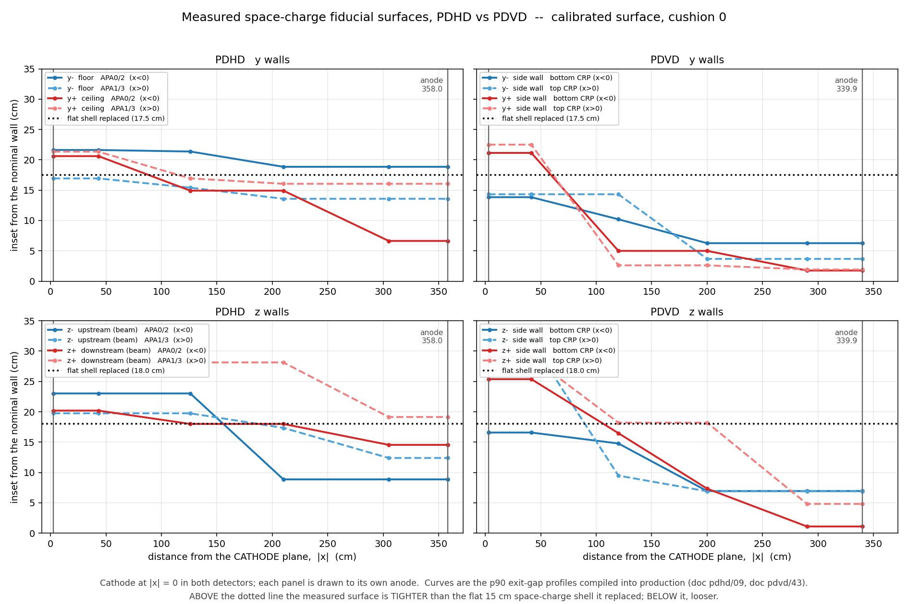
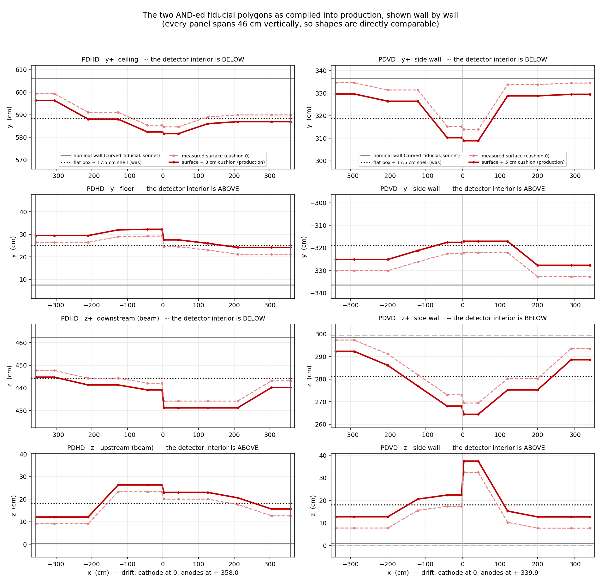
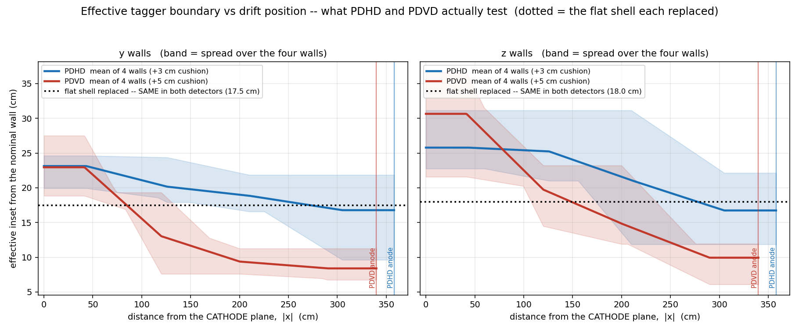

# 49 — The curved fiducial across PDHD and PDVD: wiring audit and surface comparison

**Status.** Both detectors run the measured curved surface in production. This doc
(a) proves, from the compiled configs, that **every** PR-stage consumer on **both**
detectors tests it — the three cosmic taggers plus `CheckSTM_Michel` and
`TaggerCheckNeutrino` — and (b) compares the two surfaces against the cathode plane.

Predecessors: doc 41 (the map), doc 43 (the exit-gap quantile surface, PDVD production
p90 + 5), doc pdhd/09 (the PDHD measurement, PDHD production p90 + 3).

---

## 0. Repro

```sh
cd /nfs/data/1/xqian/toolkit-dev/toolkit
S=/home/xqian/tmp/fv49            # any scratch dir

# --- the four compiled configs: production and the flat arm, per detector ---
(cd pdhd && wcsonnet -A input=/dev/null -A output_dir=$S -S run=28084 -S subrun=0 \
   -S event=1 -S trigger_offset_us=0 -S readout_window_ticks=6000 \
   -o $S/pdhd_prod.json wct-pr-perevt.jsonnet)
(cd pdhd && wcsonnet -A input=/dev/null -A output_dir=$S -S run=28084 -S subrun=0 \
   -S event=1 -S trigger_offset_us=0 -S readout_window_ticks=6000 -S curved_fv=false \
   -o $S/pdhd_flat.json wct-pr-perevt.jsonnet)
(cd pdvd && wcsonnet -A input=/dev/null -A output_dir=$S -S run=29107 -S subrun=0 \
   -S event=1 -o $S/pdvd_prod.json wct-pr-perevt.jsonnet)
(cd pdvd && wcsonnet -A input=/dev/null -A output_dir=$S -S run=29107 -S subrun=0 \
   -S event=1 -S curved_fv=false -o $S/pdvd_flat.json wct-pr-perevt.jsonnet)

# --- the same, with the PR tail added, to exercise the stages the default
#     pipeline does not run (sec 2.2) ---
PIPE='["switch_scope","flag_mains","steiner","fiducialutils","tagger_check_tgm",
       "tagger_check_stm","tagger_check_fc","protect_bundle","steiner_refresh",
       "check_stm_michel","tagger_check_neutrino","tracking_visitor","pr_display"]'
(cd pdhd && wcsonnet ... -S "pipeline_names=$PIPE" -o $S/pdhd_full.json wct-pr-perevt.jsonnet)
(cd pdvd && wcsonnet ... -S "pipeline_names=$PIPE" -o $S/pdvd_full.json wct-pr-perevt.jsonnet)

# --- sec 2: who tests what ---
python3 pdvd/docs/nf_sp_img_clus/scripts/fv_consumer_audit.py \
    $S/pdhd_prod.json $S/pdhd_full.json $S/pdvd_prod.json $S/pdvd_full.json

# --- sec 3-5: the figures and the knot table ---
python3 pdvd/docs/nf_sp_img_clus/scripts/fv_cross_detector_compare.py \
    --pdhd-prod $S/pdhd_prod.json --pdhd-flat $S/pdhd_flat.json \
    --pdvd-prod $S/pdvd_prod.json --pdvd-flat $S/pdvd_flat.json \
    --toolkit-cfg cfg/pgrapher/experiment \
    --out-dir pdvd/docs/nf_sp_img_clus/figs --prefix 49
```

Nothing here runs the reconstruction: every number is read out of a compiled config.
Both scripts re-derive from the compiled JSON — the `PolyFiducial` corner lists and the
taggers' `fv_tolerance` — never from the jsonnet source, so what is plotted is what the
taggers test. The one exception is each detector's **nominal wall constant**, which the
polygon cannot supply (a p90 surface is inset from the wall even at the anode face, so
the extreme vertex is not the wall); those are parsed out of `curved_fiducial.jsonnet`
and cross-checked against the compiled `BoxFiducial` in §6.

---

## 1. The question

> Is the new curved fiducial volume set for both PDHD and PDVD, for the various cosmic
> taggers as well as the PR stage (neutrino / `CheckSTM_Michel`)?

**Yes — all five consumers, on both detectors.** Nothing needed changing. The one
substantive asymmetry found is a *chain-scope* difference, not a wiring gap (§2.2).

---

## 2. Wiring audit, from the compiled config

### 2.1 Who tests what

Every component in the compiled PR config that carries a `fiducial` key:

| component | PDHD | PDVD |
|---|---|---|
| `TaggerCheckTGM` | `CompositeFiducial:pdhdcurved-fv` | `CompositeFiducial:pdvdcurved-fv` |
| `TaggerCheckSTM` | `CompositeFiducial:pdhdcurved-fv` | `CompositeFiducial:pdvdcurved-fv` |
| `TaggerCheckFC` | `CompositeFiducial:pdhdcurved-fv` | `CompositeFiducial:pdvdcurved-fv` |
| `CheckSTM_Michel` | `CompositeFiducial:pdhdcurved-fv` | `CompositeFiducial:pdvdcurved-fv` |
| `TaggerCheckNeutrino` | `CompositeFiducial:pdhdcurved-fv` | `CompositeFiducial:pdvdcurved-fv` |
| `MakeFiducialUtils` | `DetectorVolumes:dv-apa0-1-2-3` | `DetectorVolumes:dv-apa0-…-7` |

and the `fv_tolerance` each receives (cm; index order
`[x_lo, x_hi, y_lo, y_hi, z_MAX, z_MIN]` — **the z pair is reversed**; negative = inset):

| | PDHD | PDVD |
|---|---|---|
| production (curved) | `[-2, -2, -3, -3, -3, -3]` | `[-2.5, -2.5, -5, -5, -5, -5]` |
| flat arm (`-S curved_fv=false`) | `[-2, -2, -17.5, -17.5, -18, -18]` | `[-2.5, -2.5, -17.5, -17.5, -18, -18]` |

Three facts fall straight out of that table:

- **Every consumer gets the identical fiducial object and the identical tolerance
  vector.** "Contained" means one thing across the whole PR stage on both detectors.
- **`grep -c pr_fv` on either production config returns 0.** The flat `BoxFiducial`
  is not merely unused — it is not emitted.
- **Both detectors replaced the same flat allowance**, y 17.5 / z 18 cm — the dvm
  margins — **identical on both detectors**, `FV_ymin_margin` 2.5 cm and
  `FV_zmin_margin` 3 cm in each `clus.jsonnet` — plus a flat 15 cm space-charge
  shell: 2.5 + 15 = 17.5, 3 + 15 = 18. This is the fact §5 turns on.

`MakeFiducialUtils` is the one component that stays on `DetectorVolumes`, correctly:
it is the dead-region / sensitive-volume utility, not a tagger boundary. It matters
only as the *fallback* a tagger uses when handed `fiducial=null`, and no tagger is.

The three `PolyFiducial` / `CompositeFiducial` components are instantiated in both,
each polygon with **24 corners** (4 wall arcs × 6 drift knots) and one slab spanning
±1000 cm along its axis — the bounding-box short circuit in `PolyFiducial::contained()`
padded so the transverse polygon is the only cut, and the AND is the composite's.

### 2.2 The one asymmetry: chain scope, not wiring

The default `pipeline_names` differ:

| | PDHD | PDVD |
|---|---|---|
| default pipeline ends at | `steiner_refresh` | `pr_display` |
| `check_stm_michel` in default | **no** (runner `-nu` appends it) | **yes** (doc 48 flip, 2026-09-06) |
| `tagger_check_neutrino` in default | no (runner `-nu-legacy`) | no |

So on PDHD, production today runs **cosmic-only**: `CheckSTM_Michel` and
`TaggerCheckNeutrino` are correctly wired but do not execute unless named on the
command line. That is a decision about chain scope, and flipping it would change
production output unconditionally — outside the scope of this audit. Open item 1.

The `_uses` gate that emits the polygon components is structurally identical in both
`pr.jsonnet` files and covers all five stages, including the reduced pipelines where
TGM/FC are absent and only the neutrino or Michel stage names the volume. Verified by
compiling the full pipeline: the components are present and the tagger table above is
what comes back.

### 2.3 Outside the PR stage

Two other fiducial-shaped things exist; neither is a cosmic-tagger boundary.

- `protodunevd/crp_gap_fiducial.jsonnet` — a `BoxFiducial` + `CompositeFiducial`,
  imported by nothing. Inert, by design (same byte-identity argument the curved files make).
- **The clustering stage keeps a flat 15 cm shell.** `pdhd/clus.jsonnet:61-72` sets
  `FV_ymin 226.1 mm` = active 76.1 + 150, `FV_zmin` = active + 150, etc. Those `FV_*`
  values are read by `clustering_neutrino.cxx` (the `Clustering_separate` decision),
  not by any tagger. So the 15 cm allowance the PR stage just retired is **still in
  force one stage upstream**, on a different consumer. Open item 3.

---

## 3. What y and z mean — the two detectors do not share a wall vocabulary

This is the trap the comparison has to survive. Both configs put **x = drift, cathode
at x = 0, two mirrored drift volumes** — but that is where the correspondence stops.

| | PDHD (horizontal drift) | PDVD (vertical drift) |
|---|---|---|
| **x** (drift) | horizontal, ⊥ to the APA; anodes at ±357.985 cm | **vertical**; CRPs above and below, at ±339.91 cm |
| **y−** (`ym`) | the **floor** of the active volume, y = 7.61 | a horizontal **side wall**, y = −336.39 |
| **y+** (`yp`) | the **ceiling**, y = 606.0 | the opposite horizontal side wall, y = +336.39 |
| **z−** (`zm`) | **upstream beam** end, z = 0.234 | a horizontal side wall, z = 0.813 |
| **z+** (`zp`) | **downstream beam** end, z = 462.297 | the opposite side wall, z = 298.435 |
| x < 0 half | APA 0/2 (`_g02`) | **bottom** CRP (`_bot`) |
| x > 0 half | APA 1/3 (`_g13`) | **top** CRP (`_top`) |
| y span | 598.4 cm (vertical) | 672.8 cm (horizontal) |
| z span | 462.1 cm (beam) | 297.6 cm (horizontal) |

Sources: `pdvd/docs/07_pdvd-tpc-geometry-fiducial.md` §1 (PDVD drifts along x toward
CRPs above and below a central cathode); `pdhd/docs/qlmatching-chain.md:32` ("each
volume contains two APAs offset along Z (beam)").

Two consequences that govern how the figures may be read:

1. **`yp_top` on PDVD and `yp_g13` on PDHD are not the same kind of surface.** On PDHD
   the y walls are floor and ceiling; on PDVD **all four y/z walls are vertical side
   walls**, and PDVD's floor and ceiling are the two *anode planes* — which carry no
   profile at all (`cushion_x = 0`; no drift-direction surface was measured on either
   detector). Legends are therefore labelled detector-locally, never matched by name.

2. **The cosmic exposure is mirrored.** PDHD's cosmics run along **y**, i.e.
   perpendicular to drift, so its y walls are richly populated and its z walls thin
   (doc pdhd/09 §6 flagged 8 starved z bins). PDVD's cosmics run along **x**, i.e. along
   drift, so they leave through the anodes and populate the y/z walls only through their
   inclined component. The two surfaces are measured from differently-exposed samples.

**So what is this comparison for?** A plausibility cross-check on magnitude and on
drift dependence, and an explanation of why one knob moved the two detectors in
opposite directions. It is **not** a validation of one surface against the other.

---

## 4. The surfaces



`figs/49_fv_profiles.png` — the calibrated p90 surfaces at cushion 0, inset from the
nominal wall vs **distance from the cathode plane** (both detectors are cathode-at-zero,
so this is just |x|; each panel runs out to its own anode). The dotted line is the flat
shell each replaced. `figs/49_fv_profiles_cushioned.png` is the same with each
detector's production cushion added — the boundary the taggers actually probe.



`figs/49_fv_polygons.png` — the polygons themselves, one strip per wall. A full-extent
x–y plot is useless here (a 20 cm inset against a 600 cm wall separation), so every
panel spans 46 cm vertically and the strips are directly comparable.

Per-wall endpoints (cm), from the compiled polygons; full knot list in
`figs/49_fv_knots.tsv`:

| det | plane | wall | volume | at the anode | at the cathode | + cushion | shell replaced |
|---|---|---|---|---|---|---|---|
| PDHD | y | lo (floor) | APA0/2 | 18.85 | 21.62 | 24.62 | 17.5 |
| PDHD | y | lo (floor) | APA1/3 | 13.58 | 16.93 | 19.93 | 17.5 |
| PDHD | y | hi (ceiling) | APA0/2 | 6.63 | 20.61 | 23.61 | 17.5 |
| PDHD | y | hi (ceiling) | APA1/3 | 16.05 | 21.34 | 24.34 | 17.5 |
| PDHD | z | lo (upstream) | APA0/2 | 8.86 | 23.03 | 26.03 | 18.0 |
| PDHD | z | lo (upstream) | APA1/3 | 12.39 | 19.75 | 22.75 | 18.0 |
| PDHD | z | hi (downstream) | APA0/2 | 14.55 | 20.20 | 23.20 | 18.0 |
| PDHD | z | hi (downstream) | APA1/3 | 19.14 | 28.14 | 31.14 | 18.0 |
| PDVD | y | lo (side) | bottom | 6.26 | 13.84 | 18.84 | 17.5 |
| PDVD | y | lo (side) | top | 3.67 | 14.32 | 19.32 | 17.5 |
| PDVD | y | hi (side) | bottom | 1.75 | 21.14 | 26.14 | 17.5 |
| PDVD | y | hi (side) | top | 1.92 | 22.50 | 27.50 | 17.5 |
| PDVD | z | lo (side) | bottom | 6.94 | 16.58 | 21.58 | 18.0 |
| PDVD | z | lo (side) | top | 6.90 | 31.61 | 36.61 | 18.0 |
| PDVD | z | hi (side) | bottom | 1.10 | 25.38 | 30.38 | 18.0 |
| PDVD | z | hi (side) | top | 4.82 | 29.00 | 34.00 | 18.0 |

### 4.1 What agrees

**At the cathode the two detectors land in the same place.** Averaged over the four
walls of each plane, the effective boundary at |x| = 0 is **23.1 cm (PDHD y) vs
23.0 cm (PDVD y)**, and 25.8 vs 30.6 cm on z. Given two independent measurements, on
differently-oriented detectors, from differently-exposed cosmic samples, agreeing to
a few cm at the point of maximum drift is the strongest plausibility check available
here — and it is a genuine prediction of the space-charge picture, since displacement
accumulates over the drift path and is largest for charge born at the cathode.

**Both fall monotonically toward the anode**, as PAV regularization enforces and as
the physics requires.

### 4.2 What differs, and why it is not a discrepancy

**At the anode face the two are 3–10× apart:** PDHD's p90 is 6.6–19.1 cm, PDVD's is
1.1–6.9 cm. The anode-face value is the diagnostic one, because **space-charge
displacement is zero at the anode by construction** — a charge arriving at the wire
plane has finished drifting. So whatever the p90 carries there is *not* space charge.
It is the width of the endpoint-reconstruction tail: how far short of the true wall
the reconstructed end of a genuinely exiting track lands, 10 % of the time.

That is exactly the quantity a tagger needs — the tagger tests reconstructed endpoints,
not true ones — but it must be named correctly. **The p90 surface is an exit-gap
envelope, not a space-charge map.** PDHD's is the wider of the two, consistent with
its wrapped induction planes and the retiler defects of docs pdhd/07 and pdhd/08;
doc pdhd/09 §8 measured the instrumental decomposition directly and found the inset
survives it on the cathode half, which is where it does most of its work.

**PDVD's z− top-CRP wall is the steepest feature** in either detector: 6.90 cm flat
from the anode in to |x| = 120, then 9.48, then a step to 31.61 cm over the last two
bins (|x| ≤ 41.5). It is monotone — PAV enforces that — but the whole amplitude sits
in the two cathode-most bins, which are also the sparsest. Doc 43 flagged the same walls.

---

## 5. Where each surface crosses the shell it replaced



`figs/49_fv_overlay.png` is the figure that ties the two together. Both detectors
replaced the **same** flat allowance — 17.5 cm in y, 18 cm in z. The question is
therefore not "how big is each surface" but **"where does each surface cross the shell
it replaced":**

| detector | plane | crosses the shell at | tighter than the shell over |
|---|---|---|---|
| PDHD | y | \|x\| = 272 cm | **76 %** of the drift |
| PDHD | z | \|x\| = 277 cm | **77 %** |
| PDVD | y | \|x\| = 85 cm | **25 %** |
| PDVD | z | \|x\| = 148 cm | **44 %** |

(Knot by knot, without the interpolation: PDHD is tighter at 36 of 48 emitted knots,
PDVD at 21 of 48.)

**PDHD's measured surface sits inside the shell it replaced over three quarters of the
drift; PDVD's over a quarter to a half.** Both surfaces are the same *shape* — large
inset at the cathode, falling toward the anode — and they even agree at the cathode
(§4.1). What differs is where each sits relative to the single flat number it displaced,
and that is what sets the sign of the total tag count.

### 5.1 What each swap did, from the two grading tables

Doc pdhd/09 §9.5 (61 events, PDHD) and doc 43 §6.2 (99 events, PDVD), flat arm → the
arm each detector took to production:

| | PDHD, p90 + 3 vs flat | PDVD, p90 + 5 vs flat |
|---|---|---|
| tighter than the shell over | 76 % of the drift | 25 % (y) / 44 % (z) |
| **TGM, total** | 1561 → **1755** (+12.4 %) | 2148 → **2095** (−2.5 %) |
| **TGM, tracks > 2 m** | 430 → **464** (+7.9 %) | 754 → **769** (+2.0 %) |
| STM | 318 → 320 | 470 → 476 |
| fully contained | 2180 → 2058 | 2045 → 2105 |
| TGM, < 10 cm | 724 → 815 | (< 50 cm: 769 → 727) |

*Counting note.* Both grading tables also carry a "TGM" column that is the **sum of
their length bins**, and it runs 80–120 clusters short of the full count on both
detectors (PDHD 1478 vs 1561; PDVD 2029 vs 2148) because the shared census assigns
no length to some tagged objects. The totals above are the full counts (doc pdhd/09
§9.3 and §12.2; doc 43 §6.2). Ratios barely move — PDHD is +12.4 % on the full count
against +12.6 % on the binned sum — and the length bins themselves, which are the
graded numbers, are exact. Filed against doc pdhd/09 §9.5, whose column was relabelled.

Two readings, and the second is the one that matters.

- **The total TGM count moves in opposite directions, and the crossing fraction is
  why.** PDHD's surface is tighter over most of the drift, so more ends fall outside
  and the count rises; PDVD's is looser over most of it, so the count falls slightly.

- **On long tracks both detectors GAIN.** 430 → 464 on PDHD, 754 → 769 on PDVD. Doc
  pdhd/09 §9.5 records that *every* rung of the PDHD ladder beats the flat shell on
  long-track TGM; doc 43 §6.2 records that PDVD's whole −6.3 % at p90 + 3 sits on
  clusters under 50 cm. So the physics statement is the same on both detectors — **the
  measured surface recovers through-going muons the uniform inset was missing** — and
  the opposite total-count signs are a short-cluster effect, not a disagreement about
  the boundary.

That distinction is load-bearing because the short bin is not trustworthy on either
detector: `TaggerCheckTGM.cxx:1066` tags a two-extreme-group cluster with no interior
support and no length test, and 46 % of PDHD's production TGM tags are under 10 cm
(815 of 1755). Grading on total TGM grades partly on that defect; grading on
long-track TGM does not. Open item 4.

**One citation trap, recorded because this doc nearly walked into it.** PDVD's
frequently-quoted **−33 %** TGM drop belongs to the **d50 arm** (doc 43 §6.2, `d50 + 3`:
2148 → 1431), which doc 41 §13.3 **withdrew**. It is not what PDVD production does —
p90 + 5 is −2.5 %. Any cross-detector expectation built on the −33 % figure is built on
a retracted arm.

## 6. Geometry cross-check, and one small finding

`curved_fiducial.jsonnet`'s wall constants against the compiled flat `BoxFiducial`
(cm) — these must agree, or the curved and flat arms are not measuring insets from
the same wall:

| | XW | y lo | y hi | z lo | z hi |
|---|---|---|---|---|---|
| PDHD curved file | 357.9850 | 7.6100 | 606.0000 | 0.2343 | 462.2970 |
| PDHD compiled box | 357.9850 | 7.6100 | 606.0000 | 0.2343 | 462.2970 |
| PDVD curved file | 339.9100 | −336.3900 | 336.3900 | **0.8130** | **298.4350** |
| PDVD compiled box | 339.9100 | −336.4000 | 336.4000 | **0.0500** | **299.2500** |

**PDHD agrees exactly on all five. PDVD's z walls do not**: the curved file takes
`ZLO/ZHI` from the 16 `AnodePlane` `sensvol` boxes (0.813 / 298.435) while
`pr.jsonnet`'s box takes the overall FV bounds (0.05 / 299.25). PDVD's curved surface
therefore starts **0.76 cm (z−) and 0.82 cm (z+) inside** the wall the flat arm used,
before any measured inset. On y the two differ by 0.01 cm, negligible.

Size of the effect: ~0.8 cm against a 5 cm cushion and a 17–32 cm inset, i.e. under
5 % of the z boundary, and it applies uniformly at every drift position — it does not
distort the shape, only shifts the z walls. It was not introduced by this audit and
does not invalidate doc 43's grading, which measured the p90 arm against the flat arm
as run. But the two z arms are not insets from a common wall, and any future
recalibration of PDVD's z profile should resolve which source is right first.
Open item 2.

---

## 7. A trap for anyone recovering an arm

`curved_fv_profile` has different defaults and different *meanings* in the two configs:

| | PDHD | PDVD |
|---|---|---|
| function default | `'flat'` | `'d50'` |
| what that default is | all eight trapezoids `dc: 0.00` ⇒ **the nominal box** | doc 41's **half-density trapezoids** — a real, different surface |

Both mean "pass no `profile` argument", but PDVD's file defaults are the d50 surface
that doc 41 §13.3 **withdrew** (a fiducial for an endpoint test must come from the
endpoint tail, not a charge-density median; the d50 arm called 22.7 % of exit ends
contained against 7.5 % for the flat box). PDHD never measured a d50 surface, so its
defaults are the box.

So on PDVD, `-S curved_fv=false` and `-A curved_fv_profile=d50` are **different arms**;
on PDHD, `curved_fv_profile=flat` is the box. Someone recovering an "off" arm on PDVD
using PDHD's recipe would silently get d50.

Arm recovery, for the record:

| arm | PDHD | PDVD |
|---|---|---|
| flat box + 15 cm shell | `-S curved_fv=false` | `-S curved_fv=false` |
| p80 | `-A curved_fv_profile=p80` | `-A curved_fv_profile=p80` |
| production | (no TLA) p90 + 3 | (no TLA) p90 + 5 |
| other cushion | `-S curved_fv_margin_y=5 -S curved_fv_margin_z=5` | likewise |
| d50 | — (never measured) | `-A curved_fv_profile=d50 -S curved_fv_margin_y=3 -S curved_fv_margin_z=3` |

---

## 8. Changes made in this round

Config, both **comments only**, gated:

- `cfg/pgrapher/experiment/pdhd/curved_fiducial.jsonnet` — the header asserted that
  PDHD's tagger margins "carry NO flat 15 cm space-charge allowance" and that the
  surface "ADDS an inset rather than replacing a shell". Both are false: the header
  read `pr.jsonnet`'s function defaults, and the production driver overrides them to
  y 17.5 / z 18. Replaced with the measured statement, including the §5 crossing
  fractions. (This is the same error doc pdhd/09 records as correction #1.)
- `cfg/pgrapher/experiment/protodunevd/curved_fiducial.jsonnet` — added the production
  operating point (p90, cushion 5) and a pointer here.

**Gate.** Recompiled both production configs after the edits and `cmp`-compared against
the pre-edit compiles: **IDENTICAL**, PDHD 263 981 B, PDVD 276 509 B. Comment-only, proven.

New, in `pdvd/docs/nf_sp_img_clus/`:

- `scripts/fv_consumer_audit.py` — §2, the compiled-config wiring audit.
- `scripts/fv_cross_detector_compare.py` — §3–6, the figures and the knot table.
- `figs/49_fv_profiles.png`, `49_fv_profiles_cushioned.png`, `49_fv_polygons.png`,
  `49_fv_overlay.png`, `49_fv_knots.tsv`.

No reconstruction was re-run and no reconstruction output changes.

---

## 9. Open items

1. **PDHD's default pipeline stops at `steiner_refresh`** (§2.2), so `CheckSTM_Michel`
   and `TaggerCheckNeutrino` are wired but never execute in PDHD production, while PDVD
   runs `check_stm_michel` by default since the doc 48 flip. Whether PDHD should follow
   is an owner decision — it changes production output unconditionally.
2. **PDVD's curved z walls sit 0.8 cm inside the box z walls** (§6). Resolve which
   source is right before the next PDVD z recalibration.
3. **The clustering stage still carries the flat 15 cm shell** (§2.3), on `FV_*` read by
   `clustering_neutrino.cxx`. The PR stage retired it; clustering did not. Whether the
   two should be made consistent is a separate question with its own A/B — the consumer
   is a clustering-separation decision, not a containment verdict.
5. **The two grading tables count TGM two ways** (§5.1 counting note): a full
   verdict count and a sum over length bins that is 80–120 clusters short, on both
   detectors. Harmless for every ratio quoted here, but the census should say which
   objects carry no length before the next round grades on a total.
6. Carried from doc pdhd/09 §11, unchanged: fix `TaggerCheckTGM.cxx:1066` (a
   two-extreme-group cluster is tagged with no interior support and no length test —
   49 % of PDHD production TGM tags are under 10 cm); give TGM/FC the readout-edge
   guard that only `TaggerCheckSTM` has; clear PDHD's 8 starved z bins with ~60 more
   Q/L events. **The cushion choice is conditional on the first of these**: PDHD's 3 cm
   was preferred over PDVD's 5 cm only because 3 → 5 buys 5 long tracks for 64 more
   sub-10 cm tags, and those are the `:1066` defect rather than the surface.
