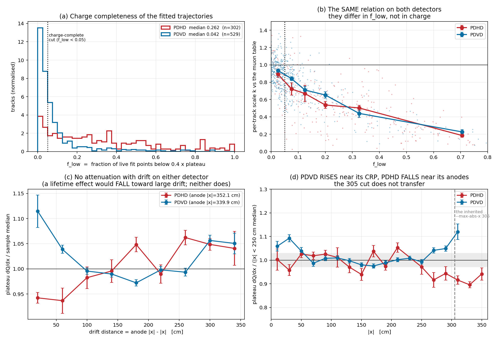
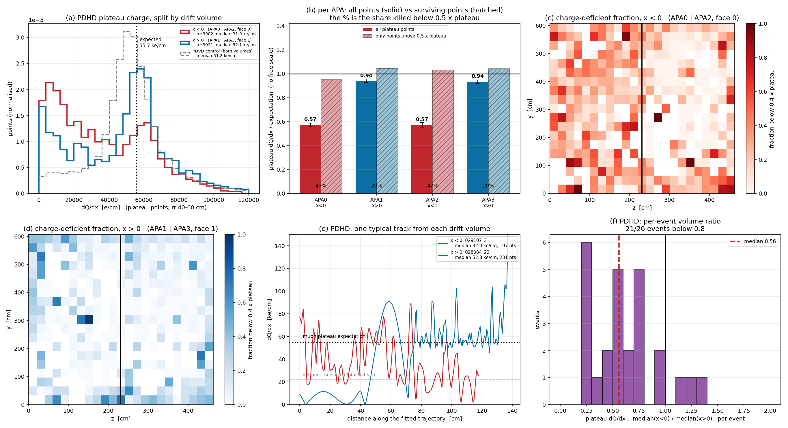
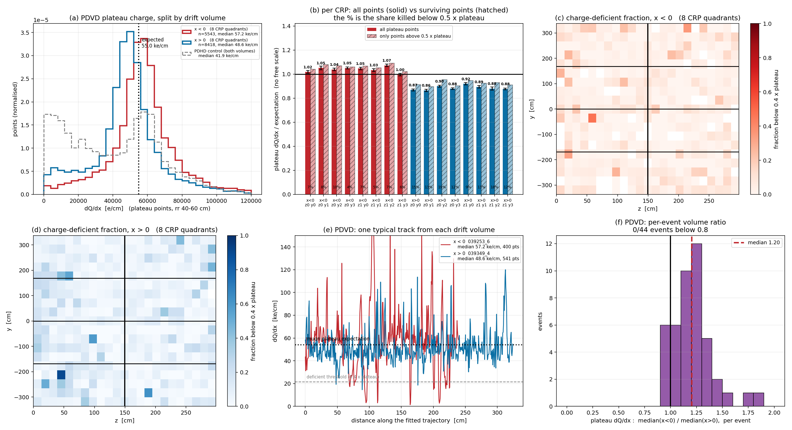
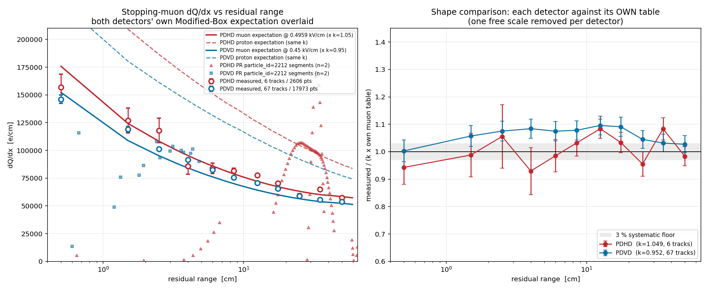
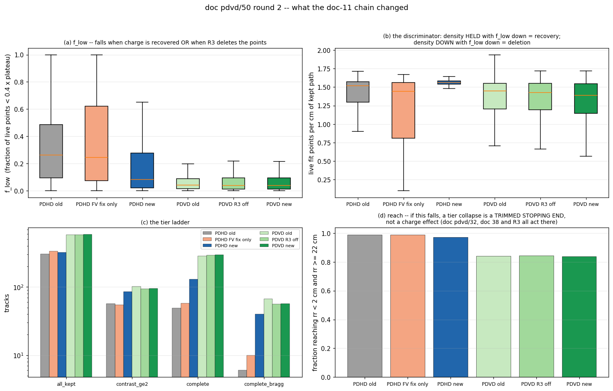
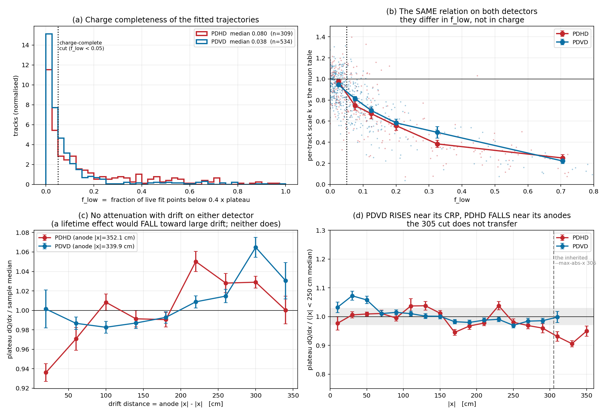
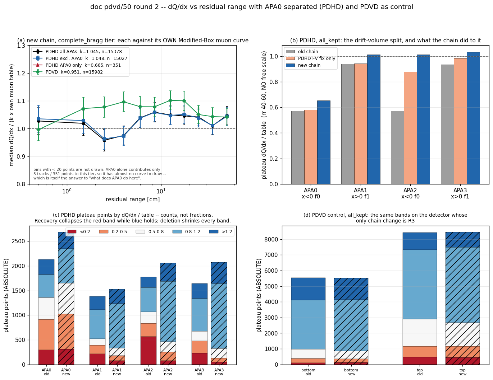
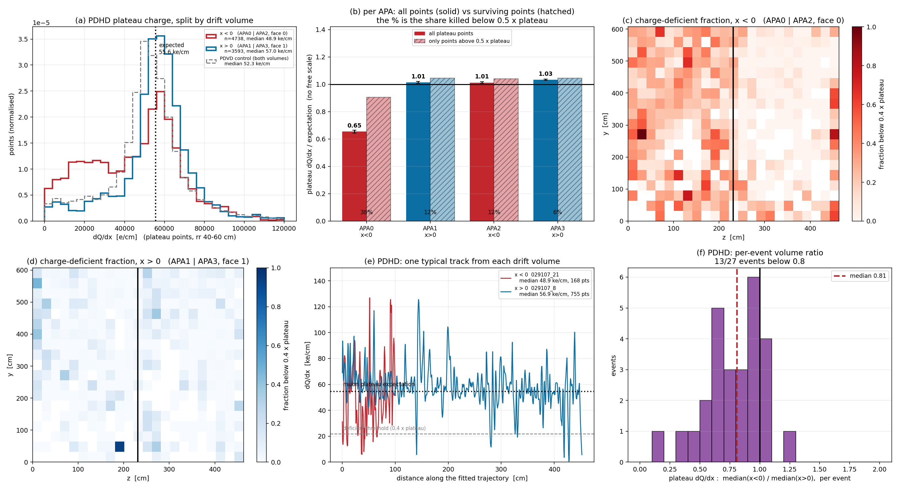
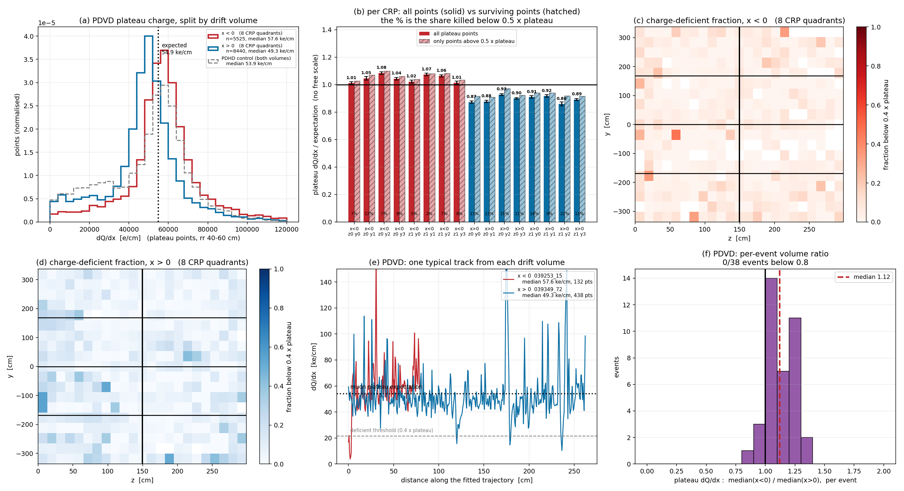
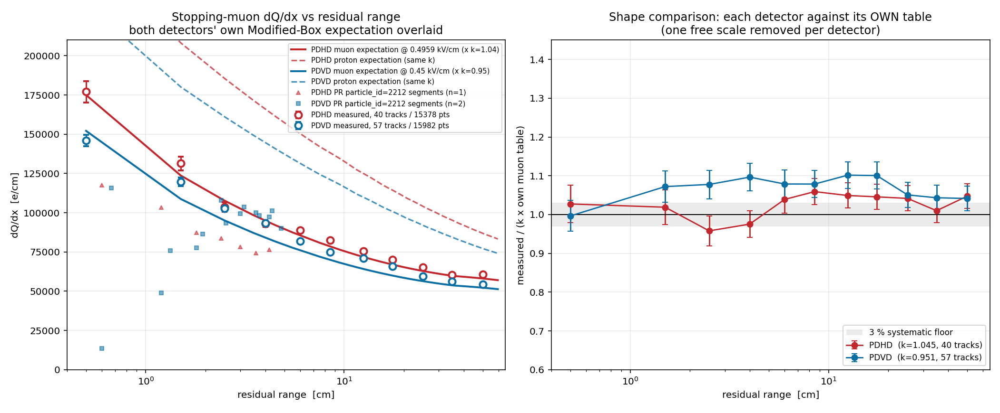

# doc pdvd/50 — dQ/dx vs residual range for stopping muons: PDHD next to PDVD

> **Round 2, 2026-09-07 (later the same day).** Everything in §§1-9 was measured
> on arms that predate the doc-11 production flips by hours. The owner asked for
> the measurement to be redone on the updated chain with **APA0 separated on
> PDHD**. That is §§10-16. The round-1 numbers are kept in place, each labelled
> with its arm, because two of them are not merely superseded but **contradicted**
> — see the markers on §4.2 and §5. Round 2 changed no code in the toolkit; it
> did fix one bug in `pdhd/run_pr_evt.sh` (§15).

**Scope.** No code is changed. This is an analysis of reconstruction products
already on disk, against the Modified-Box expectation tables the production
taggers already carry. Owner question (2026-09-07): *"For PDHD, I forgot if we
have got the dQ/dx vs. residual range for stopping muon and compared them with
expectation. Can we summarize this for PDHD and PDVD and compare them… overlay
with the expected dQ/dx for two cases… if you can find some proton candidates
that would be good to add as well."*

**The short answer.**

1. PDVD was measured and published (doc 42 §4). **PDHD had not been** — doc
   `pdhd/docs/stm-tagger-chain.md` §6 said so itself ("derived and consistent,
   NOT confirmed", n = 1 track). It is measured here.
2. **The PDHD tagger is not the problem** — it tags 5.25 STM per event against
   PDVD's 4.88, i.e. slightly *more*. What is 11× worse is the *analysis*
   selection applied afterwards, and **it is not a charge or calibration
   difference either.** Both detectors put the *same* scale on
   charge-complete tracks (k = 0.89 vs 0.94) and follow the *same* k-vs-
   completeness curve. They differ only in how many fitted points carry full
   charge: median f_low **0.262 on PDHD vs 0.042 on PDVD**.
3. **PDHD's two drift volumes disagree by a factor 1.63.** APA0+APA2 (x<0,
   face 0) read **0.573** of the muon table on the plateau; APA1+APA3 (x>0,
   face 1) read 0.935-0.941 — with no free scale, on 21 of 26 events. It is
   **not a gain shift**: the surviving points agree to 5 % in all four APAs,
   and what differs is the share of points killed (43-47 % vs 29 %). PDVD's
   control asymmetry is 1.18 with 4-19 % killed. §4.2-§4.4.
4. The cut that destroys the PDHD sample is doc-55's **muon shape rms ≤ 0.10**
   (33 → 1 tracks). It is not a stopping-muon selector; it is a charge-
   completeness selector in disguise. Replacing it with an explicit
   completeness cut gives **6 PDHD / 67 PDVD** clean stopping muons and both
   detectors then agree with their own expectation.
5. **No usable stopping-proton population exists in either sample**, and the
   dQ/dx-vs-rr shape cannot supply one: the proton and muon tables differ by a
   ×1.6 *normalisation* but only 0.06 in *shape*. Section 7 gives the four
   independent searches and what each returned.

**Round 2 (the doc-11 chain), in five lines.**

6. **PDHD's clean stopping-muon sample goes 6 → 40 tracks**, and it is charge
   *recovery*, not a bookkeeping artifact: `f_low` falls 0.262 → 0.082 while the
   fit-point density *rises* 1.52 → 1.56 /cm and the total point count rises
   77 801 → 95 971. §12.
7. **§4.2's central claim is contradicted.** APA2 reads **1.012** of the muon
   table where round 1 measured 0.573; APA1 1.013 and APA3 1.033. The "factor
   1.63 between the two halves of the detector" was the pre-doc-11
   *reconstruction*, not PDHD. §13.
8. **APA0 is the whole of what remains: 0.654**, with 26 % of its plateau points
   in the partial band and its surviving points 10 % low — the signature of
   `pdhd/docs/sp-apa0-plane2.md`'s hardware fault. Round 1's APA0 = APA2 = 0.573
   was a coincidence of two different causes. §13.1-§13.4.
9. **The fix that did it is `unmerge_assoc`**, with the defect-B FV fix supplying
   the APA2-specific two thirds; **R2 and R3 together move one track out of 40.**
   §12.1, §13.2.
10. Two round-1 readings are **corrected**: PDHD does not favour PDVD's +10 %
    hump (Δχ² −6.29 → −0.13 on 40 tracks, §14.2), and PDVD's near-CRP *rise* —
    the reason `--max-abs-x 305` exists — **is gone** and was itself a
    reconstruction artifact (§14.3). A runner bug found on the way: PDHD's
    `-nounmerge` had been a silent no-op since the 2026-09-07 flip (§15).

---

## Repro

```bash
cd /nfs/data/1/xqian/toolkit-dev/wcp-porting-img
S=<scratch>            # ANA=$S/ana ; all TSVs below land there

# 1. the tier ladder, doc 42's engine unchanged (sanity anchor + arm stability)
( cd pdhd && python3 docs/scripts/d42_dqdx_rr.py --det pdhd \
      --ref stm/pdhd_ref_dqdx.json --ref-key MuonDeDx --max-abs-x 1e9 \
      --out $S/ana/pdhd_d30hpost_nox work/*_d30hpost/tracking-stm.root )
( cd pdvd && python3 docs/nf_sp_img_clus/scripts/d42_dqdx_rr.py --det pdvd \
      --ref stm/pdvd_ref_dqdx_045.json --ref-key MuonDeDx \
      --out $S/ana/pdvd_d42fit work/*_d42fit/tracking-stm.root )

# 2. this round's engine: adds f_low, the completeness tier, both hypotheses
D=$PWD/pdvd/docs/nf_sp_img_clus/scripts/d50_dqdx_rr_cross.py
( cd pdhd && python3 $D --det pdhd --ref stm/pdhd_ref_dqdx.json --max-abs-x 1e9 \
      --status 0 --out $S/ana/d50_pdhd_s0 work/*_d30hpost/tracking-stm.root )
( cd pdvd && python3 $D --det pdvd --ref stm/pdvd_ref_dqdx_045.json --max-abs-x 305 \
      --status 0 --out $S/ana/d50_pdvd_s0 work/*_d42fit/tracking-stm.root )
#   ... and again with --status 5 (the tagger's "proton endpoint" rejects) -> _s5

# 3. the PR chain's own proton-tagged segments
P=$PWD/pdvd/docs/nf_sp_img_clus/scripts/d50_pr_proton_segments.py
python3 $P --det pdhd --out $S/ana/d50_pdhd_prp pdhd/work/*_d30hnupost/tracking-pr.root
python3 $P --det pdvd --out $S/ana/d50_pdvd_prp pdvd/work/*_d30vnupost/tracking-pr.root

# 4. figures
python3 pdvd/docs/nf_sp_img_clus/scripts/d50_dqdx_rr_plots.py \
      --ana $S/ana --figs pdvd/docs/nf_sp_img_clus/figs
for D in pdhd pdvd; do
  python3 pdvd/docs/nf_sp_img_clus/scripts/d50_deficit_plots.py \
      --det $D --ana $S/ana --figs pdvd/docs/nf_sp_img_clus/figs
done
```

Readout-unit assignment in `d50_deficit_plots.py` is geometric, read from the
production wire files: `protodunehd-wires-larsoft-v1.json.bz2` (PDHD, 4 APAs)
and `protodunevd-wires-larsoft-v7-uvwfit.json.bz2` (PDVD, 8 anodes x 2 faces).

**Arms and epoch.**

| detector | arm | events | runs | written |
|---|---|---|---|---|
| PDHD | `work/*_d30hpost` | 61 | 028084 ×31, 029107 ×30 | 2026-09-07 06:47 |
| PDVD | `work/*_d42fit` | 120 | 039252 ×18, 039253 ×18, 039349 ×84 | 2026-09-05 07:42 |
| PDHD protons | `work/*_d30hnupost` | 61 | — | 2026-09-07 07:09 |
| PDVD protons | `work/*_d30vnupost` | 120 | — | 2026-09-07 07:14 |

`local/lib/libWireCellClus.so` 2026-09-07 06:35; toolkit HEAD `c61de88a`.

### Repro, round 2 (the doc-11 chain)

```bash
cd /nfs/data/1/xqian/toolkit-dev/wcp-porting-img
S=<scratch>            # ANA=$S/ana
E=$PWD/pdvd/docs/nf_sp_img_clus/scripts

# 1. arms.  PDHD needs FRESH CLUSTERING: unmerge_assoc is silently inert on a
#    pctree written without save_assoc_id, and the defect-B FV fix is in
#    clustering.  PDVD's clustering was two days stale, so it is re-run too.
( cd pdhd && PDHD_MAX_JOBS=16 ./run_clus_evt.sh -q -save-pctree -save-assoc -s d51hclus 028084 all
             PDHD_MAX_JOBS=16 ./run_clus_evt.sh -q -save-pctree -save-assoc -s d51hclus 029107 all )
( cd pdvd && PDVD_MAX_JOBS=12 STM_RUNS="39252 39253 39349" ./stm/run_campaign.sh d51vclus stage
             PDVD_MAX_JOBS=12 STM_RUNS="39252 39253 39349" ./stm/run_campaign.sh d51vclus clus )
#    then symlink each PR arm's pctree-evt*.{tar.gz,tlas} from the clustering arm
#    and run, per run number:
( cd pdhd && ./run_pr_evt.sh -stm-fit    -s d51hstm   <run> all )   # production
( cd pdhd && ./run_pr_evt.sh -nounmerge -stm-fit -s d51hnoum2 <run> all )   # FV fix only
( cd pdhd && WIRECELL_PATH=$PWD:$WIRECELL_PATH \
      PDHD_PR_TLA="-S stm_rough_path_require_connected=false \
                   -A trackfitting_config=d51_pdhd_track_fitting_r3off.json" \
      ./run_pr_evt.sh -stm-fit -s d51hfit0 <run> all )              # + unmerge, R2/R3 off
( cd pdhd && ./run_pr_evt.sh -nu -stm-fit -s d51hnu <run> all )     # protons
( cd pdvd && PDVD_LIGHT_SUFFIX=_keep ./run_pr_evt.sh -stm-fit -s d51vstm  <run> all )
( cd pdvd && WIRECELL_PATH=$PWD:$WIRECELL_PATH PDVD_LIGHT_SUFFIX=_keep \
      PDVD_PR_TLA="-A trackfitting_config=d51_pdvd_track_fitting_r3off.json" \
      ./run_pr_evt.sh -stm-fit -s d51vfit0 <run> all )              # R3 off
( cd pdvd && PDVD_LIGHT_SUFFIX=_keep ./run_pr_evt.sh -nu -stm-fit -s d51vnu <run> all )

# 2. the round-2 engine: doc 50's decode plus a per-point APA label, point
#    density, absolute band counts and the reach counters
( cd pdhd && python3 $E/d51_dqdx_rr_apa.py --det pdhd --ref stm/pdhd_ref_dqdx.json \
      --max-abs-x 1e9 --status 0 --confusion --out $S/ana/d51_pdhd_stm work/*_d51hstm/tracking-stm.root )
( cd pdvd && python3 $E/d51_dqdx_rr_apa.py --det pdvd --ref stm/pdvd_ref_dqdx_045.json \
      --max-abs-x 305 --status 0 --confusion --out $S/ana/d51_pdvd_stm work/*_d51vstm/tracking-stm.root )
#   ... same for the d51hnoum2 / d51hfit0 / d51vfit0 control arms, the old
#   d30hpost / d42fit arms (the engine gate, sec 11.1), and --status 5.

# 3. the before/after ladders, the cross-detector shape test, the drift profile
python3 $E/d51_arm_ladder.py --out $S/ana/ladder_pdhd \
      old=$S/ana/gate_pdhd_d30hpost fvfix=$S/ana/d51_pdhd_noum2 \
      fv_unmerge=$S/ana/d51_pdhd_fit0 new=$S/ana/d51_pdhd_stm
python3 $E/d51_arm_ladder.py --out $S/ana/ladder_pdvd \
      old=$S/ana/gate_pdvd_d42fit r3off=$S/ana/d51_pdvd_fit0 new=$S/ana/d51_pdvd_stm
python3 $E/d51_arm_ladder.py --out $S/ana/shape --shape-test pdhd,pdvd \
      pdhd=$S/ana/d51_pdhd_stm pdvd=$S/ana/d51_pdvd_stm
python3 $E/d51_arm_ladder.py --out $S/ana/dp_pdhd \
      --drift-profile "pdhd:$PWD/pdhd/stm/pdhd_ref_dqdx.json:352.1" pdhd=$S/ana/d51_pdhd_stm

# 4. figures
python3 $E/d51_apa_plots.py --ana $S/ana --figs pdvd/docs/nf_sp_img_clus/figs \
      --pdhd-old gate_pdhd_d30hpost --pdhd-fit0 d51_pdhd_noum2 --pdhd-new d51_pdhd_stm \
      --pdvd-old gate_pdvd_d42fit  --pdvd-fit0 d51_pdvd_fit0  --pdvd-new d51_pdvd_stm \
      --mid-label-pdhd "PDHD FV fix only" --mid-label-pdvd "PDVD R3 off"
#   51_dqdx_rr_{overlay,diagnosis}.png and 51_{pdhd,pdvd}_deficit_anatomy.png are
#   doc 50's OWN plot scripts (d50_dqdx_rr_plots.py, d50_deficit_plots.py) run
#   unchanged on the new arms, with the d51_* TSVs symlinked to the d50_* names
#   the scripts expect and --figs pointed at a scratch dir so the round-1
#   figures are not overwritten.
```

**Arms and epoch, round 2.** All eight written 2026-09-07 15:17-15:46 against
`local/lib/libWireCellClus.so` md5 `ec5d0133948913343d21776e6e734e65`
(2026-09-07 14:37:28), toolkit HEAD **`c0b1613b`**. The same md5 was re-checked
after the last arm and is unchanged (§11.4).

| detector | arm | events | what it is |
|---|---|---|---|
| PDHD | `work/*_d51hclus` | 61 | clustering: production defaults + `-save-pctree -save-assoc` |
| PDHD | `work/*_d51hstm` | 61 | **PR, production defaults** — the round-2 measurement |
| PDHD | `work/*_d51hnoum2` | 61 | control: `-nounmerge` — the FV fix alone |
| PDHD | `work/*_d51hfit0` | 61 | control: R2 and R3 off — FV fix + unmerge, old fit |
| PDHD | `work/*_d51hnu` | 61 | `-nu`, for §16's protons |
| PDVD | `work/*_d51vclus` | 120 | clustering, production defaults |
| PDVD | `work/*_d51vstm` | 120 | **PR, production defaults** |
| PDVD | `work/*_d51vfit0` | 120 | control: R3 off, same pctrees, same binary |
| PDVD | `work/*_d51vnu` | 120 | `-nu`, for §16 |
| both | `work/*_d51{h,v}gate` | 2 each | production defaults **without** `-stm-fit`, for §11.3 |

Round 1's arms (`d30hpost`, `d30hnupost`, `d42fit`, `d30vnupost`) are untouched
and are the baselines every "old" column below is taken from.

**Why `d30hpost` is the PDHD production arm.** It is the doc-30 post-fix arm and
carries `tracking-stm.root`, which the production PR arm `d09prod` does not
(`d09_run_pr_arm.sh` runs without `-stm-fit`). Its output is *content-identical*
to production — `abtest/hash_archive.py` on `028084_0`:

```
4c5a4ba68dcddd8a4ef90901bd0c6e4a5d29f4cfcfa71c32162e024ee76c4916  9  .../028084_0_d09prod/mabc-pr.zip
4c5a4ba68dcddd8a4ef90901bd0c6e4a5d29f4cfcfa71c32162e024ee76c4916  9  .../028084_0_d30hpost/mabc-pr.zip
```

so the STM fits analysed here are production's, with the dump added. **PASS.**

---

## 1. Gate: the expectation curves are the ones production uses

The two overlaid curves are not re-derived here. They are
`pdhd/stm/pdhd_ref_dqdx.json` (E = 0.4959 kV/cm) and
`pdvd/stm/pdvd_ref_dqdx_045.json` (E = 0.45 kV/cm), re-gated against the
**compiled** `cfg/pgrapher/experiment/{pdhd,protodunevd}/particle_dataset.jsonnet`
that `TaggerCheckSTM` is actually handed:

| detector | tables | worst relative difference | tolerance | verdict |
|---|---|---|---|---|
| PDHD | 5 (Muon/Proton/Pion/Kaon/Electron DeDx) | 4.89 × 10⁻⁶ | 1 × 10⁻⁵ | **PASS** |
| PDVD | 5 | 4.67 × 10⁻⁶ | 1 × 10⁻⁵ | **PASS** |

Both are Modified Box with α = 0.93, β = 0.212, ρ = 1.38 g/cm³, W_ion = 23.6 eV
and the retained undocumented `× 0.85` fudge. Muon plateau (rr = 59.5 cm):
PDHD 54 609.2 e/cm, PDVD 53 965.5 e/cm.

## 2. Sanity anchor: doc 42 reproduces exactly

Doc 42 §4.1 on the same `d42fit` arm, recomputed today:

| tier | doc 42 published | this round |
|---|---|---|
| all status 0 | 582 trk, 143 379 pts, k 0.922, χ² 2343 | 582, 143 379, 0.9217, 2343.44 |
| contrast ≥ 2 | 102, 25 314, 0.916, 47.2 | 102, 25 314, 0.9159, 47.23 |
| doc-55 five cuts | 47, 13 039, 0.926, 67.8 | 47, 13 039, 0.9261, 67.75 |
| doc-55 + muon k | 45, 12 544, 0.931, 69.5 | 45, 12 544, 0.9305, 69.55 |

Bit-for-bit on every published figure. The pipeline has not moved under doc 42.
Across three PDVD arms the doc-55+muon-k tier is stable: `d42fit` 45 tracks
k 0.9305, `d30vpost` 40 / 0.9315, `d45prod` 41 / 0.9335.

## 3. The tier ladder, both detectors

> *Round 2: superseded by §12 on the doc-11 chain. The engine reproduces every
> number below exactly on the same arms (§11.1), so the differences there are the
> chain, not the code.*

Accepted STM passes (`T_stm_pass.status == 0`), kink-anchored, live points only.
k_pop = exp(median log(dQ/dx / muon table)); χ² over 11 rr bins with a 3 %
systematic floor.

| det | tier | tracks | points | k_pop | χ²/11 | per-track k | contrast med | f_low med |
|---|---|---|---|---|---|---|---|---|
| PDHD | all status 0 | 303 | 77 801 | 0.886 | 12 478 | 0.50 ± 0.32 | 0.90 | 0.262 |
| PDHD | contrast ≥ 2 | 57 | 16 599 | 0.784 | 2 408 | 0.24 ± 0.37 | 3.11 | 0.435 |
| PDHD | doc-55 five cuts | **1** | 365 | 1.133 | 9.6 | 1.16 | 2.42 | 0.008 |
| PDHD | **charge-complete** | 49 | 21 491 | 1.029 | 914 | 0.89 ± 0.21 | 0.93 | 0.023 |
| PDHD | **complete + Bragg ≥ 2** | **6** | 2 606 | **1.049** | **14.4** | 1.00 ± 0.14 | 2.24 | 0.016 |
| PDVD | all status 0 | 582 | 143 379 | 0.922 | 2 343 | 0.86 ± 0.25 | 1.07 | 0.043 |
| PDVD | contrast ≥ 2 | 102 | 25 314 | 0.916 | 47.2 | 0.97 ± 0.25 | 2.43 | 0.034 |
| PDVD | doc-55 + muon k | 45 | 12 544 | 0.931 | 69.6 | 1.01 ± 0.08 | 2.29 | 0.015 |
| PDVD | **charge-complete** | 284 | 80 655 | 0.964 | 911 | 0.94 ± 0.16 | 1.19 | 0.018 |
| PDVD | **complete + Bragg ≥ 2** | **67** | 17 973 | **0.952** | **40.0** | 1.00 ± 0.10 | 2.28 | 0.012 |

`complete + Bragg` is the like-for-like cross-detector stopping-muon sample and
is what every number below uses.

**k is not a charge scale.** No electron-lifetime correction is wired up on
either detector, and the tables carry the uncalibrated `× 0.85` fudge, so k
absorbs gain × lifetime × fudge. Only the *shape* is interpretable.

## 4. Why PDHD's sample looked 11× worse — the per-cut attrition

### 4.0 First: the PDHD tagger is not the problem

This section is about the *analysis* selection, not about the tagger. Stated
plainly, because "PDHD has trouble finding stopping muons" is the wrong reading:

| | PDHD (61 evt) | PDVD (120 evt) |
|---|---|---|
| clusters tagged `STM=1` | 320 — **5.25 / event** | 586 — **4.88 / event** |
| STM passes fitted | 23.2 / event | 15.1 / event |
| accepted passes (status 0) | 5.25 / event | 4.88 / event |

**PDHD tags slightly *more* stopping muons per event than PDVD.** The tagger
finds them; what collapses is the quality selection applied afterwards, and
§4.1 below shows it collapses on one cut.

Two independent things are easy to conflate here, so they are kept apart:

- **Purity** — the tagger's accepted population is not a Bragg-bearing sample on
  *either* detector (median Bragg contrast 0.90 PDHD, 1.07 PDVD; only ~20 % of
  accepted passes on either detector reach contrast ≥ 2). That is doc 42 §4.2's
  finding, it is not PDHD-specific, and a contrast cut is the fix.
- **Charge completeness** — PDHD's fitted points carry deficient charge 3× as
  often as PDVD's. That *is* PDHD-specific and is what §4.2 characterises.

The doc-55 five cuts fail PDHD tracks for the second while appearing to select
for the first.

### 4.1 The attrition

> *Round 2: superseded by §12.2. The 11x collapse is much smaller on the new
> chain — the doc-55 five cuts leave 20 PDHD tracks, not 1.*

Cuts applied cumulatively in doc-55 order:

| cut applied cumulatively | PDHD | PDVD |
|---|---|---|
| accepted STM passes (status 0) | 303 | 582 |
| + npts ≥ 40 | 302 | 563 |
| + ≥ 6 populated rr bins | 219 | 474 |
| + reaches rr < 2 and rr ≥ 22 cm | 219 | 471 |
| + Bragg contrast ≥ 2 | 46 | 98 |
| + median reduced χ² ≤ 2.5 | 33 | 81 |
| **+ muon shape rms ≤ 0.10** | **1** | **47** |
| *(instead)* npts ≥ 40 and f_low < 0.05 | 49 | 284 |
| *(instead)* … and Bragg contrast ≥ 2 | **6** | **67** |

The stopping-muon cuts proper (contrast, χ², reach) cost PDHD no more than PDVD
in proportion: 303 → 33 vs 582 → 81. **The whole 11× is the last line.** The
shape rms is computed on per-bin medians, and a track with a quarter of its fit
points carrying partial charge has scattered medians whatever particle it is.



*(a)* f_low, the fraction of live fit points below 0.4 × plateau: PDHD median
0.262, PDVD 0.042 — a 6× difference in charge completeness, the single largest
PDHD/PDVD difference in this analysis. *(b)* **the same relation on both
detectors.** Per-track k against f_low:

| f_low | PDHD k (n) | PDVD k (n) |
|---|---|---|
| 0.00–0.05 | 0.893 (49) | 0.940 (276) |
| 0.05–0.10 | 0.740 (27) | 0.821 (108) |
| 0.10–0.15 | 0.663 (22) | 0.710 (37) |
| 0.15–0.25 | 0.537 (44) | 0.641 (31) |
| 0.25–0.40 | 0.497 (57) | 0.443 (21) |
| 0.40–1.00 | 0.187 (89) | 0.234 (24) |

Two detectors, one curve. PDHD's apparent 4× charge deficit was a population
effect, not a detector property. The mechanism on the PDHD side is already
documented — the wrapped-plane charge attribution of `pdhd/docs/04` §8 and the
retiler ghosts of `pdhd/docs/07`; this round measures its cost to calorimetry
for the first time. It is also exactly the failure mode of
`feedback_zero_charge_points_corrupt_medians`: at the contrast ≥ 2 tier PDHD's
median Bragg contrast is 3.11 with k = 0.24, i.e. *fake* Bragg peaks made by
depressed plateaus, not real ones.

**On selecting with f_low.** The cut is on completeness, not on charge scale,
but it is not free of bias: PDVD moves from k 0.86 (all) to 0.94 (complete).
The check that it lands on the right population is that on PDVD it reproduces
the established doc-55 tier's scale — 0.952 (67 tracks) vs 0.931 (45 tracks) —
with 50 % more tracks and a *better* χ² (40.0 vs 69.6).

### 4.2 What the PDHD deficit actually is: a drift-volume effect

> ⚠ **Round 2: this section's central claim is CONTRADICTED, not merely
> superseded.** On the doc-11 chain APA2 reads **1.012** of the muon table where
> this section measured 0.573, while APA0 stays low at 0.654. The "factor 1.63
> between the two halves of the detector" was a property of the **pre-doc-11
> reconstruction**, not of PDHD. Do not quote 0.573 / 0.941 / 0.573 / 0.935 as a
> detector property. §13 has the replacement, and §13.3 explains why APA0 and
> APA2 agreeing to three decimals here was a coincidence of two different causes.



*PDHD. (a) plateau charge split by drift volume; (b) per APA, all plateau points
(solid) against only the points above 0.5 x plateau (hatched), with the share
killed printed below; (c,d) the deficient fraction mapped in (y, z), one panel
per drift volume, APA boundary drawn; (e) one typical track from each volume;
(f) the per-event ratio between the volumes.*

**The deficit tracks the drift volume, not a region.** Assigning every fit point
to its APA geometrically from `protodunehd-wires-larsoft-v1.json.bz2`
(APA0: x<0 z<231; APA1: x>0 z<231; APA2: x<0 z>=231; APA3: x>0 z>=231), the
plateau (rr 40-60 cm) charge against the table, **with no free scale**:

| APA | drift volume | plateau dQ/dx / table | points |
|---|---|---|---|
| APA0 | x < 0 (face 0) | **0.573** | 2 128 |
| APA1 | x > 0 (face 1) | **0.941** | 1 378 |
| APA2 | x < 0 (face 0) | **0.573** | 1 774 |
| APA3 | x > 0 (face 1) | **0.935** | 1 643 |

APA0 and APA2 agree with each other to three decimal places, as do APA1 and
APA3, and `cfg/pgrapher/experiment/pdhd/clus.jsonnet` groups them exactly that
way: **APA0+APA2 = face 0 (drift -x), APA1+APA3 = face 1 (drift +x)**. On PDHD
the sign of x *is* the drift volume, so this is a **factor 1.63 between the two
halves of the detector**, not an APA0 problem and not the corner effect an
earlier version of this section reported (that reading was an artifact of
pooling the two volumes: panel (c) shows the x<0 deficit is detector-wide).

It is on **every event**, not a few: over the 26 events with >=40 plateau points
in both volumes, median(x<0)/median(x>0) has median **0.56**, and **21 of 26**
events fall below 0.8 (panel f).

**It is not a gain shift.** If one volume were simply mis-calibrated, its whole
charge distribution would slide. It does not — the distribution is **bimodal**
(panel a), and the points that survive land in the same place everywhere:

| APA | all plateau points | only points > 0.5 x plateau | share killed |
|---|---|---|---|
| APA0 | 0.573 | **0.952** | 43 % |
| APA1 | 0.941 | **1.045** | 29 % |
| APA2 | 0.573 | **1.032** | 47 % |
| APA3 | 0.935 | **1.043** | 29 % |

So the surviving charge is right to within 5 % in all four APAs. What differs is
**how many points get killed**. That is a charge-attribution failure, not a
calorimetry constant, and it is why a *scale* correction cannot repair it.

**The two bad APAs fail differently**, which matters for where to look. Binning
the plateau points by fraction of the expectation:

| APA | < 0.2 (dead) | 0.2-0.5 (partial) | 0.5-0.8 | 0.8-1.2 | > 1.2 |
|---|---|---|---|---|---|
| APA0 | 0.13 | **0.29** | 0.21 | 0.21 | 0.16 |
| APA1 | 0.16 | 0.12 | 0.09 | 0.42 | 0.21 |
| APA2 | **0.31** | 0.16 | 0.13 | 0.27 | 0.13 |
| APA3 | 0.14 | 0.15 | 0.11 | 0.40 | 0.20 |

APA0's excess sits in the **partial** band — points that keep some charge but
not enough. That is the signature of a *weakened* plane, and PDHD has a
documented one: `pdhd/docs/sp-apa0-plane2.md` records that **APA0's collection
plane behaves like an induction plane with much weaker signals because of a
hardware fault**. APA2's excess sits in the **dead** band instead, so whatever
APA2 suffers from is not the APA0 fault. The face-0 grouping is common to both.

### 4.2b The APA label does not depend on x or on t0 (owner check, 2026-09-07)

The assignment above used `sign(x)` and `z`, and the owner rightly asked whether
that is legitimate: **before Q/L matching or a t0 correction, x is a drift-time
proxy, not a position, so it cannot by itself say which APA read the charge.**

It does not have to. The dump carries a wire-based label. `pu/pv/pw` in
`T_rec_charge` are not per-face wire numbers — `PdvdMagnifyTrackingVisitor.cxx:599-601`
writes them through `ChanScheme::globalf`, i.e. `base[plane] +` the rank of the
channel in the ascending list of that plane's channels over **all** anodes. From
the production wire file the blocks are exact:

| plane | base | block size | APA from the stored value |
|---|---|---|---|
| U | 0 | 800 / APA | `pu // 800` |
| V | 3200 | 800 / APA | `(pv - 3200) // 800` |
| W | 6400 | 960 / APA (480 per face) | `(pw - 6400) // 960` |

Labelling every accepted-pass fit point by `(pw - 6400) // 960` and comparing
with the `sign(x) + z` guess, over all 61 events:

```
CONFUSION   rows = APA from pw (wire index)   cols = APA guessed from sign(x), z
   true APA0     20747       0       0       0
   true APA1         0   14764       0       0
   true APA2         0       0   22684       0
   true APA3         0       0       0   20672
                                     agreement 78867/78867 = 100.0 %
```

The two agree on **every point**. The reason is that imaging runs per APA, so a
point's x is built from the drift time relative to *that* APA's own anode and
stays inside that APA's drift volume whatever the t0 error is — a wrong t0 slides
x within the volume, it does not move it across the cathode. The W-rank blocks
also confirm which face is live: the APA0-face1, APA1-face0, APA2-face1 and
APA3-face0 blocks are **empty**, exactly matching `clus.jsonnet`'s statement that
APA0+APA2 run on face 0 and APA1+APA3 on face 1.

So the per-APA numbers stand, and **APA2 really is APA2**. (An earlier attempt to
check this through `T_proj_data.channel` gave 28 % agreement; that was an error on
my side — that branch is `cs.global(...) = base[plane] + rank`, not a raw LArSoft
channel, and decoding it as `channel // 2560` scrambles the APAs.)

### 4.2c The charge is already missing before the fit runs

This is §9's first test, answered here rather than deferred. `T_proj_data` holds
the 2-D pixels the fit was actually handed. Per accepted pass, normalised by the
**true 3-D path length** (not `sum(nq)` — the fitter's `dx` is
`|p-prev| + |p-next|`, about twice the step):

| APA | measured W charge per cm | W pixels per cm | charge per pixel | slices per channel |
|---|---|---|---|---|
| APA0 | 369 954 | 34.8 | 6 776 | 18.4 |
| APA1 | 785 593 | 90.9 | 5 620 | 18.7 |
| APA2 | 429 756 | 46.8 | 5 937 | 16.9 |
| APA3 | 1 053 035 | 114.9 | 5 517 | 17.2 |

Relative to the APA1/APA3 mean the measured collection charge per cm is **APA0
0.40, APA1 0.85, APA2 0.47, APA3 1.15** — the same ordering, and roughly the same
factor, as the fit's own dQ/dx (0.59 / 0.95 / 0.53 / 0.92). Two further points:
the **charge per pixel is the same in all four APAs** (5.5-6.8 k), and the **ROI
time extent per channel is the same** (17-19 slices) and essentially no pixel
carries zero charge. So APA0 and APA2 are not being read at a lower gain and
their ROIs are not being truncated in time — the fit is simply handed about half
as much collection-plane charge per unit track.

**`TrackFitting` is therefore not the culprit; the deficit arrives with the
input.** That moves the investigation upstream into SP/imaging.

*Caveat, stated rather than solved:* `T_proj_data` is a region around the
trajectory, not only the wires the track crosses, so "pixels per cm" is not a
pure geometric rate and can carry a track-angle dependence; APA1 and APA3
themselves differ by 35 %. The robust part of this table is the ordering and the
fact that charge-per-pixel and slices-per-channel are flat while the total is
not.

### 4.2d The long swings are the deficit, not a second effect (owner check)

PDHD profiles show large slow swings along the track — the charge falls away and
comes back over tens of centimetres — and the question is whether that is a
separate artifact or the same thing as §4.2. Quantifying it per track: normalise
dQ/dx by the track median, smooth with a 15-point boxcar, and take
**swing** = p90 − p10 of the smoothed profile, with **hf** = the residual
point-to-point scatter.

| sample | n | swing | hf | swing/hf |
|---|---|---|---|---|
| PDHD APA0 | 57 | 1.07 | 0.36 | 2.78 |
| PDHD APA1 | 36 | 0.66 | 0.21 | 3.34 |
| PDHD APA2 | 61 | **1.39** | 0.22 | **5.74** |
| PDHD APA3 | 51 | 0.53 | 0.19 | 2.58 |
| PDHD x<0 (APA0+APA2) | 118 | **1.19** | — | — |
| PDHD x>0 (APA1+APA3) | 87 | 0.60 | — | — |
| PDVD x<0 | 150 | 0.45 | 0.29 | 1.52 |
| PDVD x>0 | 274 | 0.46 | 0.29 | 1.60 |

**Yes, the swings track the bad volume**: 1.19 in x<0 against 0.60 in x>0, a
factor 2, while PDVD is flat at 0.45/0.46 across both of its volumes — and
PDHD's *good* volume (0.53-0.66) is already close to PDVD.

**But it is not an independent phenomenon.** Restricted to charge-complete
tracks (f_low < 0.05) the swing collapses to **0.35** on PDHD with the volume
difference gone (x<0 0.39 on 8 tracks, x>0 0.34 on 36), against PDVD's 0.37.
Removing the killed points removes the swings. They *are* §4.2's extended
deficient stretches seen in profile, not a separate oscillation riding on top.

**And there is no characteristic period.** The dominant wavelength of the
smoothed profile scales with the track: λ/span = 1.00, 0.50, 0.50, 0.33, 0.25
across length bins from <60 cm to >250 cm, correlation(length, λ) = 0.57. The
FFT is picking the longest mode the track can hold. An earlier reading of these
profiles as a "~40 cm periodic oscillation" was an artifact of finite track
length and should not be carried forward — nothing here supports a periodic
mechanism such as a wire-pattern beat.

### 4.3 PDVD as the control: this is PDHD-specific

> *Round 2: the conclusion survives and strengthens — see §13.5. PDVD's volume
> asymmetry is **not** a reconstruction artifact (it is unchanged by the new
> chain), whereas PDHD's was.*



*The identical analysis on PDVD, whose 16 CRP quadrants (2 drift volumes x 4 y
bands x 2 z bands) come from `protodunevd-wires-larsoft-v7-uvwfit.json.bz2`.*

PDVD does have a drift-volume asymmetry, and that is the useful part of the
control — it is **mild, uniform, and the opposite sign**:

| | PDHD | PDVD |
|---|---|---|
| plateau ratio, x<0 volume | **0.573** | 1.00 - 1.07 |
| plateau ratio, x>0 volume | 0.935 - 0.941 | 0.86 - 0.92 |
| volume asymmetry | **0.61** | 1.18 |
| share of points killed | **29 % (good volume) - 47 %** | **4 - 19 %** |
| spread across readout units *within* a volume | 0.000 (2 APAs) | <= 0.08 (8 CRPs) |
| per-event ratio | median 0.56, **21/26 events below 0.8** | median 1.20, **0/44 below 0.8** |

Three things follow. **First**, a modest uniform volume asymmetry is normal in
this chain — PDVD's 18 % is there and nobody has chased it — so PDHD's factor
1.63 is the anomaly, not the existence of an asymmetry. **Second**, PDVD's 16
quadrants are homogeneous *within* each volume (1.00-1.07 and 0.86-0.92), so the
effect is per-volume on both detectors, not per-readout-unit. **Third, even
PDHD's good volume is worse than PDVD's bad one** — 29 % of points killed
against 9-19 % — so PDHD carries a baseline attribution problem on top of the
volume split. Panel (e) makes the difference visible directly: PDVD's tracks
scatter around the expectation, PDHD's x<0 track spends most of its length
below the deficient threshold.

### 4.4 What this does and does not invalidate

**Does not**: the doc-50 clean tier survives. Its 6 PDHD tracks have median
dQ/dx 53 500 - 62 900 e/cm, i.e. all normal, and they split 3 purely x>0, 2
purely x<0, 1 mixed. The completeness cut removes the killed points *before* the
scale is measured, which is why §5's k_pop = 1.049 stands and why restricting to
either volume moves it only to 1.076 (x>0) or 1.014 (x<0). The cut is doing
exactly what §4.1 says it does.

**Does**: any PDHD quantity built on *pooled, unselected* per-point dQ/dx. That
includes the raw plateau of §5's decode cross-check when read as a calorimetry
statement, and — more importantly — anything inside the reconstruction that
consumes dQ/dx without a completeness cut. `TaggerCheckSTM`'s own Bragg and KS
tests are in that category: they run on the same points, they are normalised to
a single `mip_dqdx = 56000 e/cm` for the whole detector, and in the x<0 volume
the median plateau point is at 32 000. That is a plausible mechanism for the
purity finding of §4.0 (median accepted Bragg contrast 0.90 on PDHD against 1.07
on PDVD) but it is **not tested here** and should not be quoted as established.

## 5. The comparison the owner asked for

> *Round 2: superseded by §14, and one sentence below is CORRECTED. This section
> read PDHD's shape as "marginally favouring" PDVD's +10 % hump (Delta chi2 =
> -2.5 on 6 tracks). On 40 tracks that preference disappears (§14.2): PDHD is
> consistent with flat and does not discriminate. The old preference was noise.*



*Left: measured per-bin medians for both detectors with **both detectors' own**
Modified-Box muon curves (solid) and proton curves (dashed) at each detector's
own field, each scaled by that detector's single free k. Right: each detector
against its own table with one free scale removed.*

Per-bin median of dQ/dx / (k_pop × own muon table), complete + Bragg tier:

| det | k_pop | χ²/11 | 0–1 | 1–2 | 2–3 | 3–5 | 5–7 | 7–10 | 10–15 | 15–20 | 20–30 | 30–40 | 40–60 |
|---|---|---|---|---|---|---|---|---|---|---|---|---|---|
| PDHD | 1.049 | 14.4 | 0.943 | 0.988 | 1.056 | 0.930 | 0.985 | 1.032 | 1.084 | 1.034 | 0.955 | 1.083 | 0.983 |
| PDVD | 0.952 | 40.0 | 1.003 | 1.057 | 1.075 | 1.084 | 1.075 | 1.078 | 1.096 | 1.091 | 1.045 | 1.031 | 1.027 |

Points per bin — PDHD 12, 7, 11, 18, 20, 26, 49, 44, 95, 93, 187; PDVD 137, 100,
110, 206, 208, 308, 534, 515, 1024, 996, 1895. **PDHD's three lowest bins hold
7–12 points between them: the PDHD Bragg peak is not measured in this sample.**

**The absolute scale, with no free parameter.** Before any k is removed, the
raw plateau median (rr 40–60 cm, complete + Bragg tier) against the table
evaluated on the same points:

| det | measured | table | ratio | points |
|---|---|---|---|---|
| PDHD | 57 318 e/cm | 55 627 e/cm | **1.030** | 187 |
| PDVD | 53 628 e/cm | 54 948 e/cm | **0.976** | 1 895 |

Both within 3 %, in opposite directions, with the `× 0.85` fudge left in. This
is a decode cross-check first — it confirms `(q − offset)/scale/nq` and the rr
convention — but it also says the uncalibrated absolute charge scale of both
chains is already right to a few percent, which is more than k alone shows.

Reading it:

- **Both detectors follow their own muon expectation over 0.5–60 cm**, at
  k = 1.05 (PDHD) and 0.95 (PDVD) — both inside the few-percent uncalibrated
  gain / lifetime / fudge freedom. This is the first confirmation of the PDHD
  0.4959 kV/cm tables against PDHD data.
- **The two samples carry different geometric cuts** — PDHD none, PDVD
  |x| < 305 cm — because §6 derives them separately. This does not manufacture
  the difference below: PDVD's excess is measured *after* its near-CRP points
  are already excluded, so the near-CRP rise cannot be its cause; and applying
  the same 305 cut to the PDHD clean tier drops 17 % of its points and moves
  k_pop by **+0.7 %** (1.0495 → 1.0573), leaving every conclusion below intact.
  The asymmetry is a per-detector geometry choice, not a lever on the result.
- **PDVD's +10 % hump at 3–20 cm reproduces** (1.075–1.096 across 2–20 cm,
  1.03–1.05 at the plateau, same sign in every bin, χ² 40.0/11). Doc 42 saw it
  at 69.5/11 on 45 tracks; on the 67-track completeness tier it is smaller but
  unmistakable.
- **PDHD neither confirms nor excludes it.** PDHD's own χ² against a flat 1.0
  is 14.4/11 — consistent. But its median per-bin error is 4.9 %, so a +8 % hump
  is only a 1.6 σ per-bin effect, and comparing shapes directly (each
  renormalised to unit geometric mean) gives χ² 14.7 flat vs **12.1 against the
  PDVD hump template — Δχ² = −2.5, marginally *favouring* the hump.** With 6
  tracks PDHD cannot discriminate. **Do not read this table as "the hump is
  PDVD-specific."** Settling that needs more PDHD stopping muons (§9).

## 6. Two things measured on the way

**The inherited `--max-abs-x 305`.** Every published PDHD dQ/dx number
(`pdhd/docs/stm-tagger-chain.md` §6, docs 01 and 02) was taken with
`d42_dqdx_rr.py`'s default 305 cm, inherited verbatim from PDVD's near-CRP rise.
PDHD is cathode-centred with anodes at |x| ≈ 352, so it silently dropped 20 % of
PDHD points. Panel (d) shows the two detectors have **opposite** near-anode
behaviour: PDVD *rises* to 1.09–1.14 beyond |x| = 280 (which is what 305 was for),
PDHD *falls* to 0.86–0.95 beyond |x| ≈ 260. The PDHD fall is gradual, not a
cliff, and cutting at |x| < 250 discards 45 % of plateau points to move the
plateau median by 3.6 % — inside the 3 % systematic floor. **Derived value for
PDHD: no cut** (`--max-abs-x 1e9`), with the ≈ 4 % near-anode depression carried
as a systematic. PDVD keeps 305.

**No attenuation with drift on either detector** (panel c, rr 20–80 cm,
charge-complete). A finite electron lifetime would fall monotonically toward
large drift; neither does. PDHD is 6 % *low* near its anodes and PDVD 11 %
*high* near its CRP — the same geometric structure as panel (d), opposite in
sign, and not lifetime. This supports leaving the lifetime correction unwired
(`protodunevd/params.jsonnet`'s note) but does not measure the lifetime.

## 7. Protons: four searches, one null

> *Round 2: redone on the new `-nu` arms in §16. Still a null, but the two
> unusable PDHD segments this section rejected are gone and PDHD now has real
> short candidates — all of them muons.*

The owner asked for proton candidates. There are none usable in either sample.
Four independent searches, in increasing order of independence from the charge
scale:

1. **The shape discriminator does not exist.** Removing one free scale, the
   proton and muon tables differ by ×1.612 (PDHD) / ×1.589 (PDVD) in
   *normalisation* but only **0.062 / 0.060 in shape rms** over 0.5–59.5 cm —
   they are nearly parallel. Tracks whose proton shape rms beats their muon
   shape rms do so by 0.01–0.04, well inside that. Those "proton-shaped" tracks
   (PDHD 10, PDVD 80) have median *range* 221 and 190 cm — they are muons.
   Separating μ from p on this plot is a scale question, which is precisely the
   circularity `sbnd_xin/dqdx_rr_sample/collect_proton_sample.py` documents.
2. **The tagger's own verdict.** `TaggerCheckSTM` status 5 ("proton endpoint",
   `detect_proton`) marks 13 PDHD / 73 PDVD passes, and `persist_stm_fit` writes
   them regardless of the verdict. But they run to 1300 fit points: status 5 is a
   statement about a long muon's *endpoint*, not a proton track. Charge-complete
   and Bragg-bearing, they reduce to 2 PDHD / 11 PDVD, all sitting on the muon
   curve.
3. **Range, which is scale-free.** Charge-complete, contrast ≥ 2, range < 40 cm:
   **0 PDHD, 3 PDVD** (039252_3 blk 750, 039349_0 blk 280, 039349_9 blk 190;
   31–36 cm). All three have k_muon 0.97–1.14 and k_proton 0.58–0.68 — they sit
   on the **muon** curve at the same scale as the muon sample, i.e. they are
   short stopping muons.
4. **The PR chain's own PID.** `tracking-pr.root`'s `T_rec_charge.particle_id`
   tags **2 segments per detector** as 2212 (`50_{pdhd,pdvd}_pr_proton_index.tsv`;
   for scale, the same files carry 1203/1662 muon-tagged and 635/730
   electron-tagged segments). Plotted as triangles/squares in §5:
   - PDVD `039349_10` seg 1107986733 (4.8 cm, 10 pts) and `039349_77` seg
     105876712 (4.3 cm, 9 pts) — genuinely short and 93–98 ke/cm, but k_muon
     0.94–1.05 against k_proton 0.55–0.61. They lie on the **muon** curve.
   - PDHD `028084_1` seg 215729117 (64.3 cm) and `029107_25` seg 210253409
     (37.4 cm) — too long for cosmic protons, and the second's dQ/dx peaks at
     rr ≈ 33 cm rather than at rr = 0, i.e. its residual range is anchored at the
     wrong end. Neither is usable.

**Mechanism, not just a null.** The STM fit runs only on STM-*candidate* main
clusters, so a short proton stub is structurally absent from `tracking-stm.root`;
and these are cosmic-ray data, where stopping protons of usable range are rare.
The proton curves are drawn in §5 anyway, at each detector's own k, so the null
is legible: every measured sample sits on the muon curve, a factor ≈ 1.6 below
the proton curve. **A proton measurement needs a different sample** — beam
protons, or a dedicated selection over PR segments rather than STM fits.

## 8. Honest limits

- **PDHD n = 6.** Enough to confirm the tables at the plateau, not enough to
  measure the Bragg region (7–12 points below rr = 3 cm) or to discriminate
  PDVD's hump.
- **k is not a charge scale** (§3). Nothing here calibrates PDHD or PDVD gain.
- **The lowest rr bins are the least trustworthy on both detectors** — doc
  pdvd/32 showed the STM trajectory's track ends are amputated, and doc 38's
  end trim moves points near the stop. The Bragg bin sits exactly there.
- **PDHD's pooled per-point dQ/dx is not a calorimetry measurement** until the
  drift-volume split of §4.2 is understood. Only the completeness-selected tier
  is quoted here as a scale, and §4.4 says what that does and does not cover.
- **f_low is a diagnostic, not a fix.** It selects tracks whose charge was
  reconstructed completely; it does not recover the charge missing from the
  other 78 % of PDHD passes.
- Both samples are **data** (PDHD 028084/029107, PDVD 039252/3/039349), so the
  agreement is a real test of the recombination model, not a self-consistency
  check against a simulation that used it.

## 9. Recommended next step

The target moved. §4.2 replaces "PDHD loses charge in a corner" with a specific,
first-order defect: **the x<0 drift volume (APA0+APA2, face 0) kills 43-47 % of
its fit points where the x>0 volume kills 29 %, and the surviving points in both
are correct to 5 %.** Imaging more PDHD events buys nothing against this.

Four tests, in the order that narrows fastest. None needs a new dump.

1. ~~Is the charge already missing before the fit?~~ **Answered in §4.2c: yes.**
   The 2-D collection charge per cm handed to the fit is 0.40 / 0.85 / 0.47 /
   1.15 for APA0-3, with identical charge-per-pixel and ROI time extent. It is
   **not** `TrackFitting`. The next step inherits from this: take the same
   comparison one stage further upstream, into the per-APA imaging products
   (`clusters-apa-apa{0..3}-ms-active.tar.gz`, already on disk) and then the SP
   frames, and find the stage at which APA0 and APA2 diverge from APA1 and APA3.
2. **Separate the APA0 hardware fault from whatever APA2 has.** This is now the
   central question — the owner's position is that APA2 is a normal APA, and
   §4.2b rules out a mis-labelling. §4.2 shows they
   fail differently — APA0 in the partial band (0.29), APA2 in the dead band
   (0.31). `pdhd/docs/sp-apa0-plane2.md` explains APA0. APA2 needs its own
   explanation, and the fact that both are face 0 is the clue.
3. **Check `T_bad_ch`**, present in the same ROOT files, against the killed
   points. If they coincide this is a masking problem with a different fix than
   an attribution problem.
4. **Ask whether the tagger inherits it.** `TaggerCheckSTM` normalises to a
   single `mip_dqdx = 56000 e/cm` for the whole detector while the x<0 volume's
   median plateau point sits at 32 000. §4.4 flags this as a plausible mechanism
   for PDHD's low accepted-population Bragg contrast; a per-volume census of the
   tagger's own contrast would confirm or kill it.

The two earlier suggestions still stand but are now lower priority: overlaying
the killed points on the wrapped U/V wire map (`pu/pv/pw` are in
`T_rec_charge`), and imaging runs 027980/027305, which the owner has already
declined and which §4.2 makes clearly not worth it.

Finally, an offer rather than a plan: the completeness cut is new, and nothing
here confirms by eye that it selects *real* stopping muons. The 6 PDHD and 67
PDVD clean stoppers are listed by event and block in
`figs/50_pdhd_s0_tracks.tsv` / `figs/50_pdvd_s0_tracks.tsv` (rows with
`complete = 1` and `contrast >= 2`), so a Bee scan set of the 6 PDHD ones is
cheap to build on request.

---

## 10. Round 2 — what was re-run, and what each arm isolates

Round 1's arms were written 06:47-07:20 on 2026-09-07. The production chain moved
twice later the same day: `818c47fb` (12:38) and `c0b1613b` (14:52), and
`libWireCellClus.so` was relinked at 14:37:28. Three things changed for PDHD and
one for PDVD:

| change | where | PDHD | PDVD |
|---|---|---|---|
| **defect B** — the degenerate-face FV vote in `select_scope_fv` | clustering | new, unconditional | structural no-op (no degenerate blocks) |
| **unmerge_assoc** — undo `clustering_isolated`'s merges before the Steiner build | PR | new (needs `save_assoc_id` in the pctree) | on since 2026-09-04 |
| **R2** `stm_rough_path_require_connected` | PR | new | never wired |
| **R3** `traj_final_fill_charge_test` | PR | new | new |

Between the round-1 pctrees (`d09` 01:05, `d09ctl2` 04:37) and the round-2 ones,
`git log` shows exactly two toolkit commits touching the **clustering** job —
`818c47fb` and `c0b1613b` — and both touch only `clustering_separate.cxx` +
`clus.jsonnet`, i.e. defect B (added default-OFF at 12:38, made unconditional at
14:52). `save_assoc_id` is additive: it writes three `perblob` arrays and does not
change cluster membership. So the PDHD clustering delta is defect B and nothing
else, and the four PDHD arms decompose the whole chain change:

| arm | clustering | unmerge | R2 | R3 |
|---|---|---|---|---|
| `d30hpost` (round 1) | pre-defect-B | inert (no provenance) | off | off |
| `d51hnoum2` | **defect B fixed** | off | on | on |
| `d51hfit0` | defect B fixed | **on** | off | off |
| `d51hstm` | defect B fixed | on | **on** | **on** |

PDVD's pair is simpler and cleaner: `d51vfit0` → `d51vstm` differ in **exactly one
line** of compiled config (§11.2), so PDVD prices R3 on its own.

## 11. Round-2 gates

### 11.1 The engine reproduces round 1 exactly

`d51_dqdx_rr_apa.py` is a fork by duplication of `d50_dqdx_rr_cross.py`; run on
round 1's own arms it must reproduce §3. It does, on every column:

| det | tier | §3 published | round-2 engine on the same arm |
|---|---|---|---|
| PDHD | all status 0 | 303 trk, 77 801 pts, k 0.886, χ² 12 478, f_low 0.262 | 303, 77 801, 0.8856, 12 478.47, 0.262 |
| PDHD | doc-55 five cuts | 1, 365, 1.133, 9.6 | 1, 365, 1.1328, 9.64 |
| PDHD | complete + Bragg | 6, 2 606, 1.049, 14.4 | 6, 2 606, 1.0495, 14.40 |
| PDVD | all status 0 | 582, 143 379, 0.922, 2 343 | 582, 143 379, 0.9217, 2 343.44 |
| PDVD | doc-55 + muon k | 45, 12 544, 0.931, 69.6 | 45, 12 544, 0.9305, 69.55 |
| PDVD | complete + Bragg | 67, 17 973, 0.952, 40.0 | 67, 17 973, 0.9518, 40.01 |

§4.2's per-APA plateau reproduces too — 0.5733 / 0.9409 / 0.5735 / 0.9351 on
2 128 / 1 378 / 1 774 / 1 643 points, killed 42.4 / 28.1 / 46.7 / 28.6 %. **PASS**:
every difference reported below is the chain, not the code.

The APA label is now committed code rather than an ad-hoc check. `--confusion`
prints the wire-index label against the geometric one: PDHD **87 606/87 606 =
100.0 %**, confirming doc 50 §4.2b. **New:** the same test on PDVD gives
**166 660/166 660 = 100.0 %** once the wire anode is folded to its drift volume
(anodes 0-3 bottom, 4-7 top), so `(pw − 7616) // 584` **is** contiguous per anode
on the v7 wire file. Doc 50 could not assume that; it now holds, and PDVD could
be split per CRP rather than per volume in a future round.

### 11.2 Compiled-config proof, and the control arms differ in one key

`PDHD_PR_COMPILE_ONLY=1` / `PDVD_PR_COMPILE_ONLY=1`:

- `d51hstm`: `"rough_path_require_connected" : true`, `unmerge_assoc` in the
  pipeline, `"trackfitting_config_file" : "pgrapher/experiment/pdhd/pdhd_track_fitting.json"`
  (which carries `traj_final_fill_charge_test: 1`).
- `d51hfit0`: the `rough_path_require_connected` key is **absent** (the
  key-suppression idiom: false ⇒ omitted ⇒ the C++ default false), and the
  fitting config is `d51_pdhd_track_fitting_r3off.json`.
- `d51vstm` vs `d51vfit0`: the two compiled configs differ in **one line**, the
  fitting-config filename. The two JSON files differ in **one non-comment key**,
  `traj_final_fill_charge_test = 1`. So PDVD's before/after is R3 and nothing else.
- `d51hnoum2`'s pipeline is
  `[switch_scope,flag_mains,steiner,…]` — no `unmerge_assoc` (see §15).

### 11.3 The arms are production's output plus a dump

Doc 50 justified `d30hpost` by member-hash equality with `d09prod`. R3 changed the
fit stage, so that inheritance had to be re-earned. `abtest/hash_archive.py` on
`mabc-pr.zip`, production defaults **with** `-stm-fit` against production defaults
**without** it, same pctrees:

```
PDHD 028084 evt 0   dc78811c8291f93d5b3150d2090f732a2f03b8d0df122be556e7c94e6081608a   IDENTICAL
PDHD 028084 evt 9   d90d08d1edb21639f17dfac1e41efa9ad89974db0a781b201247377f10e82af9   IDENTICAL
PDVD 039252 evt 5   a1e8a816c7dd5347334bf842bb479526c0a05e87d4af99151d8a22a5cc4c13fa   IDENTICAL
PDVD 039252 evt 16  ece9ff4d8650d7ee5806878500b071f72a66474172d0cb79850468f1d1fb0633   IDENTICAL
```

**PASS** — `-stm-fit` adds the ROOT writer and changes no production product.

### 11.4 The rest

- **Expectation tables re-gated.** `d42_make_ref_dqdx.py` and
  `d42_make_ref_dqdx_045.py` re-run: *"gate: 0.4959 kV/cm ROOT tables == compiled
  pdhd/particle_dataset.jsonnet (max rel < 1e-05)"* and the same for 0.45 /
  protodunevd. Both reference JSONs come back **byte-identical**, so §1 stands
  unchanged and the muon plateaus are still PDHD 54 609 e/cm, PDVD 53 966 e/cm.
- **Binary pin.** `libWireCell{Clus,Match,Root,Aux,Img,Util}.so` md5s recorded
  before the first arm (15:16:47) and re-checked after the last (15:45:19):
  **identical**. One arm, `d51hnoum2`, ran against an *edited* `run_pr_evt.sh`
  (§15) — same binary, different runner revision, and it is the only arm for which
  that is true.
- **Completeness.** 61/61 and 120/120 `tracking-stm.root` per arm, batch
  `failed: 0` on every run, counted independently of the runner's own summary.
- **Decode cross-check.** The no-free-parameter plateau of §14.1 is 1.094 (PDHD)
  and 0.990 (PDVD) — both order-unity against the table, so `(q − offset)/scale/nq`
  and the `rr` convention still decode correctly on both detectors.

## 12. The tier ladder and the attrition, on the new chain

Same definitions as §3. `pts_per_cm` (live fit points per cm of kept path) is new
and is printed next to `f_low` on purpose: R3 **deletes** charge-free fit points,
so `f_low` would fall even if no charge had been recovered. Density held or rising
alongside a falling `f_low` is recovery; density falling with it is deletion.



*(a) f_low and (b) the point density per arm — they must be read together;
(c) the tier ladder; (d) the reach fraction, which would fall if a tier had
collapsed because the stopping end was trimmed rather than because the charge
changed.*

| det | tier | arm | tracks | points | k_pop | χ²/11 | f_low med | **pts/cm** |
|---|---|---|---|---|---|---|---|---|
| PDHD | all status 0 | old | 303 | 77 801 | 0.886 | 12 478 | 0.262 | 1.519 |
| PDHD | all status 0 | **new** | **323** | **95 971** | **0.964** | **2 719** | **0.082** | **1.563** |
| PDHD | contrast ≥ 2 | old | 57 | 16 599 | 0.784 | 2 408 | 0.435 | 1.488 |
| PDHD | contrast ≥ 2 | **new** | **85** | 27 407 | **1.002** | **9.9** | 0.057 | 1.568 |
| PDHD | doc-55 five cuts | old | **1** | 365 | 1.133 | 9.6 | 0.008 | 1.561 |
| PDHD | doc-55 five cuts | **new** | **20** | 7 850 | 1.039 | 19.8 | 0.009 | 1.572 |
| PDHD | charge-complete | old | 49 | 21 491 | 1.029 | 914 | 0.023 | 1.560 |
| PDHD | charge-complete | **new** | **130** | 48 007 | 1.031 | 583 | 0.014 | 1.564 |
| PDHD | **complete + Bragg ≥ 2** | old | **6** | 2 606 | 1.049 | 14.4 | 0.016 | 1.559 |
| PDHD | **complete + Bragg ≥ 2** | **new** | **40** | **15 378** | **1.045** | **14.7** | 0.012 | 1.571 |
| PDVD | all status 0 | old | 582 | 143 379 | 0.922 | 2 343 | 0.043 | 1.450 |
| PDVD | all status 0 | **new** | 593 | 136 934 | 0.930 | 2 449 | 0.039 | 1.386 |
| PDVD | charge-complete | old | 284 | 80 655 | 0.964 | 911 | 0.018 | 1.493 |
| PDVD | charge-complete | **new** | 298 | 82 358 | 0.970 | 1 058 | 0.016 | 1.471 |
| PDVD | **complete + Bragg ≥ 2** | old | 67 | 17 973 | 0.952 | 40.0 | 0.012 | 1.523 |
| PDVD | **complete + Bragg ≥ 2** | **new** | 57 | 15 982 | 0.951 | 47.8 | 0.017 | 1.522 |

*`pts_per_cm` is `ngood / (max(rr) − min(rr))` over the kept points. That
denominator is an arclength span on a coordinate the tagger re-anchors at the
kink for a third of the tracks, so it was cross-checked against an independent
3-D `Σ|p[i+1] − p[i]|` over the same points: the two agree to **1 part in 10⁴**
on both arms and on both the `has_left = 0` and `has_left = 1` populations
(median ratio 1.0000). `rr` is cumulative arclength by construction
(`TaggerCheckSTM.cxx:975-999`), so the span is the path length.*

**PDHD's clean stopping-muon sample goes 6 → 40 tracks, and it is recovery, not
bookkeeping.** `f_low` falls 0.262 → 0.082 *while* the point density rises
1.519 → 1.563 and the total point count rises 77 801 → 95 971. Deletion cannot do
that. §13's absolute band counts say the same thing a second way.

**PDVD's clean tier falls 67 → 57** and a reader should not take that for a
regression: `k_pop` is unchanged (0.952 → 0.951), the reach fraction is 1.000 on
both sides, and the whole move happens at the clustering step (old → R3-off:
67 → 56), not at R3. Total points fall 4.5 % while **plateau** points hold
(13 961 → 13 965); what leaves is trajectory away from the plateau.

### 12.1 R3 is a small clean-up on both detectors, and not what changed PDHD

PDVD prices R3 alone — one key, same pctrees, same binary:

| PDVD | passes | points | k_pop | f_low med | pts/cm | plateau ratio | killed |
|---|---|---|---|---|---|---|---|
| R3 off (`d51vfit0`) | 587 | 138 215 | 0.9295 | 0.039 | 1.425 | 0.9540 | 10.83 % |
| R3 on (`d51vstm`) | 593 | 136 934 | 0.9300 | 0.039 | 1.386 | 0.9530 | 10.78 % |

R3 removes 0.9 % of the fit points, preferentially from the `> 1.2 × table` band
(2 448 → 2 339), and moves no calorimetric number. The same holds on PDHD:
`d51hfit0` (R2 and R3 off) against `d51hstm` is 323 vs 323 passes, 97 552 vs
95 971 points, k 0.9625 vs 0.9645, clean tier 39 vs 40. **R2 and R3 together
account for one track out of PDHD's 6 → 40.**

### 12.2 The attrition, and where the doc-55 collapse went

Cumulative, in doc-55 order (§4.1's ladder, four PDHD arms):

| cut applied cumulatively | old | FV fix only | + unmerge | new (prod) | PDVD old → new |
|---|---|---|---|---|---|
| accepted STM passes (status 0) | 303 | 337 | 323 | 323 | 582 → 593 |
| + npts ≥ 40 | 302 | 301 | 319 | 309 | 563 → 577 |
| + ≥ 6 populated rr bins | 219 | 193 | 298 | 290 | 474 → 479 |
| + reaches rr < 2 and rr ≥ 22 cm | 219 | 192 | 296 | 288 | 471 → 476 |
| + Bragg contrast ≥ 2 | 46 | 40 | 83 | 81 | 98 → 91 |
| + median reduced χ² ≤ 2.5 | 33 | 27 | 59 | 57 | 81 → 73 |
| **+ muon shape rms ≤ 0.10** | **1** | **2** | **20** | **20** | 47 → 41 |
| *(instead)* npts ≥ 40 and f_low < 0.05 | 49 | 61 | 130 | 131 | 295 → 305 |
| *(instead)* … and Bragg contrast ≥ 2 | **6** | **10** | **39** | **40** | 67 → 57 |



*Doc 50 §4.1's diagnosis figure re-run on the new arms: (a) the f_low
distributions and (b) the per-track k against f_low, the one curve both detectors
follow.*

§4.1's reading survives in weakened form: the shape-rms cut is still the most
expensive single cut on PDHD (57 → 20), but it no longer annihilates the sample.
That is consistent with §4.1's diagnosis — it was failing tracks for charge
*incompleteness*, and there is much less of that now.

The **reach** fraction is flat across every PDHD arm (0.990 → 0.988 → 0.992 →
0.972) and across PDVD (0.840 → 0.843 → 0.840), so none of these tier moves is a
trimmed stopping end. That mattered to check: doc pdvd/32's amputated track ends,
doc 38's end trim and now R3 all act at exactly the rr the Bragg cut reads.

## 13. The owner's question: APA0 separated

> *"For PDHD, please separate the APA0, which is the problematic APA in hardware."*



*(a) dQ/dx vs rr on the clean tier, PDHD split by readout unit against PDHD's own
Modified-Box muon curve, with PDVD beside it, each with one free scale.
(b) plateau dQ/dx / table per APA with NO free scale, old chain / FV fix only /
new chain. (c) absolute plateau point counts in the five expectation bands.
(d) the same bands on PDVD.*

### 13.1 The answer, in one table

Plateau (rr 40-60 cm), median dQ/dx against the muon table, **no free scale**, all
accepted status-0 points, 61 events:

| APA | drift volume | old chain | FV fix only | **new chain** | plateau points, new | killed, old → new |
|---|---|---|---|---|---|---|
| **APA0** | x < 0 (face 0) | 0.573 | 0.580 | **0.654** | 2 679 | 42 % → **37 %** |
| APA1 | x > 0 (face 1) | 0.941 | 0.943 | **1.013** | 1 523 | 28 % → 12 % |
| **APA2** | x < 0 (face 0) | 0.574 | 0.878 | **1.012** | 2 059 | 47 % → 12 % |
| APA3 | x > 0 (face 1) | 0.935 | 0.986 | **1.033** | 2 070 | 29 % → **6 %** |
| all four | — | 0.752 | 0.838 | **0.969** | 8 331 | 37 % → 19 % |
| **excluding APA0** | — | 0.856 | 0.940 | **1.022** | 5 652 | 35 % → 10 % |

**APA1, APA2 and APA3 now read the muon table to within 3.3 % with no free
parameter. APA0 reads 0.654.** Excluding APA0, PDHD's plateau is 1.022.

*Read the "killed" column with its denominator: it is a share of plateau points,
and the plateau point count itself grew (APA0 2 128 → 2 679, APA2 1 774 → 2 059).
APA0's 42 % → 37 % is therefore **not** 5 % of its points being repaired — its
absolute count of deficient points rose with the sample. §13.3 gives the
unambiguous version in absolute counts, and that is the table to quote.*

### 13.2 This contradicts §4.2, and §4.2 was right about its own arm

§4.2 concluded *"a factor 1.63 between the two halves of the detector, not an APA0
problem"*, and its strongest evidence was that APA0 and APA2 agreed to three
decimal places (0.5733 and 0.5735). That agreement was a **coincidence of two
unrelated causes**, and the new chain separates them: APA2's 0.574 was
reconstruction and is gone, while APA0's 0.573 moves only to 0.654 — it gains
what the chain gives every APA and keeps a deficit no other APA has.

The decomposition names which fix did it:

- **defect B (the FV fix) alone** moves APA2 0.574 → **0.878**, i.e. two thirds of
  the way, while APA0 and APA1 move by less than 0.01 and APA3 by 0.05. That is
  `clustering_separate`'s drift-side fiducial
  window becoming live on PDHD for the first time — precisely the failure
  `pdhd/docs/clustering-separate-fv-27409.md` diagnosed and `ee054213` was written
  to fix, and doc pdhd/11 §2 found had never taken effect.
- **unmerge_assoc** does the rest and more: APA2 0.878 → 1.012, APA1 0.943 →
  1.009, APA3 0.986 → 1.031, APA0 0.580 → 0.654, and `f_low` 0.244 → 0.084 with
  the density recovering 1.445 → 1.566. It is the dominant fix.
- **R2 + R3** move nothing here (§12.1).

### 13.3 It is recovery, in absolute counts

§4.2 published band *fractions*; fractions cannot separate "the bad points were
fixed" from "the bad points were deleted". Absolute plateau point counts can:

| APA | arm | < 0.2 (dead) | 0.2-0.5 (partial) | 0.5-0.8 | 0.8-1.2 | > 1.2 | total |
|---|---|---|---|---|---|---|---|
| APA0 | old | 293 | **625** | 441 | 462 | 307 | 2 128 |
| APA0 | **new** | 311 | **709** | 629 | 700 | 330 | 2 679 |
| APA1 | old | 216 | 177 | 131 | 590 | 264 | 1 378 |
| APA1 | **new** | 77 | 104 | 148 | **903** | 291 | 1 523 |
| APA2 | old | **563** | 274 | 228 | 497 | 212 | 1 774 |
| APA2 | **new** | **77** | 174 | 215 | **1 217** | 376 | 2 059 |
| APA3 | old | 231 | 244 | 197 | 664 | 307 | 1 643 |
| APA3 | **new** | 52 | 76 | 198 | **1 313** | 431 | 2 070 |

APA2's dead band collapses 563 → 77 while its good band more than doubles
497 → 1 217 **on more total points**. Deletion cannot produce that; only recovery
can. APA0 is the exception that proves it: its dead and partial bands *grow* with
the sample (293 → 311, 625 → 709), i.e. APA0's points are still being
mis-attributed at the same rate, there are simply more of them now.

### 13.4 APA0's signature is unchanged, and it is the documented one

APA0's excess still sits in the **partial** band (709 / 2 679 = 26 %, against
4-7 % in APA1/APA3) — points that keep some charge but not enough. That is the
signature of a weakened plane, and PDHD has a documented one:
`pdhd/docs/sp-apa0-plane2.md` records that **APA0's collection plane behaves like
an induction plane with much weaker signals because of a hardware fault.**

Two things are new. First, APA0's *surviving* points are now low too — the
"only points above 0.5 × plateau" ratio is **0.898** for APA0 against 1.044 /
1.041 / 1.046 for APA1/2/3. On the old chain that number was 0.946 and read as
"the surviving charge is right to 5 % in all four APAs" (§4.2); with the
reconstruction defects removed, APA0 no longer keeps that company. Second, APA0
now barely reaches the clean tier at all: 3 tracks and 351 points, **zero plateau
points**, so excluding it moves the clean-tier scale by only +0.3 %
(k 1.0446 → 1.0479). The clean sample was already effectively APA0-free.

### 13.5 PDVD as control: its volume asymmetry is *not* a reconstruction artifact




*Doc 50 §4.2's and §4.3's own anatomy figures, from the same script, re-run on the
new arms. Compare panel (a) with the round-1 versions above: PDHD's bimodal
plateau distribution has collapsed to one peak in APA1-3 and survives only in
APA0, while PDVD's panels are unchanged.*

| | old chain | new chain |
|---|---|---|
| bottom volume (x < 0, anodes 0-3) | 1.040 | 1.048 |
| top volume (x > 0, anodes 4-7) | 0.885 | 0.898 |
| asymmetry | 1.18 | **1.17** |
| share of points killed | 10.8 % | **10.8 %** |

PDVD's asymmetry and its killed fraction are unmoved by the same chain that
removed PDHD's. This strengthens §4.3 rather than replacing it: a mild uniform
volume asymmetry is a real property of the PDVD chain that nobody has chased,
while PDHD's factor 1.63 was a reconstruction defect. It also says PDHD's
*remaining* difference is genuinely APA0, not "the x < 0 half".

## 14. dQ/dx vs residual range: PDHD next to PDVD next to expectation



*Doc 50's own overlay script, re-run on the new arms.*

### 14.1 The comparison

Per-bin median of dQ/dx / (k_pop × own muon table), complete + Bragg tier:

| det | arm | k_pop | χ²/11 | 0–1 | 1–2 | 2–3 | 3–5 | 5–7 | 7–10 | 10–15 | 15–20 | 20–30 | 30–40 | 40–60 |
|---|---|---|---|---|---|---|---|---|---|---|---|---|---|---|
| PDHD | old (n=6) | 1.049 | 14.4 | 0.943 | 0.988 | 1.056 | 0.930 | 0.985 | 1.032 | 1.084 | 1.034 | 0.955 | 1.083 | 0.983 |
| **PDHD** | **new (n=40)** | **1.045** | **14.7** | 1.027 | 1.019 | 0.958 | 0.975 | 1.039 | 1.059 | 1.049 | 1.046 | 1.042 | 1.010 | 1.048 |
| PDHD excl. APA0 | new (n=39) | 1.048 | 14.6 | 1.035 | 1.029 | 0.963 | 0.973 | 1.038 | 1.058 | 1.048 | 1.051 | 1.038 | 1.011 | 1.044 |
| PDVD | old (n=67) | 0.952 | 40.0 | 1.003 | 1.057 | 1.075 | 1.084 | 1.075 | 1.078 | 1.096 | 1.091 | 1.045 | 1.031 | 1.027 |
| **PDVD** | **new (n=57)** | **0.951** | **47.8** | 0.997 | 1.072 | 1.078 | 1.097 | 1.079 | 1.079 | 1.102 | 1.101 | 1.051 | 1.043 | 1.042 |

Points per bin — PDHD new **80 / 64 / 63** / 121 / 128 / 185 / 305 / 306 / 628 /
620 / 1 130, against round 1's 12 / 7 / 11. PDVD new 118 / 79 / 97 / 176 / 176 /
266 / 448 / 437 / 877 / 814 / 1 512.

**The absolute scale, no free parameter.** Raw plateau median (rr 40-60, clean
tier) against the table on the same points:

Round 2 reports the **median of the per-point ratio** rather than §5's ratio of
medians; on round 1's own arms the two agree to 0.2 % (1.032 vs §5's 1.030 for
PDHD, 0.978 vs 0.976 for PDVD), so the columns below are comparable.

| det | arm | plateau dQ/dx / table | plateau points |
|---|---|---|---|
| PDHD | old (n = 6 tracks) | 1.032 | 187 |
| **PDHD** | **new (n = 40)** | **1.094** | **1 130** |
| PDVD | old (n = 67) | 0.978 | 1 895 |
| **PDVD** | **new (n = 57)** | **0.990** | **1 512** |

PDVD is unchanged within 1 %. **PDHD moves from +3 % to +9 %**, and that is a
selection effect this doc has already named, not a new calorimetric claim: §4.1
showed the completeness cut biases the scale upward (PDVD k 0.86 all → 0.94
complete), and PDHD's clean tier is now 40 tracks drawn from a population whose
deficient points have largely gone. Against the *unselected* population PDHD's
plateau is 0.969 all-APA and 1.022 excluding APA0 (§13.1), i.e. the same few
percent as PDVD. Both numbers stay inside the uncalibrated gain × lifetime × 0.85
freedom, and this remains a **decode and shape** check, not a calibration — §8
stands.

### 14.2 Correction to §5: PDHD does not favour PDVD's hump

§5 reported that PDHD's shape *"marginally favours"* PDVD's +10 % hump at 3-20 cm
(Δχ² = −2.5 on 6 tracks). Redone on 40 tracks, it does not. Renormalising both
curves to unit geometric mean over the bins both populate, and adding the
template's own error in quadrature (§5's quoted values did not, so they are not
numerically comparable — both epochs below are through the round-2 test):

| PDHD arm | χ² vs flat | χ² vs the PDVD template | Δχ² |
|---|---|---|---|
| old (n = 6) | 13.54 | 7.25 | **−6.29** |
| **new (n = 40)** | **8.21** | **8.07** | **−0.13** |

On the new chain PDHD is consistent with flat (8.21 over 11 bins) and the two
hypotheses fit equally well. **The round-1 preference for the hump was noise.**
PDVD's hump itself is unmoved (χ² 40.0 → 47.8, same sign in every bin), so the
open question is now "why does PDVD hump and PDHD not", not "does PDHD hump too".

### 14.3 Correction to §6: PDVD's near-CRP rise is gone

§6 derived `--max-abs-x`: 305 cm for PDVD because of a near-CRP *rise*, no cut for
PDHD. Plateau-region points (rr 20-80), ratio to the table with no free scale:

| |x| band | PDVD old | PDVD new | PDHD new |
|---|---|---|---|---|
| 240-260 | 0.922 | 0.922 | 1.031 |
| 260-280 | 0.938 | 0.917 | 0.933 |
| 280-300 | 0.947 | 0.908 | 0.967 |
| 300-320 | 1.040 | **0.920** | 0.934 |
| 320-340 | **1.198** | **0.850** | 0.917 |
| whole sample, no cut | 0.953 | 0.945 | 0.961 |
| `< 305` | 0.944 | 0.951 | 0.976 |

The 1.20 spike at the CRP that motivated the 305 cut **is a reconstruction
artifact and is gone**; PDVD now falls gently toward its anodes exactly as PDHD
does. The cut is no longer doing what §6 says it does — on the new arms it moves
the plateau by 0.6 % (PDVD) and 1.6 % (PDHD), both inside the 3 % systematic
floor. §14.1 keeps PDVD at 305 and PDHD uncut so the tables stay comparable with
round 1; **the derived value for a future round is no cut on either detector.**

What that does *not* contaminate: `pdhd/docs/01` §12.5 and `pdhd/docs/02` §7 quote
`k_pop` only as an **A/B comparator between arms on the same events with the same
cut**, where the 305 cut applies to both sides and cancels. They need no marker.
`pdhd/docs/stm-tagger-chain.md` §6 does quote it as a statement about PDHD, and
carries one.

## 15. A runner bug found on the way: `-nounmerge` was a silent no-op

**Symptom.** The PDHD control arm `d51hnoum` (`-nounmerge`) produced numbers
*identical to the production arm* in every column — 323 passes, 95 971 points,
k 0.9645, χ² 2 718.83.

**Root cause.** `pdhd/run_pr_evt.sh`. The 2026-09-07 owner flip wrote
`unmerge_assoc` into the `PIPE_STM` / `PIPE_NU` strings themselves, but the
`UNMERGE` handling below them only ever *inserted* the stage:

```bash
if [ "$UNMERGE" = 1 ] && [ -n "$PIPE" ]; then
    case ",$PIPE," in
        *,unmerge_assoc,*) ;;                      # already there -- nothing to do
        *,flag_mains,*)    PIPE="${PIPE/flag_mains,/flag_mains,unmerge_assoc,}" ;;
    esac
fi
```

With `UNMERGE=0` the block is skipped, and the stage the flip had hard-coded stays
in the pipeline. `-nounmerge` therefore ran the unmerge chain and said nothing.

**Why it hid.** Before the flip the default pipelines carried no `unmerge_assoc`,
so declining to insert it *was* the off state, and the flag was correct. The flip
changed the meaning of the surrounding code without changing the flag. PDVD never
had this bug: it selects separate `PIPE_{STM,NU}_MERGED` strings instead.

**Fix.** `UNMERGE=0` now removes the stage. Committed with this doc.

**Verification.** Compile-only, same event, same tag:

```
-nounmerge : pipeline=[switch_scope,flag_mains,steiner,fiducialutils,…]
default    : pipeline=[switch_scope,flag_mains,unmerge_assoc,steiner,fiducialutils,…]
```

**Blast radius.** Every PDHD PR batch log written after the 14:31 runner flip:
`d11prod`, `d51hfit0`, `d51hnu`, `d51hstm` (all correctly *with* `unmerge_assoc`),
`d51hnoum` (mislabelled — the bug), `d51hnoum2` (correct, post-fix). **One arm,
this round's own, and no published result used it.** `d51hnoum` is kept on disk as
the evidence; §13's "FV fix only" column is `d51hnoum2`.

## 16. Protons, redone — still a null, but a cleaner one

The two table facts §7 rests on are unchanged: the proton and muon curves differ by
×1.612 (PDHD) / ×1.589 (PDVD) in normalisation and only 0.062 / 0.060 in shape rms
over 0.5-59.5 cm, so **the shape cannot separate μ from p**; the reference JSONs
re-gate byte-identical (§11.4). Searches 2-4 on the new arms:

| search | round 1 | round 2 |
|---|---|---|
| status 5 ("proton endpoint") passes | 13 PDHD / 73 PDVD | 13 PDHD / 56 PDVD |
| … charge-complete and Bragg-bearing | 2 / 11 | **1 / 10** |
| charge-complete, contrast ≥ 2, range < 40 cm | **0** PDHD / 3 PDVD | **2** PDHD / **5** PDVD |
| `T_rec_charge.particle_id == 2212` segments | 2 PDHD / 2 PDVD | **1** PDHD / 2 PDVD |

Every candidate still lands on the **muon** curve:

| segment | range | k_muon | k_proton |
|---|---|---|---|
| PDHD `029107_23` seg −81973860 | 4.2 cm | 0.79 | 0.46 |
| PDVD `039349_10` seg 1107986733 | 4.8 cm | 1.05 | 0.61 |
| PDVD `039349_77` seg 105876712 | 4.3 cm | 0.94 | 0.55 |
| PDHD `029107_23` blk 1150 (STM, complete) | 36.9 cm | 0.97 | 0.57 |
| PDHD `029107_27` blk 640 (STM, complete) | 37.4 cm | 0.86 | 0.51 |

Two improvements worth naming. The two PDHD PR segments §7 had to reject as
unusable — a 64.3 cm "proton" and a 37.4 cm one whose dQ/dx peaked at rr ≈ 33 cm,
i.e. anchored at the wrong end — **are gone from the new chain**, replaced by a
single genuinely short 4.2 cm segment. And PDHD's short-stopper search, which
returned 0 in round 1, now returns 2 at 37 cm. Both are muons, so §7's conclusion
is unchanged: **a proton measurement needs a different sample** — beam protons, or
a dedicated selection over PR segments rather than STM fits.

## 17. Round-2 limits, and the next step

What round 2 does **not** change:

- **k is still not a charge scale.** No electron-lifetime correction is wired on
  either detector and the tables keep the undocumented `× 0.85` fudge, so k
  absorbs gain × lifetime × fudge. Only the *shape* and the per-APA *ratios at
  fixed scale* are interpretable. §8's list stands.
- **The lowest rr bins are still the least trustworthy.** 80 / 64 / 63 points in
  the three lowest bins is a real improvement on 12 / 7 / 11, but those points
  still come from track ends shaped by doc pdvd/32's amputation, doc 38's trim and
  now R3. Read §14.1's Bragg bins as *populated*, not as a measured Bragg shape.
- **Per-APA claims are plateau-only.** APA0 contributes 3 tracks and no plateau
  points to the clean tier, so there is no per-APA Bragg number here and none
  should be quoted.
- **`f_low` is still a diagnostic, not a fix**, and the completeness tier is still
  a selection: it removes the tracks whose charge was reconstructed badly, it does
  not repair them. What changed is how few there are.
- **Old → new is not a matched-track comparison.** `block = cluster*10 + pass` and
  cluster ids do not survive re-clustering, so every before/after table here is a
  **population** delta over the same 61 (PDHD) / 120 (PDVD) events, not a
  track-by-track one. "6 → 40 tracks" means the new chain's selection admits 40
  clean stoppers from the same material, not that 34 individual tracks improved.
  `d51_arm_ladder.py` prints the event sets and their intersection for exactly
  this reason, and an arm missing an event there means that event yielded no
  accepted pass — itself a chain effect, not a coverage gap.

**Recommended next step, in the order that narrows fastest.**

1. **APA0 is now the whole of PDHD's charge deficit, and it is upstream of the
   fit.** §13 leaves APA0 at 0.654 with 26 % of its plateau points in the partial
   band and its *surviving* points 10 % low. Doc 50 §4.2c already showed the
   deficit arrives with the 2-D input, and `pdhd/docs/sp-apa0-plane2.md` names a
   hardware fault in APA0's collection plane. The measurement that closes this is
   a per-APA comparison one stage further upstream — the imaging products
   (`clusters-apa-apa{0..3}-ms-active.tar.gz`, on disk) and then the SP frames —
   asking whether APA0's charge is low *there* by the same 0.65. If it is, this is
   a calibration item for APA0, not a reconstruction defect, and the honest
   downstream fix is a per-APA response correction rather than anything in `clus`.
2. **Re-check the taggers that normalise to one detector-wide MIP.** §4.4 flagged
   `TaggerCheckSTM`'s single `mip_dqdx = 56000 e/cm` as a plausible mechanism for
   PDHD's low accepted-population Bragg contrast when the x<0 median plateau point
   sat at 32 000. Three of four APAs are now at the table, so that concern
   narrows to APA0 — worth one per-APA census of the tagger's own contrast, which
   needs no new arm.
3. **PDVD's hump is now the open cross-detector question** (§14.2). PDHD at 40
   tracks is flat and PDVD's +8 % at 3-20 cm reproduces on a fresh arm with a
   different clustering epoch, so it is a PDVD property, not statistics. It is
   also 8 %, i.e. inside nobody's systematic budget yet — worth stating as a known
   PDVD-specific shape residual rather than chasing now.
4. **Retire the `--max-abs-x` cut** on both detectors at the next round (§14.3),
   and say so in whatever consumes `d42_dqdx_rr.py`'s 305 default.

Two offers, not plans. The 40 PDHD and 57 PDVD clean stoppers are listed by event
and block in `figs/51_{pdhd,pdvd}_s0_tracks.tsv` (rows with `complete = 1` and
`contrast >= 2`), so a Bee scan set of the PDHD ones is cheap to build on request
— and unlike round 1's offer, there are now enough of them for a scan to mean
something. Second, the round-2 engine proved PDVD's wire-index APA label exact
(§11.1), so PDVD's deficit anatomy could be redone per CRP rather than per drift
volume if that is ever wanted.

---

**Committed products, round 2.** `scripts/d51_{dqdx_rr_apa,arm_ladder,apa_plots}.py`;
`figs/51_dqdx_rr_apa.png`, `figs/51_chain_before_after.png`, and
`figs/51_dqdx_rr_{overlay,diagnosis}.png` + `figs/51_{pdhd,pdvd}_deficit_anatomy.png`
(doc 50's own plot scripts, unchanged, re-run on the new arms);
`figs/51_{pdhd,pdvd}_s{0,5}_{tracks,summary,apa}.tsv`;
`figs/51_{pdhd,pdvd}_ladder_{tiers,attrition,apa}.tsv`;
`figs/51_{pdhd,pdvd}_pr_proton_{index,points}.tsv`; the two control fitting
configs `pdhd/d51_pdhd_track_fitting_r3off.json` and
`pdvd/d51_pdvd_track_fitting_r3off.json`; and the `-nounmerge` fix in
`pdhd/run_pr_evt.sh` (§15).  The per-point TSVs (8-15 MB each) are regenerable
from the round-2 Repro block and are not committed.  `d50_*.py`, `d42_*.py` and
every round-1 figure and TSV are untouched.

**Committed products.** This doc;
`scripts/{d50_dqdx_rr_cross,d50_pr_proton_segments,d50_dqdx_rr_plots,d50_deficit_plots}.py`;
`figs/50_dqdx_rr_{overlay,diagnosis}.png`; `figs/50_{pdhd,pdvd}_deficit_anatomy.png`;
`figs/50_{pdhd,pdvd}_s{0,5}_{tracks,summary}.tsv`;
`figs/50_{pdhd,pdvd}_pr_proton_{index,points}.tsv`. The per-point TSVs (7.5–14 MB
each) are regenerable from the Repro block and are not committed. `d42_dqdx_rr.py`
and its PDHD fork are untouched.
